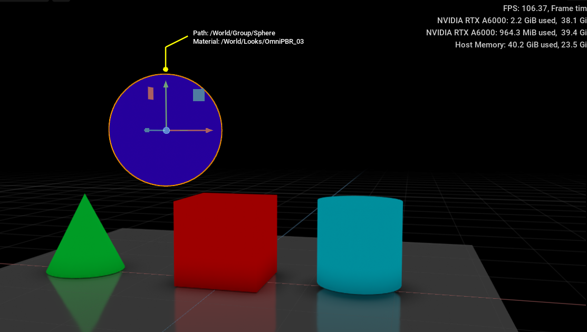
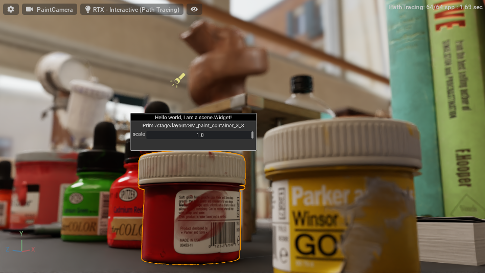
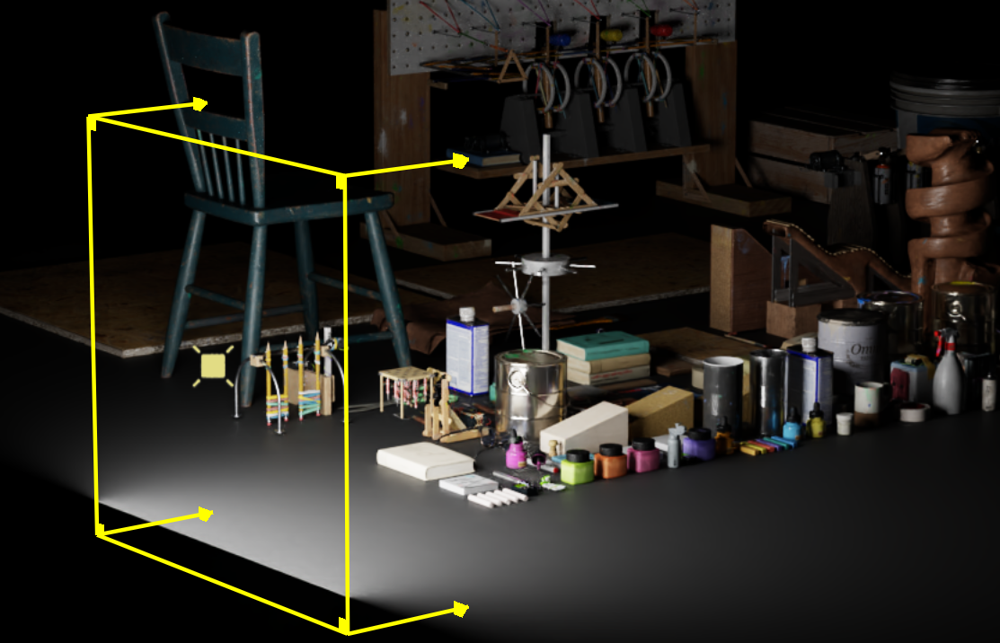
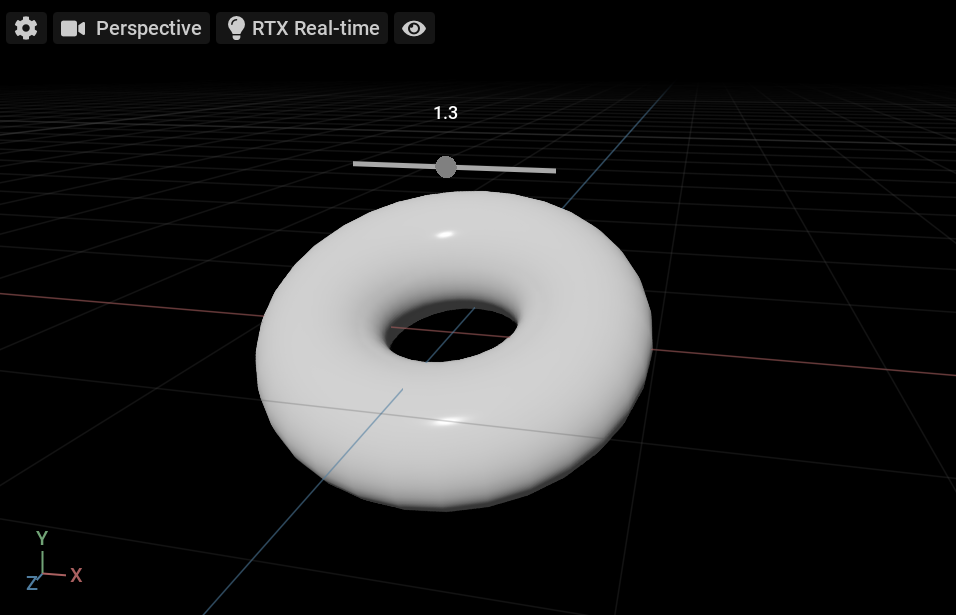

# omni.ui.scene Kit Extension Samples

## [Object Info (omni.example.ui_scene.object_info)](exts/omni.example.ui_scene.object_info)

[](exts/omni.example.ui_scene.object_info)

### About
This extension uses the omni.ui.scene API to add primitive graphics and labels in the viewport above your selected prim. The labels provide the prim path of the selected prim and the prim path of its assigned material.

### [README](exts/omni.example.ui_scene.object_info)
See the [README for this extension](exts/omni.example.ui_scene.object_info) to learn more about it including how to use it.

### [Tutorial](exts/omni.example.ui_scene.object_info/Tutorial/object_info.tutorial.md)
Follow a [step-by-step tutorial](exts/omni.example.ui_scene.object_info/Tutorial/object_info.tutorial.md) that walks you through how to use omni.ui.scene to build this extension.

## [Widget Info (omni.example.ui_scene.widget_info)](exts/omni.example.ui_scene.object_info)

[](exts/omni.example.ui_scene.widget_info)

### About
This extension uses the omni.ui.scene API to add a widget in the viewport, just above your selected prim. The widget provides the prim path of your selection and a scale slider.

### [README](exts/omni.example.ui_scene.widget_info)
See the [README for this extension](exts/omni.example.ui_scene.widget_info) to learn more about it including how to use it.

### [Tutorial](exts/omni.example.ui_scene.widget_info/Tutorial/object.info.widget.tutorial.md)
Follow a [step-by-step tutorial](exts/omni.example.ui_scene.widget_info/Tutorial/object.info.widget.tutorial.md) that walks you through how to use omni.ui.scene to build this extension.

## [Light Manipulator (omni.example.ui_scene.light_manipulator)](exts/omni.example.ui_scene.light_manipulator)

[](exts/omni.example.ui_scene.light_manipulator)

### About
This extension add a custom manipulator for RectLights that allows you to control the width, height, and intensity of RectLights by clicking and dragging in the viewport.

### [README](exts/omni.example.ui_scene.light_manipulator)
See the [README for this extension](exts/omni.example.ui_scene.light_manipulator) to learn more about it including how to use it.

### [Tutorial](exts/omni.example.ui_scene.light_manipulator/tutorial/tutorial.md)
Follow a [step-by-step tutorial](exts/omni.example.ui_scene.light_manipulator/tutorial/tutorial.md) that walks you through how to use omni.ui.scene to build this extension.

## [Slider Manipulator (omni.example.ui_scene.slider_manipulator)](exts/omni.example.ui_scene.slider_manipulator)

[](exts/omni.example.ui_scene.slider_manipulator)

### About
This extension add a custom slider manipulator above you selected prim that controls the scale of the prim when you click and drag the slider.

### [README](exts/omni.example.ui_scene.slider_manipulator)
See the [README for this extension](exts/omni.example.ui_scene.slider_manipulator) to learn more about it including how to use it.

### [Tutorial](exts/omni.example.ui_scene.slider_manipulator/Tutorial/slider_Manipulator_Tutorial.md)
Follow a [step-by-step tutorial](exts/omni.example.ui_scene.slider_manipulator/Tutorial/slider_Manipulator_Tutorial.md) that walks you through how to use omni.ui.scene to build this extension.

## Adding These Extensions

To add these extensions to your Omniverse app:
1. Go into: Extension Manager -> Gear Icon -> Extension Search Path
2. Add this as a search path: `git://github.com/NVIDIA-Omniverse/kit-extension-sample-ui-scene?branch=main&dir=exts`

## Linking with an Omniverse app

For a better developer experience, it is recommended to create a folder link named `app` to the *Omniverse Kit* app installed from *Omniverse Launcher*. A convenience script to use is included.

Run:

```bash
> link_app.bat
```

There is also an analogous `link_app.sh` for Linux. If successful you should see `app` folder link in the root of this repo.

If multiple Omniverse apps is installed script will select recommended one. Or you can explicitly pass an app:

```bash
> link_app.bat --app code
```

You can also just pass a path to create link to:

```bash
> link_app.bat --path "C:/Users/bob/AppData/Local/ov/pkg/create-2022.1.3"
```

## Contributing
The source code for this repository is provided as-is and we are not accepting outside contributions.
