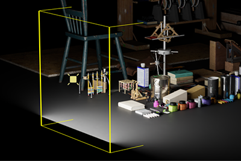
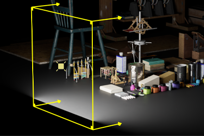
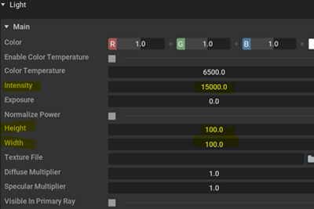

# Overview
We provide an End-to-End example of a light manipulator extension, which adds manipulators to RectLight.

It contains the LightModel which stores the light attribute values. Focused on "width", "height" and "intensity" in this example. It also plays the role of communication with the USD data, reading and writing updated attributes from and to USD.

LightManipulator defines 4 types of manipulators which separately controls the light's width, height, intensity and all of the three.

###[Tutorial](../tutorial/tutorial.md)

Follow this [step-by-step guide](../tutorial/tutorial.md) to learn how this extension was created.

## Manipulator
The manipulator contains a rectangle and 4 lines perpendicular to the rectangle face. The manipulator is generated in a unit size, and the update of the look is through the parent transform of the manipulator.

 - When you hover over to the rectangle's width or height of the manipulator, you will see the width or height will be highlighted and you can drag and move the manipulator. When you drag and move the height or width of the rectangle of the manipulator, you will see the width or height attributes of the RectLight are updated.

      

 - When you hover over on the tip of any line perpendicular to the rectangle face, you will see the 4 lines will be highlighted and the arrow on the tip will reveal. When you drag and move the arrow, you will see the intensity attribute of the RectLight is updated.

  

 - When you hover over to the corner of the rectangle (slightly inside the rectangle), you will see the entire manipulator is highlighted, and there will be 4 small rectangles revealed at the corner of the rectangle. When you drag and move the small rectangle, you will see all of the width, height and intensity attributes of the RectLight are updated.

  

 - When you change the attributes (Width, height and intensity) of the RectLight, you will see the manipulator appearance updates.

  

## Gesture
The example defined a customized `_DragGesture` for the manipulator. This is how the gesture is implemented:
 - `on_began`: the start attributes data is restored into the model, so that we have a record of previous value later for running `omni.kit.commands`.
 - `on_changed`: update the attributes into the model, and the model will directly write the value to the USD without keeping it since we want to see the real-time updating of attribute value in the property window
 - `on_ended`: update the attributes into the model, and the model will call `omni.kit.commands` to change the property since we want to support the undo/redo for the dragging. The previous value from `on_began` is used here.

## Model
The model contains the following named items:
 - width - the width attribute of the RectLight
 - height - the height attribute of the RectLight
 - intensity - the intensity attribute of the RectLight
 - prim_path - the USD prim path of the RectLight.
 - transform - the transform of the RectLight.

The model is the bridge between the manipulator and the attributes data. The manipulator is subscribe to the model change to update the look. All the attributes value are directly coming from USD data.

We use `Tf.Notice` to watch the rectLight and update the model. The model itself doesn't keep and doesn't duplicate the USD data, except the previous value when a gesture starts.

 - When model's `width`, `height` or `intensity` changes, the manipulator's parent transform is updated.
 - The model's `prim_path` is subscribed to `omni.usd.StageEventType.SELECTION_CHANGED`, so when the selection of RectLight is changed, the entire manipulator is redrawn.
 - When model's `transform` is changed, the root transform of the manipulator is updated.

For width, height and intensity, the model demonstrates two strategies working with the data.
It keeps the attribute data during the manipulating, so that the manipulator has the only one truth of data from the model. When the manipulator requests the attributes from the model, the model computes the position using USD API and returns it to the manipulator.

# Overlaying with the viewport

We use `sc.Manipulator` to draw manipulator in 3D view. To show it in the viewport, we overlay `sc.SceneView` with our `sc.Manipulator`
on top of the viewport window.

```python
from omni.kit.viewport.utility import get_active_viewport_window
viewport_window = get_active_viewport_window()

# Create a unique frame for our SceneView
with viewport_window.get_frame(ext_id):
    # Create a default SceneView (it has a default camera-model)
    self._scene_view = sc.SceneView()
    # Add the manipulator into the SceneView's scene
    with self._scene_view.scene:
        LightManipulator(model=LightModel())
```

To synchronize the projection and view matrices, `omni.kit.viewport.utility` has
the method `add_scene_view`, which replaces the camera model, and the
manipulator visually looks like it's in the main viewport.

```python
# Register the SceneView with the Viewport to get projection and view updates
viewport_window.viewport_api.add_scene_view(self._scene_view)
```