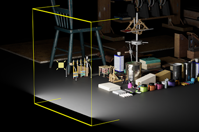
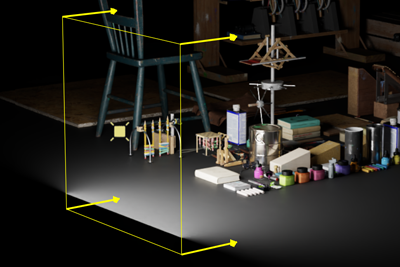

# Create a Reusable Light Panel with the Drag and Hover Gestures

[Gestures](https://docs.omniverse.nvidia.com/py/kit/source/extensions/omni.ui.scene/docs/Gestures.html) are a powerful way to allow users to create their scenes with interactable objects. In this tutorial, we will create a light panel where users can alter the size and intensity of the light by dragging on its edges.

## Learning Objectives

In this guide, we will learn how to:
* Extend the [Manipulator](https://docs.omniverse.nvidia.com/py/kit/source/extensions/omni.ui.scene/docs/Manipulator.html) class to create a customizable light panel.
* Use [Gestures](https://docs.omniverse.nvidia.com/py/kit/source/extensions/omni.ui.scene/docs/Gestures.html) to alter how objects are interactable in Omniverse.

## Table of Content
1. [Download the Starter Project](#1-download-the-starter-project)
2. [Setting Line Style](#2-setting-line-style)
3. [Building the Manipulator Transform](#3-building-the-manipulator-transform)
4. [Gestures](#4-gestures)
5. [Adding Intensity](#5-adding-intensity)
6. [Scaling Everything](#6-scaling-everything)
7. [Congratulations!](#7-congratulations)

## Prerequisites
It is recommended to understand the concepts in the following tutorials before proceeding:
* How to make an extension by spawning primitives ([Link](https://github.com/NVIDIA-Omniverse/sample-kit-extension-spawnPrims/blob/main/exts/omni.example.spawnPrims/tutorial/Spawn_PrimsTutorial.md))

It also recommended to have the Omniverse Code version `2022.1.2`.


## 1. Download the Starter Project
To get the assets for this hands-on lab, please clone the `tutorial-start` branch of the `kit-extension-sample-ui-scene` [github repository](https://github.com/NVIDIA-Omniverse/kit-extension-sample-ui-scene). 

`https://github.com/NVIDIA-Omniverse/kit-extension-sample-ui-scene.git`

Learn how to add extensions to the Omniverse Extension Manager in [this guide](https://github.com/NVIDIA-Omniverse/kit-extension-template).

This tutorial will focus on the `light_manipulator.py` file found in the`/exts/omni.example.ui_scene.light_manipulator/omni/example/ui_scene/light_manipulator` directory. To learn more about the other files in the repository, please check the [How to make an extension by spawning primitives](https://github.com/NVIDIA-Omniverse/sample-kit-extension-spawnPrims/blob/main/exts/omni.example.spawnPrims/tutorial/Spawn_PrimsTutorial.md) tutorial.

In particular, we will be focusing on the `LightManipulator` class, which will be created as an extension of the [Manipulator](https://docs.omniverse.nvidia.com/py/kit/source/extensions/omni.ui.scene/docs/Manipulator.html) class.

This extension will allow users to create an interactive rectangular light as shown in the image below:


Let's break down the [on_build](https://docs.omniverse.nvidia.com/py/kit/source/extensions/omni.ui.scene/docs/index.html#omni.ui_scene.scene.Manipulator.on_build) function, which should look like this:

```python
def on_build(self):
    """Called when the model is changed and rebuilds the whole slider"""
    model = self.model
    if not model:
        return

    # if we don't have selection then just return
    prim_path_item = model.prim_path
    prim_path = prim_path_item.value if prim_path_item else None
    if not prim_path:
        return
    
    #TODO: Add Step 2.2

    self.__root_xf = sc.Transform(model.get_as_floats(model.transform))
    with self.__root_xf:
        self._x_xform = sc.Transform()
        with self._x_xform:
            self._shape_xform = sc.Transform()
            # Build the shape's transform
            self._build_shape()
            with self._shape_xform:
                #TODO: Add Step 3.2

                #TODO: Add Step 4.2

                #TODO: Add Step 5.2

                #TODO: Add Step 6.2
                pass

```

When the manipulator is built, it will be passed a [model](https://docs.omniverse.nvidia.com/py/kit/source/extensions/omni.ui.scene/docs/Manipulator.html#model) as defined in [light_model.py](https://github.com/NVIDIA-Omniverse/kit-extension-sample-ui-scene/blob/main/exts/omni.example.ui_scene.light_manipulator/omni/example/ui_scene/light_manipulator/light_model.py). This model has a number of useful functions such as the ability to get and set the `height`, `width`, and `intensity` of the light. The [get_as_floats](https://github.com/NVIDIA-Omniverse/kit-extension-sample-ui-scene/blob/18a3cb7f657c1c87be88810bc5544d2ab1efe673/exts/omni.example.ui_scene.light_manipulator/omni/example/ui_scene/light_manipulator/light_model.py#L137) function and the [set_floats](https://github.com/NVIDIA-Omniverse/kit-extension-sample-ui-scene/blob/18a3cb7f657c1c87be88810bc5544d2ab1efe673/exts/omni.example.ui_scene.light_manipulator/omni/example/ui_scene/light_manipulator/light_model.py#L153) function allows us to retrieve or alter all of these values at once.

If the model is not defined, then there isn't anything to manipulate, and the function ends. Similarly, we will be storing information in [USD format](https://developer.nvidia.com/usd) under the hood. We will need a location to store our [Prim](https://graphics.pixar.com/usd/release/glossary.html#usdglossary-prim), hence checking for a `prim_path`.

## 2. Setting Line Style

### 2.1 Theory

Let's first create the rectangle that users can drag the edges of to alter the width and height of the light panel. It would be nice if it was clear to the user which edge of the rectangle they were currently hovering over with their cursor. To do this, we'll create a `set_thickness` function so hovered edges appear a littler bolder.

```python
# Style settings, as kwargs
thickness = 1
hover_thickness = 3
color = cl.yellow
shape_style = {"thickness": thickness, "color": color}

def set_thickness(sender, shapes, thickness):
    for shape in shapes:
        shape.thickness = thickness
```
### 2.1 Practice
**TODO:** Copy the above code under the `# Add Step 2.2` comment in `on_build`. This will not render anything in Omniverse yet, but will provide setup for later.

**CHALLENGE (optional):** Want to make the style your own? Try changing the `thickness`, `hover_thickness` and `color` variables to your liking. It may be worth revisiting this code and adjusting over the course of this tutorial.

## 3. Building the Manipulator Transform

### 3.1 Theory

If we give our light panel a [Transform](https://graphics.pixar.com/usd/release/tut_xforms.html), we can scale (change the size) of it more easily. To do that, we'll start from the top down, find the root transform of the model (`__root_xf`). Then, we'll create a Transform for translation (`_x_xform`), and then create a Transform for the shape (`_shape_xform`):

```python
self.__root_xf = sc.Transform(model.get_as_floats(model.transform))
with self.__root_xf:
    self._x_xform = sc.Transform()
    with self._x_xform:
        self._shape_xform = sc.Transform()
        # Build the shape's transform
        self._build_shape()
```

Finally, the `_build_shape()` function sets the scale on the `_shape_xform` using the vector `[x, 0, 0, 0, 0, y, 0, 0, 0, 0, z, 0, 0, 0, 0, 1]` where x is width, y is the height, and z is the light intensity.

```python
def _build_shape(self):
    if not self.model:
        return
    if self.model.width and self.model.height and self.model.intensity:
        x = self.model.get_as_floats(self.model.width)
        y = self.model.get_as_floats(self.model.height)
        # this INTENSITY_SCALE is too make the transform a reasonable length with large intensity number
        z = self.model.get_as_floats(self.model.intensity) / INTENSITY_SCALE
        self._shape_xform.transform = [x, 0, 0, 0, 0, y, 0, 0, 0, 0, z, 0, 0, 0, 0, 1]
```

### 3.2 Practice
**TODO:** Now that we've created a transform, let's add a few lines to it. Copy the below code block under the `# Add Step 3.2` comment in `on_build`. Please check the alignment of the python code. Feel free to view the [completed function](https://github.com/NVIDIA-Omniverse/kit-extension-sample-ui-scene/blob/main/exts/omni.example.ui_scene.light_manipulator/omni/example/ui_scene/light_manipulator/light_manipulator.py) as a hint.

```python
# Build the shape geometry as unit-sized
h = 0.5
z = -1.0
# the rectangle
shape1 = sc.Line((-h, h, 0), (h, h, 0), **shape_style)
shape2 = sc.Line((-h, -h, 0), (h, -h, 0), **shape_style)
shape3 = sc.Line((h, h, 0), (h, -h, 0), **shape_style)
shape4 = sc.Line((-h, h, 0), (-h, -h, 0), **shape_style)
```

There should now be a rectangle viewable in Omniverse.

## 4. Gestures

### 4.1 Theory

[Gestures](https://docs.omniverse.nvidia.com/py/kit/source/extensions/omni.ui.scene/docs/Gestures.html) handle callback data from user input. There are many kinds of Gestures available in Omniverse [listed here](https://docs.omniverse.nvidia.com/py/kit/source/extensions/omni.ui.scene/docs/index.html#omni-ui-scene-module). In this tutorial, we will focus on the [Hover](https://docs.omniverse.nvidia.com/py/kit/source/extensions/omni.ui.scene/docs/index.html#omni.ui_scene.scene.HoverGesture) and [Drag](https://docs.omniverse.nvidia.com/py/kit/source/extensions/omni.ui.scene/docs/index.html#omni.ui_scene.scene.DragGesture) Gestures.

### 4.1.1 The Hover Gesture

To change the thickness of the edges of our rectangle when we hover on them, we can set the `on_began_fn` (beginning of the hover) and `on_ended_fn` (ending of the hover) to use our `set_thickness` function defines in [2. Setting Line Style](#2-setting-line-style)

```python
vertical_hover_gesture = sc.HoverGesture(
    on_began_fn=lambda sender: set_thickness(sender, [shape1, shape2], hover_thickness),
    on_ended_fn=lambda sender: set_thickness(sender, [shape1, shape2], thickness),
)
```

Since the rectangle will grow and shrink about its center, we will highlight both of the affected edges to reflect this mirrored behavior. For instance, if we're changing the vertical height of the rectangle, both the top and bottom edges will be highlighted like so:



### 4.1.2 The Drag Gesture

For our light panel, the Drag Gesture will do a number of different things depending on which edge is dragged. We'll extend the base [scene.DragGesture]([Drag](https://docs.omniverse.nvidia.com/py/kit/source/extensions/omni.ui.scene/docs/index.html#omni.ui_scene.scene.DragGesture)) class into `_DragGesture`.

Let's take a look at a key part of the [on_began](https://github.com/NVIDIA-Omniverse/kit-extension-sample-ui-scene/blob/18a3cb7f657c1c87be88810bc5544d2ab1efe673/exts/omni.example.ui_scene.light_manipulator/omni/example/ui_scene/light_manipulator/light_manipulator.py#L91) function.

```python
if 0 in self.orientations:
    self.width_item = self.model.width
    self._manipulator.model.set_item_value(self.width_item, self.model.get_as_floats(self.width_item))
if 1 in self.orientations:
    self.height_item = self.model.height
    self._manipulator.model.set_item_value(self.height_item, self.model.get_as_floats(self.height_item))
if 2 in self.orientations or self.is_global:
    self.intensity_item = self.model.intensity
    self._manipulator.model.set_item_value(self.intensity_item, self.model.get_as_floats(self.intensity_item))
```

When we define our gesture, we'll pass in an `orientation` to let it know whether it's for width, height, or intensity. Then, we will alter the respective variable. To build the Gesture, we'll call it like so:

```python
_DragGesture(manipulator, orientation, flag)
```

Where `flag` indicates the negative or positive edge (ex the left horizontal edge vs the right horizontal edge).

### 4.2 Practice
**TODO:** Copy the below code block under the `# Add Step 4.2` comment in `on_build`. Please check that this code aligns with the comment.

```python
# add gesture to the lines of the rectangle to update width or height of the light
vertical_hover_gesture = sc.HoverGesture(
    on_began_fn=lambda sender: set_thickness(sender, [shape1, shape2], hover_thickness),
    on_ended_fn=lambda sender: set_thickness(sender, [shape1, shape2], thickness),
)
shape1.gestures = [_DragGesture(self, [1], [1]), vertical_hover_gesture]
shape2.gestures = [_DragGesture(self, [1], [-1]), vertical_hover_gesture]

horizontal_hover_gesture = sc.HoverGesture(
    on_began_fn=lambda sender: set_thickness(sender, [shape3, shape4], hover_thickness),
    on_ended_fn=lambda sender: set_thickness(sender, [shape3, shape4], thickness),
)
shape3.gestures = [_DragGesture(self, [0], [1]), horizontal_hover_gesture]
shape4.gestures = [_DragGesture(self, [0], [-1]), horizontal_hover_gesture]
```

## 5. Adding Intensity

### 5.1 Theory
While we have learned how to manipulate the light's height and width, it would be useful if users can define the intensity of the light also using the `DragGesture`.

To make it clear to users they are using the panel's local z-axis of our light panel to modify its intensity, we'll use arrows like so:



We've already defined the mesh for the arrows at the top of `light_manipulator.py` with the `ARROW_P`, `ARROW_VI`, and `ARROW_VC` variables.

To create our arrows, we can create a `make_arrow` function like below:

```python
# create z-axis to indicate the intensity
z1 = sc.Line((h, h, 0), (h, h, z), **shape_style)
z2 = sc.Line((-h, -h, 0), (-h, -h, z), **shape_style)
z3 = sc.Line((h, -h, 0), (h, -h, z), **shape_style)
z4 = sc.Line((-h, h, 0), (-h, h, z), **shape_style)

def make_arrow(translate):
    vert_count = len(ARROW_VI)
    with sc.Transform(
        transform=sc.Matrix44.get_translation_matrix(translate[0], translate[1], translate[2])
        * sc.Matrix44.get_rotation_matrix(0, -180, 0, True)
    ):
        return sc.PolygonMesh(ARROW_P, [color] * vert_count, ARROW_VC, ARROW_VI, visible=False)

# arrows on the z-axis
arrow_1 = make_arrow((h, h, z))
arrow_2 = make_arrow((-h, -h, z))
arrow_3 = make_arrow((h, -h, z))
arrow_4 = make_arrow((-h, h, z))

# the line underneath the arrow which is where the gesture applies
z1_arrow = sc.Line((h, h, z), (h, h, z - ARROW_HEIGHT), **shape_style)
z2_arrow = sc.Line((-h, -h, z), (-h, -h, z - ARROW_HEIGHT), **shape_style)
z3_arrow = sc.Line((h, -h, z), (h, -h, z - ARROW_HEIGHT), **shape_style)
z4_arrow = sc.Line((-h, h, z), (-h, h, z - ARROW_HEIGHT), **shape_style)
```

While this draws the arrows, we still need to add gestures in order to change the light intensity while dragging an edge. We'll create a `set_visible` function that alters both the visibility of the arrows and the thickness of the edge lines. Then, we'll assign the gestures just like in section 4.

```python
def set_visible(sender, shapes, thickness, arrows, visible):
    set_thickness(sender, shapes, thickness)
    for arrow in arrows:
        arrow.visible = visible

thickness_group = [z1, z1_arrow, z2, z2_arrow, z3, z3_arrow, z4, z4_arrow]
visible_group = [arrow_1, arrow_2, arrow_3, arrow_4]
visible_arrow_gesture = sc.HoverGesture(
    on_began_fn=lambda sender: set_visible(sender, thickness_group, hover_thickness, visible_group, True),
    on_ended_fn=lambda sender: set_visible(sender, thickness_group, thickness, visible_group, True),
)
gestures = [_DragGesture(self, [2], [-1]), visible_arrow_gesture]
z1_arrow.gestures = gestures
z2_arrow.gestures = gestures
z3_arrow.gestures = gestures
z4_arrow.gestures = gestures
```

### 5.2 Practice
**TODO:** Copy the above `5.1` code blocks under the `# Add Step 5.2` comment in `on_build`. Please check that the code aligns with the comment.

**CHALLENGE (Optional):** Right now, the arrows are always visible regardless if the cursor is hovering over them or not. Can you alter the code so that the arrows only appear when hovering? Only one line needs to be changed. Click the below for a hint.

<details>
<summary>Solution</summary>
In <code>on_ended_fn</code>, the <code>visible</code> parameter (the last argument of the function) should be set to <code>False</code>.
</details>

### 6. Scaling Everything

### 6.1 Theory
We've implemented all the critical features of the extension so far:
* The ability to change the width and height of a light panel
* The ability to change the intensity of a light panel.

In many 3D Graphics Engines, there is often a shortcut to scale all dimensions of an object at once. Let's add a few small rectangles at the corners of our light panel to allow users to scale width and height at the same time.


To do this, we'll start by creating a function (`make_corner_rec`) to draw a [rectangle](https://docs.omniverse.nvidia.com/py/kit/source/extensions/omni.ui.scene/docs/index.html#omni.ui_scene.scene.Rectangle) like so:

```python
# create 4 rectangles at the corner, and add gesture to update width, height and intensity at the same time
s = 0.03

def make_corner_rect(translate):
    with sc.Transform(transform=sc.Matrix44.get_translation_matrix(translate[0], translate[1], translate[2])):
        return sc.Rectangle(s, s, color=0x0)

r1 = make_corner_rect((h - 0.5 * s, -h + 0.5 * s, 0))
r2 = make_corner_rect((h - 0.5 * s, h - 0.5 * s, 0))
r3 = make_corner_rect((-h + 0.5 * s, h - 0.5 * s, 0))
r4 = make_corner_rect((-h + 0.5 * s, -h + 0.5 * s, 0))
```

Then, we can create another function (`set_color_and_visible`) in order to highlight all the edges at once with our `_DragGesture` function. In this case, we'll be passing in multiple orientations (`[0, 1]`) to indicate we're altering the width and height at the same time. 

```python
def set_color_and_visible(sender, shapes, thickness, arrows, visible, rects, color):
    set_visible(sender, shapes, thickness, arrows, visible)
    for rect in rects:
        rect.color = color

highlight_group = [shape1, shape2, shape3, shape4] + thickness_group
color_group = [r1, r2, r3, r4]
hight_all_gesture = sc.HoverGesture(
    on_began_fn=lambda sender: set_color_and_visible(sender, highlight_group, hover_thickness, visible_group, True, color_group, color),
    on_ended_fn=lambda sender: set_color_and_visible(sender, highlight_group, thickness, visible_group, False, color_group, 0x0),
)

r1.gestures = [_DragGesture(self, [0, 1], [1, -1]), hight_all_gesture]
r2.gestures = [_DragGesture(self, [0, 1], [1, 1]), hight_all_gesture]
r3.gestures = [_DragGesture(self, [0, 1], [-1, 1]), hight_all_gesture]
r4.gestures = [_DragGesture(self, [0, 1], [-1, -1]), hight_all_gesture]
```

### 6.2 Practice
**TODO:** Copy the above `6.1` code blocks under the `# Add Step 6.2` comment in `on_build`. Please check that the code aligns with the comment.


## 7. Congratulations!!
Great job getting through this tutorial. Interested in improving your skills further? Please consider checking out the [Reticle Extension Tutorial](https://github.com/NVIDIA-Omniverse/kit-extension-sample-reticle/blob/main/tutorial/tutorial.md).


