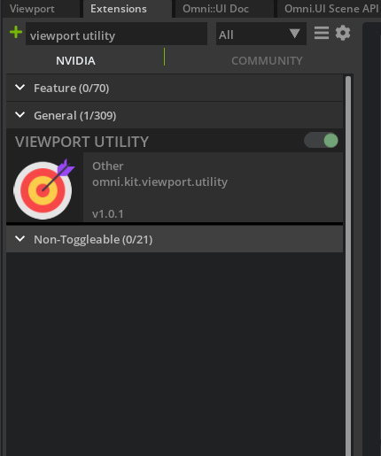
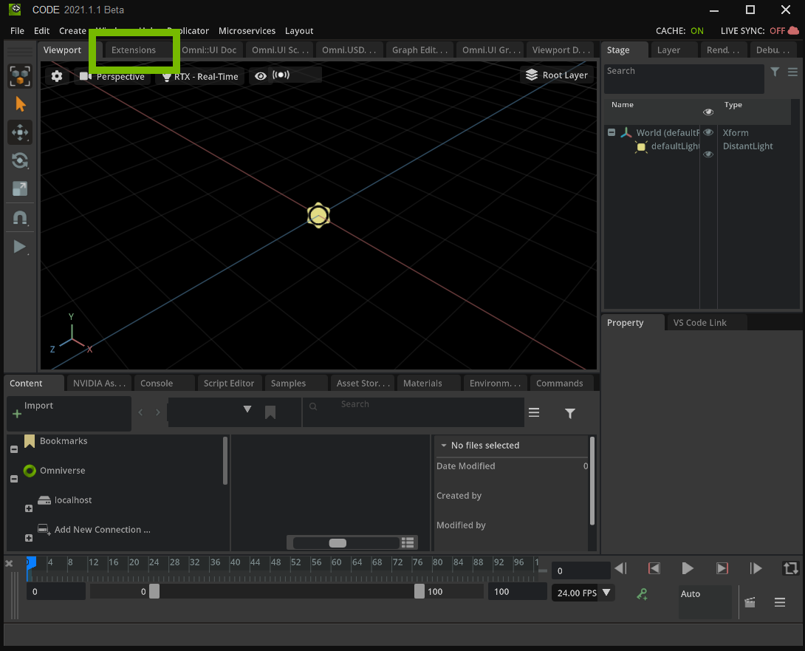
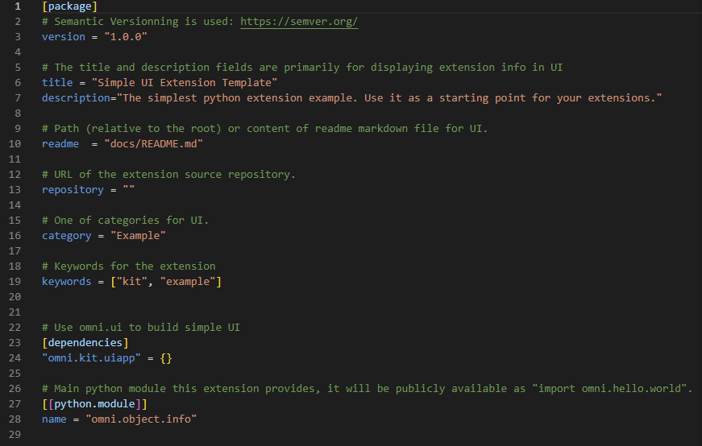
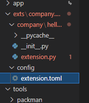
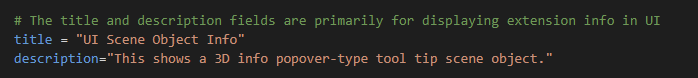
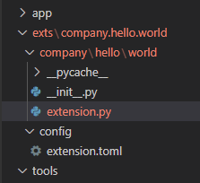
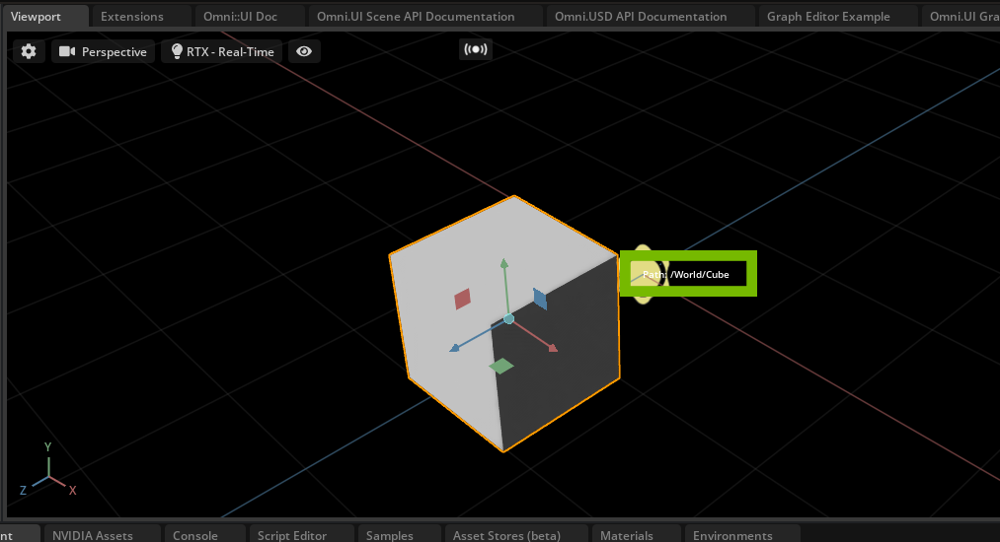
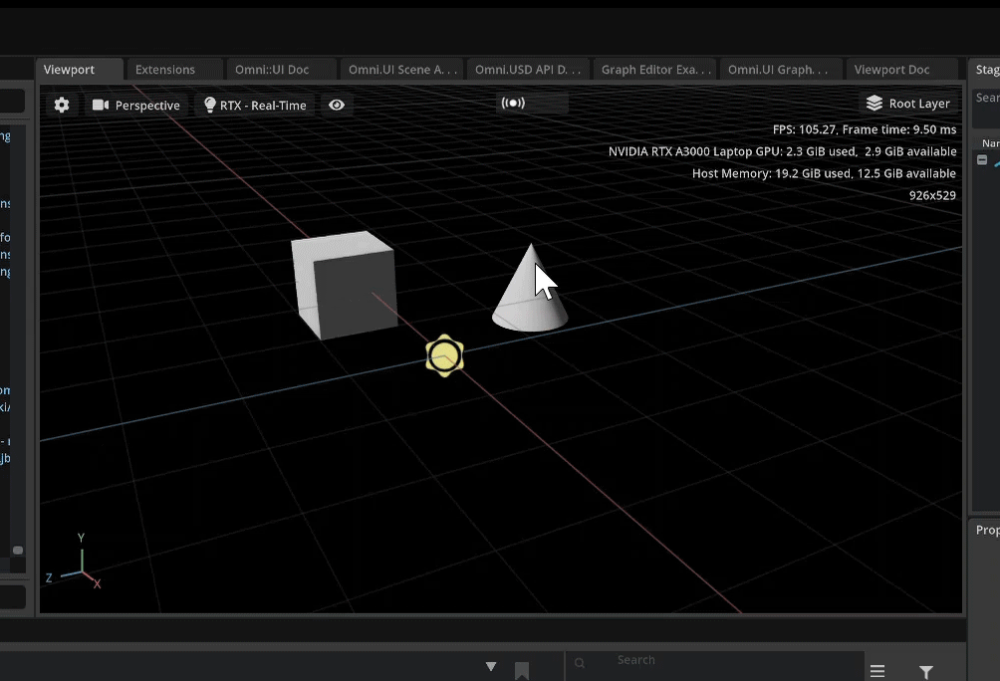

# How to make an extension to display Object Info

The object info extension displays the selected primitive’s Path and Type. This guide is great for first time extension builders.

  > NOTE: Visual Studio Code is the preferred IDE, hence forth we will be referring to it throughout this guide. 

# Learning Objectives

In this tutorial you learn how to:
- Create an extension in Omniverse Code
- Use Omniverse Viewport Library
- Display object info in the viewport
- Translate from World space to Local space
# Prerequisites
  We recommend that you complete these tutorials before moving forward:

- [Extension Environment Tutorial](https://github.com/NVIDIA-Omniverse/ExtensionEnvironmentTutorial)
- [How to make an extension by spawning primitives](https://github.com/NVIDIA-Omniverse/kit-extension-sample-spawn-prims)

> :exclamation: <span style="color:red"><b> WARNING: Check that Viewport Utility Extension is turned ON in the extension manager: </b></span> <br> 

# Step 1: Create an Extension

> **Note:** This is a review, if you know how to create an extension, feel free to skip this step.

For this guide, we will briefly go over how to create an extension. If you have not completed [How to make an extension by spawning primitives](https://github.com/NVIDIA-Omniverse/kit-extension-sample-spawnprims/blob/main/exts/omni.example.spawnPrims/tutorial/Spawn_PrimsTutorial.md) we recommend you pause here and complete that before moving forward.

## Step 1.1: Create the extension template

  In Omniverse Code navigate to the `Extensions` tab and create a new extension by clicking the ➕ icon in the upper left corner and select `New Extension Template Project`. 
  <br>

  

  <br>
  
  <icon>                       |  <new template>
:-------------------------:|:-------------------------:
  |  

<br>

A new extension template window and Visual Studio Code will open after you have select the folder location, folder name, and extension ID. 

## Step 1.2: Naming your extension

  Before beginning to code, navigate into `VS Code` and change how the extension is viewed in the **Extension Manager**. It's important to give your extension a title and description for the end user to understand the extension's purpose. 

 <br>

Inside of the `config` folder, locate the `extension.toml` file:


<br>

> **Note:** `extension.toml` is located inside of the `exts` folder you created for your extension. <br> 

<br>

Inside of this file, there is a title and description for how the extension will look in the **Extension Manager**. Change the title and description for the object info extension. Here is an example of how it looks in `VS code` and how it looks in the **Extension Manager**:



<br>


# Step 2: Print the active viewport

In this section, you import a viewport utility into `extension.py`. Then, you use it to store the active viewport. Finally, you display the active viewport to the console. 

## Step 2.1: Navigate to `extension.py`

Navigate to `extension.py`: 


 
This module contains boilerplate code for building a new extension:


## Step 2.2: Import the Viewport

Import the viewport:

  ```python
import omni.ext
import omni.ui as ui

# NEW: Import function to get the active viewport
from omni.kit.viewport.utility import get_active_viewport_window
  ```

Now that you've imported the viewport library, begin adding to the `MyExtension`class.

## Step 2.3: Get the activate viewport window 

In `on_startup()` set the `viewport_window` variable to the active viewport:

```python

class MyExtension(omni.ext.IExt):
    # ext_id is current extension id. It can be used with extension manager to query additional information, like where
    # this extension is located on filesystem.
    def on_startup(self, ext_id):
        print("[company.hello.world] MyExtension startup")

        # NEW: Get the active Viewport 
        viewport_window = get_active_viewport_window()

        self._window = ui.Window("My Window", width=300, height=300)
        with self._window.frame:
            with ui.VStack():
                ui.Label("Some Label")

                def on_click():
                    print("clicked!")

                ui.Button("Click Me", clicked_fn=lambda: on_click())
...   
```

At startup the active window is the default Viewport.
## Step 2.4: Print the active viewport
In `on_click()`, print the active viewport:

```python
def on_click():
    print(viewport_window)
```

Here, `on_click()` is acting as a convenience method that ensures you stored the active viewport

## Step 2.5: Review your changes 
Navigate to Omniverse Code, click the **Click Me** button inside of *My Window*, and locate "Viewport" in the *Console*.


Here you see the result of the print statement you added in the last step.

> **Tip:** If you encounter an error in your console, please refer to the [Viewport Utility tip in Prereqs](#prerequisites)

  <br>

## Step 2.6: Create the Object Info Model Script

In this new script, you will create the necessary information for the object information to be called, such as the selected primitive and tracking when the selection changes. you will also create a stage to be set later on. 
   
Create a file in the same file location as `extension.py` and name it `object_info_model.py`.

  <br>

  # Step 3: Object Model Script Code
  > **Note:** Work in the `object_info_model.py` script for this section. 

<br>

The objective of this step is to import and set the basic information that the `Manipulator` and `Viewport` will need to display on the selected primitive. 

## Step 3.1: Import scene from `omni.ui`
As with `extension.py`, import `scene` from `omni.ui` to utilize scene related utilities. Also import `omni.usd`.

```python
from omni.ui import scene as sc
import omni.usd
```

The `scene` variable will be used to get information regarding the selected primitive.

## Step 3.2: Begin setting up variables
Next, create a new class and begin setting variables. Create the `ObjInfoModel` below the imports:


```python
from omni.ui import scene as sc
import omni.usd

class ObjInfoModel(sc.AbstractManipulatorModel):
    """
    The model tracks the position and info of the selected object.
    """
```

## Step 3.3: Initialize `ObjInfoModel`
Use `__init__()` inside this class to initialize the object and events. In `__Init__()`, set the variable for the current selected primitive:

```python
from omni.ui import scene as sc
import omni.usd

class ObjInfoModel(sc.AbstractManipulatorModel):
    """
    The model tracks the position and info of the selected object.
    """
    def __init__(self) -> None:
        super().__init__()

        # Current selected prim
        self.prim = None

        self.position = [0, 0, 0]
```

## Step 3.4: Store the USD context
Finally, save the USD Context variable ([see here for more information on USD in Omniverse](https://docs.omniverse.nvidia.com/plat_omniverse/plat_omniverse/usd.html)), track when selection changes, and create a stage event to be used later on:

```python
from omni.ui import scene as sc
import omni.usd

class ObjInfoModel(sc.AbstractManipulatorModel):
    """
    The model tracks the position and info of the selected object.
    """
    def __init__(self) -> None:
        super().__init__()

        # Current selected prim
        self.prim = None

        self.position = [0, 0, 0]

        # Save the UsdContext name (we currently only work with a single Context)
        self.usd_context = omni.usd.get_context()

        # Track selection changes
        self.events = self.usd_context.get_stage_event_stream()
        self.stage_event_delegate = self.events.create_subscription_to_pop(
            self.on_stage_event, name="Object Info Selection Update"
        )

    def on_stage_event(self, event):
        """Called by stage_event_stream.  We only care about selection changes."""
        print("A stage event has occurred")
        
    def destroy(self):
        self.events = None
        self.stage_event_delegate.unsubscribe()
```

<br>

It's important to include `destroy()` in the model script. This will free the memory as well as clear the screen to prevent any accumlation of events. 

<br>

## Step 4: Work on the object model

> **Note:** Work in `extension.py` for this section. 

Now that you've have created `object_info_model.py`, you need to do a few things in `extension.py` to reflect the object model, such as import from the model class, create a reference and the object, then destroy the model when the extension is shutdown. 

## Step 4.1: Import extention.py
import into `extension.py` from `object_info_model.py`:

```python
import omni.ext
import omni.ui as ui
from omni.kit.viewport.utility import get_active_viewport_window

# NEW: import model class
from .object_info_model import ObjInfoModel

...
```

## Step 4.2: Reference the object model
Now reference the object model in `__init()__` of the `MyExtension` Class:

```python
class MyExtension(omni.ext.IExt):
    # ext_id is current extension id. It can be used with extension manager to query additional information, like where
    # this extension is located on filesystem.
    # NEW: Reference to the objModel when created so we can destroy it later
    def __init__(self) -> None:
        super().__init__()
        self.obj_model = None

    ...
```

## Step 4.3: Manage the object
This allows you to create the object in `on_startup()` and destroy it later on in `on_shutdown()`:

```python
 def on_startup(self, ext_id):
        print("[omni.objInfo.tutorial] MyExtension startup")

        # Get the active Viewport (which at startup is the default Viewport)
        viewport_window = get_active_viewport_window()
        
        # NEW: create the object
        self.obj_model = ObjInfoModel()
        
        self._window = ui.Window("My Window", width=300, height=300)
        with self._window.frame:
            with ui.VStack():
                ui.Label("Some Label")

                def on_click():
                    # Print to see that we did grab the active viewport
                    print(viewport_window)

                ui.Button("Click Me", clicked_fn=lambda: on_click())

    def on_shutdown(self):
        """Called when the extension is shutting down."""
        print("[omni.objInfo.tutorial] MyExtension shutdown")
        # NEW: Destroy the model when created
        self.obj_model.destroy()
```

<details>
<summary>Click here for the updated <b>extension.py</b> script  </summary>

```python
import omni.ext
import omni.ui as ui
from omni.kit.viewport.utility import get_active_viewport_window
from .object_info_model import ObjInfoModel

# Any class derived from `omni.ext.IExt` in top level module (defined in `python.modules` of `extension.toml`) will be
# instantiated when extension gets enabled and `on_startup(ext_id)` will be called. Later when extension gets disabled
# on_shutdown() is called.
class MyExtension(omni.ext.IExt):
    # ext_id is current extension id. It can be used with extension manager to query additional information, like where
    # this extension is located on filesystem.
    def __init__(self) -> None:
        super().__init__()
        self.obj_model = None

    def on_startup(self, ext_id):
        """Called when the extension is starting up.

        Args:
            ext_id: Extension ID provided by Kit.
        """
        print("[omni.objInfo.tutorial] MyExtension startup")

        # Get the active Viewport (which at startup is the default Viewport)
        viewport_window = get_active_viewport_window()
        
        # create the object
        self.obj_model = ObjInfoModel()
        
        
        self._window = ui.Window("My Window", width=300, height=300)
        with self._window.frame:
            with ui.VStack():
                ui.Label("Some Label")

                def on_click():
                    # Print to see that we did grab the active viewport
                    print(viewport_window)

                ui.Button("Click Me", clicked_fn=lambda: on_click())

    def on_shutdown(self):
        """Called when the extension is shutting down."""
        print("[omni.objInfo.tutorial] MyExtension shutdown")
        # Destroy the model when created
        self.obj_model.destroy()
        
```

</details>

<br>

# Step 5: Set the Stage

At this point, there is nothing viewable in `Omniverse Code` as you have not created a stage for the viewport to reference an event happening. In this section you will set that stage by getting a reference to the selected object's information. By the end of step 4 you should be able to view the object info in the viewport.

> **Note:** Work in `object_info_model.py` for this section.

At this point, you have created the start of the Stage Event in `object_info_model.py` but there is nothing happening in the event. 

Replace what's in `on_stage_event` with the variable for the primitive path and where that path information is located:

```python
def on_stage_event(self, event):
    """Called by stage_event_stream."""
    # NEW
    prim_path = self.usd_context.get_selection().get_selected_prim_paths()
    if not prim_path:
        return
    stage = self.usd_context.get_stage()
    prim = stage.GetPrimAtPath(prim_path[0])
    self.prim = prim
    self.current_path = prim_path[0]
    print("Primitive: " + str(prim))

        ...
```

You can check that this is working by navigating back to `Omniverse Code` and create a primitive in the viewport. When the primitive is created, it's path should display at the bottom. 


# Step 6: Object Path Name in Scene


In this step you initialize another `__init__()` method in a new class to represent the position. This position will be taken directly from USD when requested. 

## Step 6.1: Nest the `PositionItem` class
Nest the new `PositionItem` class inside of the `ObjInfoModel` class as so:

```python
class ObjInfoModel(sc.AbstractManipulatorModel):
    """
    The model tracks the position and info of the selected object.
    """
    
    # NEW: needed for when we call item changed
    class PositionItem(sc.AbstractManipulatorItem):
        """
        The Model Item represents the position. It doesn't contain anything
        because we take the position directly from USD when requesting.
        """
        def __init__(self) -> None:
            super().__init__()
            self.value = [0, 0, 0]

    ...
```

## Step 6.2: Set path and position
Set the current path and update the position from `[0,0,0]` to hold position of the object created:

```python
def __init__(self) -> None:
    super().__init__()

    # Current selected prim
    self.prim = None

    #NEW: set to current path. 
    self.current_path = ""

    # NEW: update to hold position obj created
    self.position = ObjInfoModel.PositionItem()

    # Save the UsdContext name (we currently only work with a single Context)
    self.usd_context = omni.usd.get_context()

    # Track selection changes
    self.events = self.usd_context.get_stage_event_stream()
    self.stage_event_delegate = self.events.create_subscription_to_pop(
        self.on_stage_event, name="Object Info Selection Update"
    )
        ...
```

## Step 6.3: Check the stage
After updating the position, check the stage when the selection of an object is changed. Do this with an `"if"` statement in `on_stage_event()`, like so:

```python
    def on_stage_event(self, event):
        # NEW: if statement to only check when selection changed
        if event.type == int(omni.usd.StageEventType.SELECTION_CHANGED):        
            prim_path = self.usd_context.get_selection().get_selected_prim_paths()
            if not prim_path:
                return
            stage = self.usd_context.get_stage()
            prim = stage.GetPrimAtPath(prim_path[0])
            self.prim = prim
            self.current_path = prim_path[0]

            # NEW: Update on item change
            # Position is changed because new selected object has a different position
            self._item_changed(self.position)
            ...
```

## Step 6.4: Set identifiers
Finally, create a new function underneath `on_stage_event()` to set the identifiers:

```python
# NEW: function to get identifiers from the model
def get_item(self, identifier):
    if identifier == "name":
        return self.current_path

def destroy(self):
    self.events = None
    self.stage_event_delegate.unsubscribe()
```

<details>
<summary>Click here for the updated <b>object_info_model.py</b> script  </summary>

```python
from omni.ui import scene as sc
import omni.usd


class ObjInfoModel(sc.AbstractManipulatorModel):
    """
    The model tracks the position and info of the selected object.
    """
    
    class PositionItem(sc.AbstractManipulatorItem):
        """
        The Model Item represents the position. It doesn't contain anything
        because we take the position directly from USD when requesting.
        """
        def __init__(self) -> None:
            super().__init__()
            self.value = [0, 0, 0]
 
    def __init__(self) -> None:
        super().__init__()

        # Current selected prim
        self.prim = None
        
        self.current_path = ""
        
        self.position = ObjInfoModel.PositionItem()
        
        self.usd_context = omni.usd.get_context()

        # Track selection changes
        self.events = self.usd_context.get_stage_event_stream()
        self.stage_event_delegate = self.events.create_subscription_to_pop(
            self.on_stage_event, name="Object Info Selection Update"
        )

    def on_stage_event(self, event):
        if event.type == int(omni.usd.StageEventType.SELECTION_CHANGED):
        
            prim_path = self.usd_context.get_selection().get_selected_prim_paths()
            if not prim_path:
                return
            stage = self.usd_context.get_stage()
            prim = stage.GetPrimAtPath(prim_path[0])
            self.prim = prim
            self.current_path = prim_path[0]

            # Position is changed because new selected object has a different position
            self._item_changed(self.position)
            
    def get_item(self, identifier):
        if identifier == "name":
            return self.current_path

    def destroy(self):
        self.events = None
        self.stage_event_delegate.unsubscribe()
```

</details>

<br>

# Step 7: The Manipulator Class

In this step you will create a new script that references the manipulator class for the object info, which will be displayed in the viewport in another step ([see here for more information on the Manipulator Class in Omniverse](https://docs.omniverse.nvidia.com/py/kit/source/extensions/omni.ui.scene/docs/Manipulator.html)).<br>

## Step 7.1: Create `object_info_manipulator.py`
Similar to when you created `object_info_model.py`, create a new script in the same folder and name it `object_info_manipulator.py`.

The objective of this script is to grab the reference of the object model's details, such as name and path, to be displayed in the viewport through `on_build()`. This is important as it connects the nested data in `object_info_model.py`. 

## Step 7.2: Import ui
import from omni.ui:

```python
from omni.ui import scene as sc
import omni.ui as ui
```

## Step 7.3: Create `ObjectInfoManipilator`
Create the `ObjInfoManipulator` class:

```python
...

class ObjInfoManipulator(sc.Manipulator):
    """Manipulator that displays the object path and material assignment
    with a leader line to the top of the object's bounding box.
    """
```

## Step 7.4 Populate `ObjInfoManipulator`
Populate the `ObjInfoManipulator` class with `on_build()`:

```python
...

def on_build(self):
    """Called when the model is changed and rebuilds the whole manipulator"""
    
    if not self.model:
        return
    
    # If we don't have a selection then just return
    if self.model.get_item("name") == "":
        return

    position = [0, 0, 0]
    
    sc.Label(f"Path: {self.model.get_item('name')}")
```
This method checks if there is a selection and creates a label for the path.

## Step 7.5 Clean up memory
Before moving on from `object_info_manipulator.py`, Navigate to the end of the file and call `invalidate()`.

```python
...

    def on_model_updated(self, item):
        # Regenerate the manipulator
        self.invalidate()
```

This method purges old memory when the model is updated. 

<details>
<summary>Click here for the full <b>object_info_manipulator.py</b> script  </summary>

```python
from omni.ui import scene as sc
import omni.ui as ui


class ObjInfoManipulator(sc.Manipulator):
    """Manipulator that displays the object path and material assignment
    with a leader line to the top of the object's bounding box.
    """
    
    def on_build(self):
        """Called when the model is changed and rebuilds the whole manipulator"""
        
        if not self.model:
            return
        
        # If we don't have a selection then just return
        if self.model.get_item("name") == "":
            return

        position = [0, 0, 0]
        
        sc.Label(f"Path: {self.model.get_item('name')}")


    def on_model_updated(self, item):
        # Regenerate the manipulator
        self.invalidate()
```

</details>

<br>

# Step 8: Displaying information in the viewport

In this step, you will create a new script that references the gathered information from other scripts and calls them to display in the active viewport. 

## Step 8.1: Create new file 
Add this script to the same folder and name it `viewport_scene.py`.

Import the scene from `omni.ui`, the object Model and object Manipulator:

```python
from omni.ui import scene as sc
import omni.ui as ui

from .object_info_manipulator import ObjInfoManipulator
from .object_info_model import ObjInfoModel
```

## Step 8.2 Create new class
Create the `ViewportSceneInfo` class and initialize it with `__init__()`:

```python
...
class ViewportSceneInfo():
    """The Object Info Manipulator, placed into a Viewport"""
    def __init__(self, viewport_window, ext_id) -> None:
        self.scene_view = None
        self.viewport_window = viewport_window
```

## Step 8.3 Display object information
To display the information, set the default SceneView. Then add the manipulator into the SceneView's scene and register it with the Viewport:

```python
...
class ViewportSceneInfo():
    """The Object Info Manipulator, placed into a Viewport"""
    def __init__(self, viewport_window, ext_id) -> None:
        self.scene_view = None
        self.viewport_window = viewport_window

        # NEW: Create a unique frame for our SceneView
        with self.viewport_window.get_frame(ext_id):
            # Create a default SceneView (it has a default camera-model)
            self.scene_view = sc.SceneView()
            # Add the manipulator into the SceneView's scene
            with self.scene_view.scene:
                ObjInfoManipulator(model=ObjInfoModel())
            # Register the SceneView with the Viewport to get projection and view updates
            self.viewport_window.viewport_api.add_scene_view(self.scene_view)
```

## Step 8.4: Clean up scene and viewport memory
Before closing out on `viewport_scene.py` don't forget to call `destroy()` to clear the scene and un-register our unique SceneView from the Viewport. 

```python
...
    def __del__(self):
        self.destroy()

    def destroy(self):
        if self.scene_view:
            # Empty the SceneView of any elements it may have
            self.scene_view.scene.clear()
            # un-register the SceneView from Viewport updates
            if self.viewport_window:
                self.viewport_window.viewport_api.remove_scene_view(self.scene_view)
        # Remove our references to these objects
        self.viewport_window = None
        self.scene_view = None
```

<details>
<summary>Click here for the full <b>viewport_scene.py</b> script  </summary>

```python
from omni.ui import scene as sc
import omni.ui as ui

from .object_info_manipulator import ObjInfoManipulator
from .object_info_model import ObjInfoModel

class ViewportSceneInfo():
    """The Object Info Manipulator, placed into a Viewport"""
    def __init__(self, viewport_window, ext_id) -> None:
        self.scene_view = None
        self.viewport_window = viewport_window

        # Create a unique frame for our SceneView
        with self.viewport_window.get_frame(ext_id):
            # Create a default SceneView (it has a default camera-model)
            self.scene_view = sc.SceneView()

            # Add the manipulator into the SceneView's scene
            with self.scene_view.scene:
                ObjInfoManipulator(model=ObjInfoModel())
            # Register the SceneView with the Viewport to get projection and view updates
            self.viewport_window.viewport_api.add_scene_view(self.scene_view)

    def __del__(self):
        self.destroy()

    def destroy(self):
        if self.scene_view:
            # Empty the SceneView of any elements it may have
            self.scene_view.scene.clear()
            # un-register the SceneView from Viewport updates
            if self.viewport_window:
                self.viewport_window.viewport_api.remove_scene_view(self.scene_view)
        # Remove our references to these objects
        self.viewport_window = None
        self.scene_view = None
```

</details>

<br>


# Step 9: Cleaning up extension.py
> **Note:** Work in `extension.py` for this section.

Now that you've have established a Viewport, you need to clean up `extension.py` to reflect these changes. You will remove some of the references you made previously and ensure that the viewport is flushed out on shutdown.

## Step 9.1: Import class
Import `viewport_scene.py` and its' class:

```python
import omni.ext
from omni.kit.viewport.utility import get_active_viewport_window
# NEW:
from .viewport_scene import ViewportSceneInfo
```

## Step 9.2: Remove `object_info_model` import
Remove the import from object_info_model as it's no longer will be used:

```python
# REMOVE
from .object_info_model import ObjInfoModel
```

## Step 9.3: Remove reference
As you removed the import from `object_info_model.py`, remove its' reference in the `__init__()` method and replace it with the `viewport_scene`:

```python

class MyExtension(omni.ext.IExt):
    # ext_id is current extension id. It can be used with extension manager to query additional information, like where
    # this extension is located on filesystem.
    def __init__(self) -> None:
        super().__init__()
        # NEW: removed reference to objmodelinfo and replaced with viewportscene
        self.viewport_scene = None
```

## Step 9.4: Remove start up code
Remove the start up code where you reference to create the object and the code following it that creates the extension window and **Cick Me** button:

```python
...
    def on_startup(self, ext_id):
       # # # !REMOVE! # # #
        print("[omni.objInfo.tutorial] MyExtension startup")

        viewport_window = get_active_viewport_window()
        
        self.obj_model = ObjInfoModel()
       
        self._window = ui.Window("My Window", width=300, height=300)
        with self._window.frame:
            with ui.VStack():
                ui.Label("Some Label")

                def on_click():
                    print(viewport_window)

                ui.Button("Click Me", clicked_fn=lambda: on_click())
         # # # END # # #

        # # # !REPLACE WITH! # # #
        viewport_window = get_active_viewport_window()

        self.viewport_scene = ViewportSceneInfo(viewport_window, ext_id)
        # # # END # # #

```

<details>
<summary>Click to view final <b>on_startup</b> code</summary>

```python
    def on_startup(self, ext_id):
        viewport_window = get_active_viewport_window()

        self.viewport_scene = ViewportSceneInfo(viewport_window, ext_id)
```

</details>

<br>


## Step 9.5: Clean up viewport memory
Finally, update `on_shutdown()` to clean up the viewport:

```python
...
    def on_shutdown(self):
        """Called when the extension is shutting down."""
        # NEW: updated to destroy viewportscene
        if self.viewport_scene:
            self.viewport_scene.destroy()
            self.viewport_scene = None
```


<details>
<summary>Click to view the updated <b>extension.py</b> </summary>

```python
import omni.ext
import omni.ui as ui
from omni.kit.viewport.utility import get_active_viewport_window

from .viewport_scene import ViewportSceneInfo

class MyExtension(omni.ext.IExt):
    """Creates an extension which will display object info in 3D
    over any object in a UI Scene.
    """
    # ext_id is current extension id. It can be used with extension manager to query additional information, like where
    # this extension is located on filesystem.
    def __init__(self) -> None:
        super().__init__()
        self.viewport_scene = None

    def on_startup(self, ext_id):
        viewport_window = get_active_viewport_window()

        self.viewport_scene = ViewportSceneInfo(viewport_window, ext_id)

    def on_shutdown(self):
        """Called when the extension is shutting down."""
        if self.viewport_scene:
            self.viewport_scene.destroy()
            self.viewport_scene = None

```

</details>

<br>


## Congratulations! 

You should be able to create a primitive in the viewport and view the Object Info at the world position `[0,0,0]`.



>💡 Tip: If you are logging any errors in the Console in `Omniverse Code` after updating `extention.py` try refreshing the application.

<br>

# Step 10: Displaying Object Info in Local Space

At this stage, the Object Info is displaying in the viewport but it is displayed in World Space. This means that regardless of where your object is located in the World, the info will always be displayed at [0,0,0]. In the next few steps you will convert this into Local Space. By the end of step 4 the Object Info should follow the object. 

  ## Step 10.1: Import USD variables

  > **Note:** Work in `object_info_model.py` for this section.

  In this step and the following steps, we will be doing a little bit of math. Before we jump into that though, let's import what we need to make this work into `object_info_model.py`. We will be importing primarily what we need from USD and we will place these imports at the top of the file:

  ```python
# NEW IMPORTS
from pxr import Usd
from pxr import UsdGeom

from omni.ui import scene as sc
import omni.usd
  ```

## Step 10.2: Add identifier
Add a new identifier for the position in `get_item()`:

```python
...
def get_item(self, identifier):
    if identifier == "name":
        return self.current_path
    # NEW: new identifier
    elif identifier == "position":
        return self.position
```

 ## Step 10.3: Add `get_as_floats()`
 After adding to `get_item()`, create a new function to get the position of the primitive. Call this function `get_as_floats()`:

```python
...
    # NEW: new function to get position of prim
    def get_as_floats(self, item):
        if item == self.position:
            # Requesting position
            return self.get_position()
        if item:
            # Get the value directly from the item
            return item.value

        return []
    # END NEW
```
This function requests the position and value from the item.

## Step 10.4: Define `get_position()`:
Although you created this new function to get the position, you've yet to define the position. The position will be defined in a new function based on the bounding box we will create for the primitive. Name the new function `get_position()` and use it to get the stage:

```python
...
    # NEW: new function that defines the position based on the bounding box of the primitive
    def get_position(self):
        stage = self.usd_context.get_stage()
        if not stage or self.current_path == "":
            return [0, 0, 0]
```

## Step 10.5: Get the position
Use `get_position()` to get the position directly form USD using the bounding box:
```python
...
def get_position(self):
    stage = self.usd_context.get_stage()
    if not stage or self.current_path == "":
        return [0, 0, 0]

    # Get position directly from USD
    prim = stage.GetPrimAtPath(self.current_path)
    box_cache = UsdGeom.BBoxCache(Usd.TimeCode.Default(), includedPurposes=[UsdGeom.Tokens.default_])
    bound = box_cache.ComputeWorldBound(prim)
    range = bound.ComputeAlignedBox()
    bboxMin = range.GetMin() #bbox stands for bounding box
    bboxMax = range.GetMax()
```

 ## Step 10.6: Find the top center
 Finally, find the top center of the bounding box. Additionally, add a small offset upward so that the information is not overlapping our primitive. Append this code to `get_position()`:

```python
...
    def get_position(self):
        stage = self.usd_context.get_stage()
        if not stage or self.current_path == "":
            return [0, 0, 0]
            
        # Get position directly from USD
        prim = stage.GetPrimAtPath(self.current_path)
        box_cache = UsdGeom.BBoxCache(Usd.TimeCode.Default(), includedPurposes=[UsdGeom.Tokens.default_])
        bound = box_cache.ComputeWorldBound(prim)
        range = bound.ComputeAlignedBox()
        bboxMin = range.GetMin() #bbox stands for bounding box
        bboxMax = range.GetMax()

        # NEW
        # Find the top center of the bounding box and add a small offset upward.
        x_Pos = (bboxMin[0] + bboxMax[0]) * 0.5
        y_Pos = bboxMax[1] + 5 
        z_Pos = (bboxMin[2] + bboxMax[2]) * 0.5
        position = [x_Pos, y_Pos, z_Pos]
        return position 
```

<details>
<summary>Click here for the final <b>object_info_model.py</b> code for this step.</summary>

```python
from pxr import Usd
from pxr import UsdGeom
from omni.ui import scene as sc
import omni.usd


class ObjInfoModel(sc.AbstractManipulatorModel):
    """
    The model tracks the position and info of the selected object.
    """
    class PositionItem(sc.AbstractManipulatorItem):
        """
        The Model Item represents the position. It doesn't contain anything
        because we take the position directly from USD when requesting.
        """
        def __init__(self) -> None:
            super().__init__()
            self.value = [0, 0, 0]

    def __init__(self) -> None:
        super().__init__()

        # Current selected prim
        self.prim = None
        self.current_path = ""

      
        self.position = ObjInfoModel.PositionItem()

        # Save the UsdContext name (we currently only work with a single Context)
        self.usd_context = omni.usd.get_context()

        # Track selection changes
        self.events = self.usd_context.get_stage_event_stream()
        self.stage_event_delegate = self.events.create_subscription_to_pop(
            self.on_stage_event, name="Object Info Selection Update"
        )

    def on_stage_event(self, event):
        """Called by stage_event_stream.  We only care about selection changes."""
        if event.type == int(omni.usd.StageEventType.SELECTION_CHANGED):
            prim_path = self.usd_context.get_selection().get_selected_prim_paths()
            if not prim_path:
                return
            stage = self.usd_context.get_stage()
            prim = stage.GetPrimAtPath(prim_path[0])
            self.prim = prim
            self.current_path = prim_path[0]

            # Position is changed because new selected object has a different position
            self._item_changed(self.position)

    def get_item(self, identifier):
        if identifier == "name":
            return self.current_path
        elif identifier == "position":
            return self.position
      

    def get_as_floats(self, item):
        if item == self.position:
            # Requesting position
            return self.get_position()
        if item:
            # Get the value directly from the item
            return item.value

        return []

    # defines the position based on the bounding box of the primitive
    def get_position(self):
        stage = self.usd_context.get_stage()
        if not stage or self.current_path == "":
            return [0, 0, 0]
        
        # Get position directly from USD
        prim = stage.GetPrimAtPath(self.current_path)
        box_cache = UsdGeom.BBoxCache(Usd.TimeCode.Default(), includedPurposes=[UsdGeom.Tokens.default_])
        bound = box_cache.ComputeWorldBound(prim)
        range = bound.ComputeAlignedBox()
        bboxMin = range.GetMin() #bbox stands for bounding box
        bboxMax = range.GetMax()

        # Find the top center of the bounding box and add a small offset upward.
        x_Pos = (bboxMin[0] + bboxMax[0]) * 0.5
        y_Pos = bboxMax[1] + 5 
        z_Pos = (bboxMin[2] + bboxMax[2]) * 0.5
        position = [x_Pos, y_Pos, z_Pos]
        return position
    
    def destroy(self):
        self.events = None
        self.stage_event_delegate.unsubscribe()
```

</details>

<br>

# Step 11: Updating Object Info Manipulator

> **Note:** You are working in `object_info_manipulator.py` for this section.

In this step, you need to update the position value and to position the Object Info at the object's origin and then offset it in the up-direction. You'll also want to make sure that it is scaled properly in the viewport. 

Fortunately, this does not require a big alteration to our existing code. You merely need to add onto the `on_build` function in the `object_info_manipulator.py` script:

  ```python
  ...
def on_build(self):
    """Called when the model is changed and rebuilds the whole manipulator"""
    
    if not self.model:
        return
    
    # If we don't have a selection then just return
    if self.model.get_item("name") == "":
        return

    # NEW: update to position value and added transform functions to position the Label at the object's origin and +5 in the up direction
    # we also want to make sure it is scaled properly
    position = self.model.get_as_floats(self.model.get_item("position"))

    with sc.Transform(transform=sc.Matrix44.get_translation_matrix(*position)):
        with sc.Transform(scale_to=sc.Space.SCREEN):
            sc.Label(f"Path: {self.model.get_item('name')}")
            
    sc.Label(f"Path: {self.model.get_item('name')}")

  ...
  ```

# Step 12: Moving the Text with the Primitive

In the viewport of `Omniverse Code`, the text does not follow our object despite positioning the label at the top center of the bounding box of the object. The text also remains in the viewport even when the object is no longer selected. In this final step we will be guiding you to cleaning up these issues.

> **Note:** Work in `object_info_model.py` for this section

## 12.1: Import tf
Place one more import into `object_info_model.py` at the top of the file, as so:

```python
# NEW 
from pxr import Tf

from pxr import Usd
from pxr import UsdGeom

from omni.ui import scene as sc
import omni.usd
```

### 12.2: Store the stage listener 
Add a new variable to grab the stage listener under the second `__init__()` method:

```python
...
def __init__(self) -> None:
    super().__init__()

    # Current selected prim
    self.prim = None
    self.current_path = ""

    # NEW: new variable
    self.stage_listener = None

    self.position = ObjInfoModel.PositionItem()
...
```

### 12.3: Add `on_stage_event()` 
Now, you need to add some code to `on_stage_event()`.

You need to do a few things in this function, such as checking if the `prim_path` exists, turn off the manipulator if it does not, then check if the selected item is a `prim` and remove the stage listener if not. Additionally,  notice a change with the stage listener when the object has changed.

```python
...
    def on_stage_event(self, event):
        """Called by stage_event_stream.  We only care about selection changes."""
        if event.type == int(omni.usd.StageEventType.SELECTION_CHANGED):
            prim_path = self.usd_context.get_selection().get_selected_prim_paths()

            # NEW: if prim path doesn't exist we want to make sure nothing shows up because that means we do not have a prim selected
            if not prim_path:
                # This turns off the manipulator when everything is deselected
                self.current_path = ""
                self._item_changed(self.position)
                return

            stage = self.usd_context.get_stage()
            prim = stage.GetPrimAtPath(prim_path[0])

            # NEW: if the selected item is not a prim we need to revoke the stagelistener since we don't need to update anything
            if not prim.IsA(UsdGeom.Imageable):
                self.prim = None
                # Revoke the Tf.Notice listener, we don't need to update anything
                if self.stage_listener:
                    self.stage_listener.Revoke()
                    self.stage_listener = None
                return  

            # NEW: Register a notice when objects in the scene have changed
            if not self.stage_listener:
                self.stage_listener = Tf.Notice.Register(Usd.Notice.ObjectsChanged, self.notice_changed, stage)

```


<details>
<summary>Click here for the full <b>on_stage_event</b> function </summary>

```python
    def on_stage_event(self, event):
        """Called by stage_event_stream.  We only care about selection changes."""
        if event.type == int(omni.usd.StageEventType.SELECTION_CHANGED):
            prim_path = self.usd_context.get_selection().get_selected_prim_paths()

            if not prim_path:
                self.current_path = ""
                self._item_changed(self.position)
                return
 
            stage = self.usd_context.get_stage()
            prim = stage.GetPrimAtPath(prim_path[0])

            if not prim.IsA(UsdGeom.Imageable):
                self.prim = None
                if self.stage_listener:
                    self.stage_listener.Revoke()
                    self.stage_listener = None
                return  

            if not self.stage_listener:
                self.stage_listener = Tf.Notice.Register(Usd.Notice.ObjectsChanged, self.notice_changed, stage)
 
```

</details>


## 12.4: Setup multi-object selection
In the final step, create a new function that will be called if there are multiple objects in the scene then it will loop through all objects until the selected one is found. Place this new function after `get_position()` and name it `notice_changed()`. After this, the path should follow the selected object as well as not stay in the viewport when object is deselected:

```python
...
    # NEW: function that will get called when objects change in the scene. We only care about our selected object so we loop through all notices that get passed along until we find ours
    def notice_changed(self, notice: Usd.Notice, stage: Usd.Stage) -> None:
        """Called by Tf.Notice.  Used when the current selected object changes in some way."""
        for p in notice.GetChangedInfoOnlyPaths():
            if self.current_path in str(p.GetPrimPath()):
                self._item_changed(self.position)

...
```

<details>
<summary>Click here for the final <b>object_info_model.py</b> code </summary>

```python
from pxr import Tf
from pxr import Usd
from pxr import UsdGeom

from omni.ui import scene as sc
import omni.usd


class ObjInfoModel(sc.AbstractManipulatorModel):
    """
    The model tracks the position and info of the selected object.
    """
    class PositionItem(sc.AbstractManipulatorItem):
        """
        The Model Item represents the position. It doesn't contain anything
        because we take the position directly from USD when requesting.
        """
        def __init__(self) -> None:
            super().__init__()
            self.value = [0, 0, 0]

    def __init__(self) -> None:
        super().__init__()

        # Current selected prim
        self.prim = None
        self.current_path = ""

        self.stage_listener = None

        self.position = ObjInfoModel.PositionItem()

        # Save the UsdContext name (we currently only work with a single Context)
        self.usd_context = omni.usd.get_context()

        # Track selection changes
        self.events = self.usd_context.get_stage_event_stream()
        self.stage_event_delegate = self.events.create_subscription_to_pop(
            self.on_stage_event, name="Object Info Selection Update"
        )

    def on_stage_event(self, event):
        """Called by stage_event_stream.  We only care about selection changes."""
        if event.type == int(omni.usd.StageEventType.SELECTION_CHANGED):
            prim_path = self.usd_context.get_selection().get_selected_prim_paths()

            if not prim_path:
                self.current_path = ""
                self._item_changed(self.position)
                return
            stage = self.usd_context.get_stage()
            prim = stage.GetPrimAtPath(prim_path[0])

            if not prim.IsA(UsdGeom.Imageable):
                self.prim = None
                if self.stage_listener:
                    self.stage_listener.Revoke()
                    self.stage_listener = None
                return 

            if not self.stage_listener:
                self.stage_listener = Tf.Notice.Register(Usd.Notice.ObjectsChanged, self.notice_changed, stage)

            self.prim = prim
            self.current_path = prim_path[0]

            # Position is changed because new selected object has a different position
            self._item_changed(self.position)

    def get_item(self, identifier):
        if identifier == "name":
            return self.current_path
        elif identifier == "position":
            return self.position

    def get_as_floats(self, item):
        if item == self.position:
            # Requesting position
            return self.get_position()
        if item:
            # Get the value directly from the item
            return item.value

        return []

    def get_position(self):
        """Returns position of currently selected object"""
        stage = self.usd_context.get_stage()
        if not stage or self.current_path == "":
            return [0, 0, 0]

        # Get position directly from USD
        prim = stage.GetPrimAtPath(self.current_path)
        box_cache = UsdGeom.BBoxCache(Usd.TimeCode.Default(), includedPurposes=[UsdGeom.Tokens.default_])
        bound = box_cache.ComputeWorldBound(prim)
        range = bound.ComputeAlignedBox()
        bboxMin = range.GetMin()
        bboxMax = range.GetMax()

        # Find the top center of the bounding box and add a small offset upward.
        x_Pos = (bboxMin[0] + bboxMax[0]) * 0.5
        y_Pos = bboxMax[1] + 5 
        z_Pos = (bboxMin[2] + bboxMax[2]) * 0.5
        position = [x_Pos, y_Pos, z_Pos]
        return position

     # loop through all notices that get passed along until we find selected
    def notice_changed(self, notice: Usd.Notice, stage: Usd.Stage) -> None:
        """Called by Tf.Notice.  Used when the current selected object changes in some way."""
        for p in notice.GetChangedInfoOnlyPaths():
            if self.current_path in str(p.GetPrimPath()):
                self._item_changed(self.position)

    def destroy(self):
        self.events = None
        self.stage_event_delegate.unsubscribe()
```

</details>


# Congratulations! 

Your viewport should now display the object info above the selected object and move with the primitive in the scene. You have successfully created the Object Info Extension!

