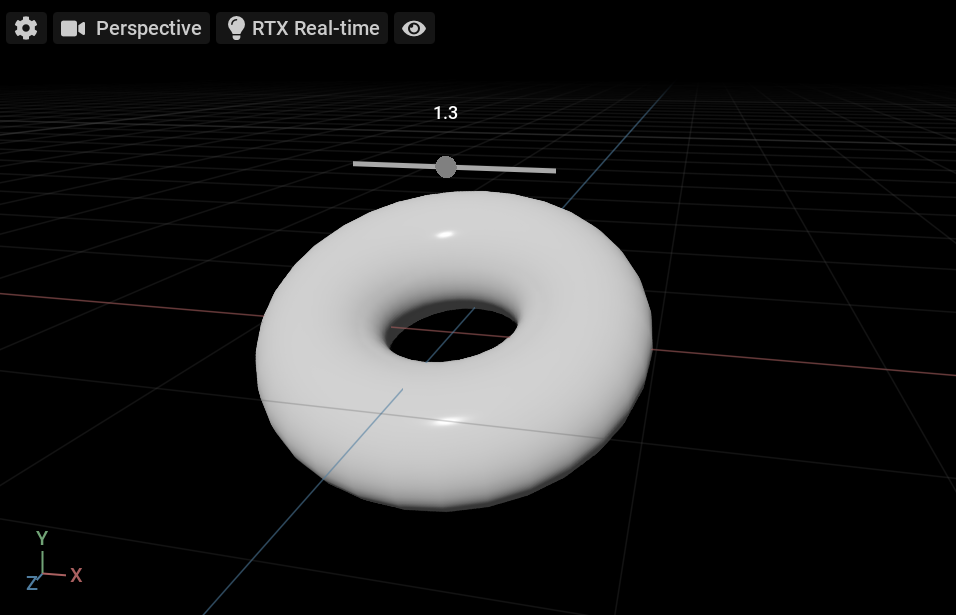
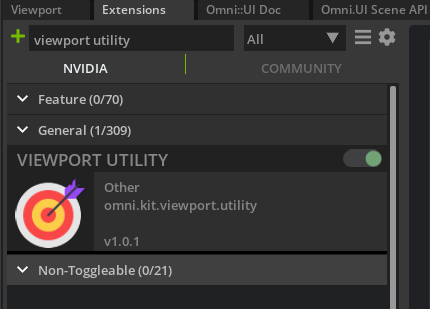
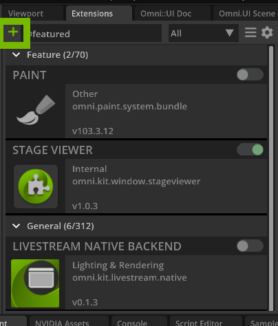
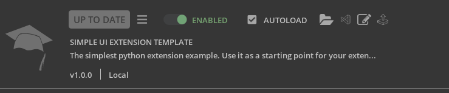
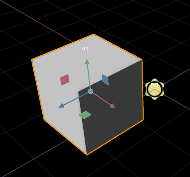
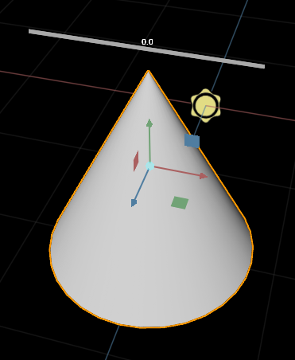
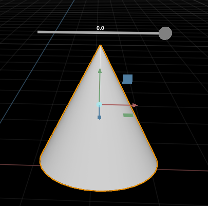

# How to make a Slider Manipulator
   
In this guide you will learn how to draw a 3D slider in the viewport that overlays on the top of the bounding box of the selected prim. This slider will control the scale of the prim with a custom manipulator, model, and gesture. When the slider is changed, the manipulator processes the custom gesture that changes the data in the model, which changes the data directly in the USD stage. 



# Learning Objectives
 - Create an extension
 - Import omni.ui and USD
 - Set up Model and Manipulator 
 - Create Gestures
 - Create a working scale slider

 
 # Prereqs
 To help understand the concepts used in this guide, it is recommended that you compelte the following:

- [Extension Environment Tutorial](https://github.com/NVIDIA-Omniverse/ExtensionEnvironmentTutorial)
- [Spawning Prims Tutorial](https://github.com/NVIDIA-Omniverse/kit-extension-sample-spawn-prims)
- [Display Object Info Tutorial](https://github.com/NVIDIA-Omniverse/kit-extension-sample-ui-scene/tree/main/exts/omni.example.ui_scene.object_info)

:exclamation: <span style="color:red"><b>WARNING:</b> Check that Viewport Utility Extension is turned ON in the extension manager: </span>


# Step 1: Create the extension

In this section, you will walk you through how to create a new extension in Omniverse Code.

## Step 1.1: Create new extension template

In Omniverse Code navigate to the `Extensions` tab and create a new extension by clicking the ➕ icon in the upper left corner and select `New Extension Template Project`.

 


<br>

A new extension template window and Visual Studio Code will open after you have selected the folder location, folder name, and extension ID.

## Step 1.2: Naming your extension

In the extension manager, you may have noticed that each extension has a title and description:



You can change this in the `extension.toml` file by navigating to `VS Code` and editing the file there. It is important that you give our extension a detailed title and summary for the end user to understand what our extension will accomplish or display. Here is how you changed it for this guide:

```python
# The title and description fields are primarily for displaying extension info in UI
title = "UI Scene Slider Manipulator"
description="Interactive example of the slider manipulator with omni.ui.scene"
```
## Step 2: Model script

In this step you will be creating the `slider_model.py` script where you will be tracking the current selected prim, calling the stage event, and getting the position directly from USD.

This script will be made up of many lines so be sure to review the <b>":memo:Code Checkpoint"</b> for updated modules of the script at various steps.

### Step 2.1: Import omni.ui and USD

After creating `slider_model.py` in the same folder as `extension.py`, import the omni.ui and the necessary USD, as follows:

```python
from omni.ui import scene as sc
from pxr import Tf
from pxr import Gf
from pxr import Usd
from pxr import UsdGeom
import omni.usd
```

### Step 2.2: Model and Position Item Class

Next, let's set up our Model class and Position Item class. The Model class tracks the positon and scale of the selected object and because you will be obtaining the position directly from USD, the Position Item class doesn't contain anything.

```python
from omni.ui import scene as sc
from pxr import Tf
from pxr import Gf
from pxr import Usd
from pxr import UsdGeom
import omni.usd

# NEW
class SliderModel(sc.AbstractManipulatorModel):
    """
    User part. The model tracks the position and scale of the selected
    object.
    """
    class PositionItem(sc.AbstractManipulatorItem):
        """
        The Model Item represents the position. It doesn't contain anything
        because because you take the position directly from USD when requesting.
        """

        def __init__(self):
            super().__init__()
            self.value = [0, 0, 0]

    def __init__(self) -> None:
        super().__init__()

        self.position = SliderModel.PositionItem()
# END NEW
```

## Step 2.3: Current Selection and Tracking Selection
In this section, you will be setting the variables for the current selection and tracking the selected, where you will also set parameters for the stage event later on. 

```python
...

class SliderModel(sc.AbstractManipulatorModel):
    """
    User part. The model tracks the position and scale of the selected
    object.
    """
    class PositionItem(sc.AbstractManipulatorItem):
        """
        The Model Item represents the position. It doesn't contain anything
        because because you take the position directly from USD when requesting.
        """

        def __init__(self):
            super().__init__()
            self.value = [0, 0, 0]

    def __init__(self) -> None:
        super().__init__()

        self.position = SliderModel.PositionItem()

        # NEW
        # Current selection
        self.current_path = ""
        self.stage_listener = None
        self.usd_context = omni.usd.get_context()
        self.stage: Usd.Stage = self.usd_context.get_stage()

        # Track selection
        self.selection = self.usd_context.get_selection()
        self.events = self.usd_context.get_stage_event_stream()
        self.stage_event_delegate = self.events.create_subscription_to_pop(
            self.on_stage_event, name="Slider Selection Update"
        )
        # END NEW
```

>:memo: Code Checkpoint

<details>
<summary> Click here for the updated SliderModel </summary>

```python
from omni.ui import scene as sc
from pxr import Tf
from pxr import Gf
from pxr import Usd
from pxr import UsdGeom
import omni.usd


class SliderModel(sc.AbstractManipulatorModel):
    """
    User part. The model tracks the position and scale of the selected
    object.
    """
    class PositionItem(sc.AbstractManipulatorItem):
        """
        The Model Item represents the position. It doesn't contain anything
        because because you take the position directly from USD when requesting.
        """

        def __init__(self):
            super().__init__()
            self.value = [0, 0, 0]

    def __init__(self) -> None:
        super().__init__()

        self.position = SliderModel.PositionItem()

        # Current selection
        self.current_path = ""
        self.stage_listener = None
        self.usd_context = omni.usd.get_context()
        self.stage: Usd.Stage = self.usd_context.get_stage()

        # Track selection
        self.selection = self.usd_context.get_selection()
        self.events = self.usd_context.get_stage_event_stream()
        self.stage_event_delegate = self.events.create_subscription_to_pop(
            self.on_stage_event, name="Slider Selection Update"
        )
```

</details>

## Step 2.4: Set the Stage
With our selection variables set, you now need to call the `Stage` and  `Stage Event` then grab reference to the path of the prims. You will start a new function for these below our previous code:

```python
...


    def on_stage_event(self, event):
        """Called by stage_event_stream"""
        if event.type == int(omni.usd.StageEventType.SELECTION_CHANGED):
            prim_paths = self.selection.get_selected_prim_paths()
            if not prim_paths:
                self._item_changed(self.position)
                # Revoke the Tf.Notice listener, you don't need to update anything
                if self.stage_listener:
                    self.stage_listener.Revoke()
                    self.stage_listener = None
                return
            prim = self.stage.GetPrimAtPath(prim_paths[0])
            if not prim.IsA(UsdGeom.Imageable):
                return

            self.current_path = prim_paths[0]

            # Add a Tf.Notice listener to update the position
            if not self.stage_listener:
                self.stage_listener = Tf.Notice.Register(Usd.Notice.ObjectsChanged, self._notice_changed, self.stage)

            # Position is changed   
            self._item_changed(self.position)    
            
```

>:memo: Code Checkpoint

<details>
<summary> Click here for the updated SliderModel </summary>

```python
from omni.ui import scene as sc
from pxr import Tf
from pxr import Gf
from pxr import Usd
from pxr import UsdGeom
import omni.usd


class SliderModel(sc.AbstractManipulatorModel):
    """
    User part. The model tracks the position and scale of the selected
    object.
    """
    class PositionItem(sc.AbstractManipulatorItem):
        """
        The Model Item represents the position. It doesn't contain anything
        because because you take the position directly from USD when requesting.
        """

        def __init__(self):
            super().__init__()
            self.value = [0, 0, 0]

    def __init__(self) -> None:
        super().__init__()

        self.position = SliderModel.PositionItem()

        # Current selection
        self.current_path = ""
        self.stage_listener = None
        self.usd_context = omni.usd.get_context()
        self.stage: Usd.Stage = self.usd_context.get_stage()

        # Track selection
        self.selection = self.usd_context.get_selection()
        self.events = self.usd_context.get_stage_event_stream()
        self.stage_event_delegate = self.events.create_subscription_to_pop(
            self.on_stage_event, name="Slider Selection Update"
        )
 
    def on_stage_event(self, event):
      """Called by stage_event_stream"""
        if event.type == int(omni.usd.StageEventType.SELECTION_CHANGED):
            prim_paths = self.selection.get_selected_prim_paths()
            if not prim_paths:
                self._item_changed(self.position)
                # Revoke the Tf.Notice listener, you don't need to update anything
                if self.stage_listener:
                    self.stage_listener.Revoke()
                    self.stage_listener = None
                return
            prim = self.stage.GetPrimAtPath(prim_paths[0])
            if not prim.IsA(UsdGeom.Imageable):
                return

            self.current_path = prim_paths[0]

            # Add a Tf.Notice listener to update the position
            if not self.stage_listener:
                self.stage_listener = Tf.Notice.Register(Usd.Notice.ObjectsChanged, self._notice_changed, self.stage)

            # Position is changed   
            self._item_changed(self.position)  
```

</details>

<br>

## Step 2.5: `Tf.Notice` function
In the previous step, you created a Tf.Notice to update the position. [Click here for more information on Tf.Notice.](https://graphics.pixar.com/usd/dev/api/page_tf__notification.html) Now, you will define the function for what happens when Tf.Notice is called. You can add that as follows:

```python
...

    def _notice_changed(self, notice, stage):
        """Called by Tf.Notice"""
        for p in notice.GetChangedInfoOnlyPaths():
            if self.current_path in str(p.GetPrimPath()):
                self._item_changed(self.position)    
```

## Step 2.6: Set the Position Identifier and Request Position
Let's define the identifier for Position like so:

```python
...

    def get_item(self, identifier):
        if identifier == "position":
            return self.position
```

And now, you will set item to request the position and get the value from the item:

```python
...

    def get_as_floats(self, item):
        if item == self.position:
            # Requesting position
            return self.get_position()
        if item:
            # Get the value directly from the item
            return item.value
        return []
```

>:memo: Code Checkpoint

<details>
<summary> Click here for the updated SliderModel </summary>

```python
from omni.ui import scene as sc
from pxr import Tf
from pxr import Gf
from pxr import Usd
from pxr import UsdGeom
import omni.usd


class SliderModel(sc.AbstractManipulatorModel):
    """
    User part. The model tracks the position and scale of the selected
    object.
    """
    class PositionItem(sc.AbstractManipulatorItem):
        """
        The Model Item represents the position. It doesn't contain anything
        because because you take the position directly from USD when requesting.
        """

        def __init__(self):
            super().__init__()
            self.value = [0, 0, 0]

    def __init__(self) -> None:
        super().__init__()

        self.position = SliderModel.PositionItem()

        # Current selection
        self.current_path = ""
        self.stage_listener = None
        self.usd_context = omni.usd.get_context()
        self.stage: Usd.Stage = self.usd_context.get_stage()

        # Track selection
        self.selection = self.usd_context.get_selection()
        self.events = self.usd_context.get_stage_event_stream()
        self.stage_event_delegate = self.events.create_subscription_to_pop(
            self.on_stage_event, name="Slider Selection Update"
        )
 
    def on_stage_event(self, event):
      """Called by stage_event_stream"""
        if event.type == int(omni.usd.StageEventType.SELECTION_CHANGED):
            prim_paths = self.selection.get_selected_prim_paths()
            if not prim_paths:
                self._item_changed(self.position)
                # Revoke the Tf.Notice listener, you don't need to update anything
                if self.stage_listener:
                    self.stage_listener.Revoke()
                    self.stage_listener = None
                return
            prim = self.stage.GetPrimAtPath(prim_paths[0])
            if not prim.IsA(UsdGeom.Imageable):
                return

            self.current_path = prim_paths[0]

            # Add a Tf.Notice listener to update the position
            if not self.stage_listener:
                self.stage_listener = Tf.Notice.Register(Usd.Notice.ObjectsChanged, self._notice_changed, self.stage)

            # Position is changed   
            self._item_changed(self.position)

    def _notice_changed(self, notice, stage):
        """Called by Tf.Notice"""
        for p in notice.GetChangedInfoOnlyPaths():
            if self.current_path in str(p.GetPrimPath()):
                self._item_changed(self.position) 

    def get_item(self, identifier):
        if identifier == "position":
            return self.position       

    def get_as_floats(self, item):
        if item == self.position:
            # Requesting position
            return self.get_position()
        if item:
            # Get the value directly from the item
            return item.value
        return []
```

</details>

### Step 2.7: Position from USD
In this last section of the Model script, you will be defining `get_position` to get position directly from USD, like so:

```python
...
    def get_position(self):
        """Returns position of currently selected object"""
        if not self.current_path:
            return [0, 0, 0]

        # Get position directly from USD
        prim = self.stage.GetPrimAtPath(self.current_path)
        box_cache = UsdGeom.BBoxCache(Usd.TimeCode.Default(), includedPurposes=[UsdGeom.Tokens.default_])
        bound = box_cache.ComputeWorldBound(prim)
        range = bound.ComputeAlignedBox()
        bboxMin = range.GetMin()
        bboxMax = range.GetMax()

        x_Pos = (bboxMin[0] + bboxMax[0]) * 0.5
        y_Pos = (bboxMax[1] + 10)
        z_Pos = (bboxMin[2] + bboxMax[2]) * 0.5
        position = [x_Pos, y_Pos, z_Pos]
        return position
```

>:memo: Code Checkpoint

<details>
<summary> Click here for the full Model script </summary>

```python
from omni.ui import scene as sc
from pxr import Tf
from pxr import Gf
from pxr import Usd
from pxr import UsdGeom
import omni.usd

class SliderModel(sc.AbstractManipulatorModel):
    """
    User part. The model tracks the position and scale of the selected
    object.
    """
    class PositionItem(sc.AbstractManipulatorItem):
        """
        The Model Item represents the position. It doesn't contain anything
        because because you take the position directly from USD when requesting.
        """

        def __init__(self):
            super().__init__()
            self.value = [0, 0, 0]

    def __init__(self) -> None:
        super().__init__()

        self.position = SliderModel.PositionItem()

        # Current selection
        self.current_path = ""
        self.stage_listener = None
        self.usd_context = omni.usd.get_context()
        self.stage: Usd.Stage = self.usd_context.get_stage()

        # Track selection
        self.selection = self.usd_context.get_selection()
        self.events = self.usd_context.get_stage_event_stream()
        self.stage_event_delegate = self.events.create_subscription_to_pop(
            self.on_stage_event, name="Slider Selection Update"
        )

    def on_stage_event(self, event):
        """Called by stage_event_stream"""
        if event.type == int(omni.usd.StageEventType.SELECTION_CHANGED):
            prim_paths = self.selection.get_selected_prim_paths()
            if not prim_paths:
                self._item_changed(self.position)
                # Revoke the Tf.Notice listener, you don't need to update anything
                if self.stage_listener:
                    self.stage_listener.Revoke()
                    self.stage_listener = None
                return
            prim = self.stage.GetPrimAtPath(prim_paths[0])
            if not prim.IsA(UsdGeom.Imageable):
                return

            self.current_path = prim_paths[0]

            # Add a Tf.Notice listener to update the position
            if not self.stage_listener:
                self.stage_listener = Tf.Notice.Register(Usd.Notice.ObjectsChanged, self._notice_changed, self.stage)

            # Position is changed   
            self._item_changed(self.position)      
            

    def _notice_changed(self, notice, stage):
        """Called by Tf.Notice"""
        for p in notice.GetChangedInfoOnlyPaths():
            if self.current_path in str(p.GetPrimPath()):
                self._item_changed(self.position)    

    def get_item(self, identifier):
        if identifier == "position":
            return self.position

    def get_as_floats(self, item):
        if item == self.position:
            # Requesting position
            return self.get_position()
        if item:
            # Get the value directly from the item
            return item.value
        return []

    def get_position(self):
        """Returns position of currently selected object"""
        if not self.current_path:
            return [0, 0, 0]

        # Get position directly from USD
        prim = self.stage.GetPrimAtPath(self.current_path)
        box_cache = UsdGeom.BBoxCache(Usd.TimeCode.Default(), includedPurposes=[UsdGeom.Tokens.default_])
        bound = box_cache.ComputeWorldBound(prim)
        range = bound.ComputeAlignedBox()
        bboxMin = range.GetMin()
        bboxMax = range.GetMax()

        x_Pos = (bboxMin[0] + bboxMax[0]) * 0.5
        y_Pos = (bboxMax[1] + 10)
        z_Pos = (bboxMin[2] + bboxMax[2]) * 0.5
        position = [x_Pos, y_Pos, z_Pos]
        return position
```

</details>

## Step 3: Manipulator Script

In this step, you will be creating `slide_manipulator.py` in the same folder as our Model script. The Manipulator class will define the `on_build` function as well as create the Label and regenerate the model.


### Step 3.1: Import omni.ui
After creating the Manipulator script, import omni.ui as follows:

```python
from omni.ui import scene as sc
from omni.ui import color as cl
import omni.ui as ui
```

### Step 3.2: Create Manipulator class
Now, you will begin the SliderManipulator class and insert the init method:

```python
from omni.ui import scene as sc
from omni.ui import color as cl
import omni.ui as ui


class SliderManipulator(sc.Manipulator):

    def __init__(self, **kwargs):
        super().__init__(**kwargs)
```

### Step 3.3: Call on_build and create the Label
The `on_build` function is called when the model is changed and it will then rebuild the slider. You will also create the `Label` for the slider and position it more towards the top of the screen.

```python
...

    def on_build(self):
        """Called when the model is changed and rebuilds the whole slider"""
        if not self.model:
            return

        # If you don't have a selection then just return
        if self.model.get_item("name") == "":
            return

        value = 0.0
        position = self.model.get_as_floats(self.model.get_item("position"))
        
        with sc.Transform(transform=sc.Matrix44.get_translation_matrix(*position)):

        # Label
            with sc.Transform(look_at=sc.Transform.LookAt.CAMERA):
                with sc.Transform(scale_to=sc.Space.SCREEN):
                # Move it 5 points more to the top in the screen space
                    with sc.Transform(transform=sc.Matrix44.get_translation_matrix(0, 5, 0)):
                        sc.Label(f"{value:.1f}", alignment=ui.Alignment.CENTER_BOTTOM)

```

### Step 3.4: Regenerate the Manipulator
Finally, let's define `on_model_updated` to regenerate the manipulator:

```python
...
    def on_model_updated(self, item):
        # Regenerate the manipulator
        self.invalidate()
```
>:memo: Code Checkpoint

<details>
<summary>Click here for the full Manipulator script </summary>

```python
from omni.ui import scene as sc
from omni.ui import color as cl
import omni.ui as ui


class SliderManipulator(sc.Manipulator):

    def __init__(self, **kwargs):
        super().__init__(**kwargs)

    def on_build(self):
        """Called when the model is  changed and rebuilds the whole slider"""
        if not self.model:
            return

        # If you don't have a selection then just return
        if self.model.get_item("name") == "":
            return

        value = 0.0
        position = self.model.get_as_floats(self.model.get_item("position"))
        
        with sc.Transform(transform=sc.Matrix44.get_translation_matrix(*position)):
            
        # Label
            with sc.Transform(look_at=sc.Transform.LookAt.CAMERA):
                with sc.Transform(scale_to=sc.Space.SCREEN):
                # Move it 5 points more to the top in the screen space
                    with sc.Transform(transform=sc.Matrix44.get_translation_matrix(0, 5, 0)):
                        sc.Label(f"{value:.1f}", alignment=ui.Alignment.CENTER_BOTTOM)

    def on_model_updated(self, item):
        # Regenerate the manipulator
        self.invalidate()
```

</details>

<br>
<br>

## Step 4: Registry Script

In this step, you will create `slider_registry.py` in the same location as the Model and Manipulator modules. You will use the registry script to have the number display on the screen when the prim is selected..

### Step 4.1: Import from Model and Manipulator

After creating the registry script, import from the Model and Manipulator, as well as `import typing` to help make the script more readable, like so:

```python
from .slider_model import SliderModel
from .slider_manipulator import SliderManipulator
from typing import Any
from typing import Dict
from typing import Optional
```

### Step 4.2: Disable Selection in Viewport Legacy

Our first class will address disabling the selection in the viewport legacy but you may encounter a bug that will not set our focused window to `True`. As a result, you will operate all `Viewport` Instances for a given usd_context instead:

```python
...

class ViewportLegacyDisableSelection:
    """Disables selection in the Viewport Legacy"""

    def __init__(self):
        self._focused_windows = None
        focused_windows = []
        try:
            # For some reason is_focused may return False, when a Window is definitely in fact the focused window!
            # And there's no good solution to this when mutliple Viewport-1 instances are open; so you just have to
            # operate on all Viewports for a given usd_context.
            import omni.kit.viewport_legacy as vp

            vpi = vp.acquire_viewport_interface()
            for instance in vpi.get_instance_list():
                window = vpi.get_viewport_window(instance)
                if not window:
                    continue
                focused_windows.append(window)
            if focused_windows:
                self._focused_windows = focused_windows
                for window in self._focused_windows:
                    # Disable the selection_rect, but enable_picking for snapping
                    window.disable_selection_rect(True)
        except Exception:
            pass

```

### Step 4.3: Slider Changed Gesture Class

Under our previously made Viewport class, you will define `SliderChangedGesture` class. In this class you will start with our init method and then define `on_began`, which will disable the selection rect when the user drags the slider:

```python

class SliderChangedGesture(SliderManipulator.SliderChangedGesture):
    """User part. Called when slider is changed."""
    def __init__(self, **kwargs):
        super().__init__(**kwargs)

    def on_began(self):
        # When the user drags the slider, you don't want to see the selection rect
        self.__disable_selection = ViewportLegacyDisableSelection()
```

Next in this class, you will define `on_changed`, which will be called when the user moves the slider. This will update the mesh as the scale of the model is changed. You will also define `on_ended` to re-enable the selection rect when the slider is not being dragged. 

```python
    def on_changed(self):
        """Called when the user moved the slider"""
        if not hasattr(self.gesture_payload, "slider_value"):
            return
        # The current slider value is in the payload.
        slider_value = self.gesture_payload.slider_value
        # Change the model. Slider watches it and it will update the mesh.
        self.sender.model.set_floats(self.sender.model.get_item("value"), [slider_value])
        
    def on_ended(self):
        # This re-enables the selection in the Viewport Legacy
        self.__disable_selection = None
```

>:memo: Code Checkpoint

<details>
<summary>Click here for the Registry script up to this point</summary>

```python
from .slider_model import SliderModel
from .slider_manipulator import SliderManipulator
from typing import Any
from typing import Dict
from typing import Optional


class ViewportLegacyDisableSelection:
    """Disables selection in the Viewport Legacy"""

    def __init__(self):
        self._focused_windows = None
        focused_windows = []
        try:
            # For some reason is_focused may return False, when a Window is definitely in fact the focused window!
            # And there's no good solution to this when mutliple Viewport-1 instances are open; so we just have to
            # operate on all Viewports for a given usd_context.
            import omni.kit.viewport_legacy as vp

            vpi = vp.acquire_viewport_interface()
            for instance in vpi.get_instance_list():
                window = vpi.get_viewport_window(instance)
                if not window:
                    continue
                focused_windows.append(window)
            if focused_windows:
                self._focused_windows = focused_windows
                for window in self._focused_windows:
                    # Disable the selection_rect, but enable_picking for snapping
                    window.disable_selection_rect(True)
        except Exception:
            pass

class SliderChangedGesture(SliderManipulator.SliderChangedGesture):
    """User part. Called when slider is changed."""
    def __init__(self, **kwargs):
        super().__init__(**kwargs)

    def on_began(self):
        # When the user drags the slider, we don't want to see the selection rect
        self.__disable_selection = ViewportLegacyDisableSelection()

    def on_changed(self):
        """Called when the user moved the slider"""
        if not hasattr(self.gesture_payload, "slider_value"):
            return
        # The current slider value is in the payload.
        slider_value = self.gesture_payload.slider_value
        # Change the model. Slider watches it and it will update the mesh.
        self.sender.model.set_floats(self.sender.model.get_item("value"), [slider_value])
        
    def on_ended(self):
        # This re-enables the selection in the Viewport Legacy
        self.__disable_selection = None
```

</details>

### Step 4.4: Slider Registry Class

Now create `SliderRegistry` Class after your previous functions. 

This class is created by `omni.kit.viewport.registry` or `omni.kit.manipulator.viewport` per viewport and will keep the manipulator and some other properties that are needed in the viewport. You will set the `SliderRegistry` class after the class you made in the previous step. Included in this class are the init methods for your manipulator and some `Getters` and `Setters`:

```python
...
class SliderRegistry:
    """
    Created by omni.kit.viewport.registry or omni.kit.manipulator.viewport per
    viewport. Keeps the manipulator and some properties that are needed to the
    viewport.
    """

    def __init__(self, description: Optional[Dict[str, Any]] = None):
        self.__slider_manipulator = SliderManipulator(model=SliderModel(), gesture=SliderChangedGesture())

    def destroy(self):
        if self.__slider_manipulator:
            self.__slider_manipulator.destroy()
            self.__slider_manipulator = None

    # PrimTransformManipulator & TransformManipulator don't have their own visibility
    @property
    def visible(self):
        return True

    @visible.setter
    def visible(self, value):
        pass

    @property
    def categories(self):
        return ("manipulator",)

    @property
    def name(self):
        return "Example Slider Manipulator"
```

>:memo: Code Checkpoint

<details>
<summary>Click here for the full Registry script  </summary>

```python
from .slider_model import SliderModel
from .slider_manipulator import SliderManipulator
from typing import Any
from typing import Dict
from typing import Optional


class ViewportLegacyDisableSelection:
    """Disables selection in the Viewport Legacy"""

    def __init__(self):
        self._focused_windows = None
        focused_windows = []
        try:
            # For some reason is_focused may return False, when a Window is definitely in fact the focused window!
            # And there's no good solution to this when mutliple Viewport-1 instances are open; so you just have to
            # operate on all Viewports for a given usd_context.
            import omni.kit.viewport_legacy as vp

            vpi = vp.acquire_viewport_interface()
            for instance in vpi.get_instance_list():
                window = vpi.get_viewport_window(instance)
                if not window:
                    continue
                focused_windows.append(window)
            if focused_windows:
                self._focused_windows = focused_windows
                for window in self._focused_windows:
                    # Disable the selection_rect, but enable_picking for snapping
                    window.disable_selection_rect(True)
        except Exception:
            pass

class SliderChangedGesture(SliderManipulator.SliderChangedGesture):
    """User part. Called when slider is changed."""
    def __init__(self, **kwargs):
        super().__init__(**kwargs)

    def on_began(self):
        # When the user drags the slider, we don't want to see the selection rect
        self.__disable_selection = ViewportLegacyDisableSelection()

    def on_changed(self):
        """Called when the user moved the slider"""
        if not hasattr(self.gesture_payload, "slider_value"):
            return
        # The current slider value is in the payload.
        slider_value = self.gesture_payload.slider_value
        # Change the model. Slider watches it and it will update the mesh.
        self.sender.model.set_floats(self.sender.model.get_item("value"), [slider_value])
        
    def on_ended(self):
        # This re-enables the selection in the Viewport Legacy
        self.__disable_selection = None

class SliderRegistry:
    """
    Created by omni.kit.viewport.registry or omni.kit.manipulator.viewport per
    viewport. Keeps the manipulator and some properties that are needed to the
    viewport.
    """

    def __init__(self, description: Optional[Dict[str, Any]] = None):
        self.__slider_manipulator = SliderManipulator(model=SliderModel(), gesture=SliderChangedGesture())

    def destroy(self):
        if self.__slider_manipulator:
            self.__slider_manipulator.destroy()
            self.__slider_manipulator = None

    # PrimTransformManipulator & TransformManipulator don't have their own visibility
    @property
    def visible(self):
        return True

    @visible.setter
    def visible(self, value):
        pass

    @property
    def categories(self):
        return ("manipulator",)

    @property
    def name(self):
        return "Example Slider Manipulator"
```

</details>

<br>
<br>

## Step 5: Update extension.py

You still have the default code in `extension.py` so now you will update the code to reflect the the scripts you made. You can locate the `extension.py` script in the `exts` folder hierarchy where you created Model and Manipulator.

### Step 5.1: Import Omniverse Viewport Library and Registry Script

Let's begin by updating the imports at the top of `extension.py` to include the Omniverse Viewport Library and the new Registry script so that you can reference it later on:

```python
import omni.ext
# NEW
from omni.kit.manipulator.viewport import ManipulatorFactory
from omni.kit.viewport.registry import RegisterScene
from .slider_registry import SliderRegistry
# END NEW
```

### Step 5.2: References in on_startup

In this step, you will remove the default code in `on_startup` and replace it with a reference to the `slider_registry` and `slider_factory`, like so:

```python
...

class MyExtension(omni.ext.IExt):
    # ext_id is current extension id. It can be used with extension manager to query additional information, like where
    # this extension is located on filesystem.
    def on_startup(self, ext_id):
        # NEW
        self.slider_registry = RegisterScene(SliderRegistry, "omni.example.slider")
        self.slider_factory = ManipulatorFactory.create_manipulator(SliderRegistry)
        # END NEW
```

### Step 5.3: Update on_shutdown

Now, you need to properly shutdown the extension. Let's remove the print statement and replace it with:

```python
...

    def on_shutdown(self):
        # NEW
        ManipulatorFactory.destroy_manipulator(self.slider_factory)
        self.slider_factory = None
        self.slider_registry.destroy()
        self.slider_registry = None
        # END NEW

```
>:memo: Code Checkpoint

<details>
<summary>Click here for the full extension script</summary>

```python
import omni.ext
from omni.kit.manipulator.viewport import ManipulatorFactory
from omni.kit.viewport.registry import RegisterScene
from .slider_registry import SliderRegistry


class MyExtension(omni.ext.IExt):
    # ext_id is current extension id. It can be used with extension manager to query additional information, like where
    # this extension is located on filesystem.
    def on_startup(self, ext_id):
        self.slider_registry = RegisterScene(SliderRegistry, "omni.example.slider")
        self.slider_factory = ManipulatorFactory.create_manipulator(SliderRegistry)

    def on_shutdown(self):
        ManipulatorFactory.destroy_manipulator(self.slider_factory)
        self.slider_factory = None
        self.slider_registry.destroy()
        self.slider_registry = None
```

</details>

This is what you should see at this point in the viewport:



## Step 6: Creating the Slider Widget

Now that you have all of the variables and necessary properties referenced, let's start to create the slider widget. You will begin by creating the geometry needed for the widget, like the line, and then you will add a circle to the line. 

### Step 6.1: Geometry Properties

You are going to begin by adding new geometry to `slider_manipulator.py`. You will set the geometry properties in our `init method` like so:

```python
from omni.ui import scene as sc
from omni.ui import color as cl
import omni.ui as ui


class SliderManipulator(sc.Manipulator):

    def __init__(self, **kwargs):
        super().__init__(**kwargs)
        # NEW
        # Geometry properties
        self.width = 100
        self.thickness = 5
        self._radius = 5
        self._radius_hovered = 7
        # END NEW
```

### Step 6.2: Create the line

Next, you will create a line above the selected primities. Let's add this to `on_build`:

```python
...
    def on_build(self):
        """Called when the model is  changed and rebuilds the whole slider"""
        if not self.model:
            return

        # If you don't have a selection then just return
        if self.model.get_item("name") == "":
            return

        value = 0.0
        position = self.model.get_as_floats(self.model.get_item("position"))

        with sc.Transform(transform=sc.Matrix44.get_translation_matrix(*position)):

          # NEW
            # Left line
            line_from = -self.width * 0.5
            line_to = -self.width * 0.5 + self.width * 1 - self._radius
            if line_to > line_from:
                sc.Line([line_from, 0, 0], [line_to, 0, 0], color=cl.darkgray, thickness=self.thickness)      
            # END NEW

        # Label
            with sc.Transform(look_at=sc.Transform.LookAt.CAMERA):
                with sc.Transform(scale_to=sc.Space.SCREEN):
                # Move it 5 points more to the top in the screen space
                    with sc.Transform(transform=sc.Matrix44.get_translation_matrix(0, 5, 0)):
                        sc.Label(f"{value:.1f}", alignment=ui.Alignment.CENTER_BOTTOM)


```


This should be the result in your viewport:



### Step 6.3: Create the circle

You are still working in `slider_manipulator.py` and now you will be adding the circle on the line for the slider. This will also be added to `on_build` like so:

```python
...
   def on_build(self):
        """Called when the model is changed and rebuilds the whole slider"""
        if not self.model:
            return

        # If you don't have a selection then just return
        if self.model.get_item("name") == "":
            return

        value = 0.0
        position = self.model.get_as_floats(self.model.get_item("position"))

        with sc.Transform(transform=sc.Matrix44.get_translation_matrix(*position)):
            # Left line
            line_from = -self.width * 0.5
            line_to = -self.width * 0.5 + self.width * 1 - self.radius
            if line_to > line_from:
                sc.Line([line_from, 0, 0], [line_to, 0, 0], color=cl.darkgray, thickness=self.thickness)

            # NEW
            # Circle
            circle_position = -self.width * 0.5 + self.width * 1
            with sc.Transform(transform=sc.Matrix44.get_translation_matrix(circle_position, 0, 0)):
                radius = self._radius
                sc.Arc(radius, axis=2, color=cl.gray)
            # END NEW
...
```

Now, your line in your viewport should look like this:



<details>
<summary>Click here for the full Manipulator script</summary>

```python
from omni.ui import scene as sc
from omni.ui import color as cl
import omni.ui as ui


class SliderManipulator(sc.Manipulator):

    def __init__(self, **kwargs):
        super().__init__(**kwargs)
        # Geometry properties
        self.width = 100
        self.thickness = 5
        self.radius = 5
        self.radius_hovered = 7

    def on_build(self):
        """Called when the model is  changed and rebuilds the whole slider"""
        if not self.model:
            return

        # If you don't have a selection then just return
        if self.model.get_item("name") == "":
            return

        value = 0.0
        position = self.model.get_as_floats(self.model.get_item("position"))

        with sc.Transform(transform=sc.Matrix44.get_translation_matrix(*position)):
            # Left line
            line_from = -self.width * 0.5
            line_to = -self.width * 0.5 + self.width * 1 - self._radius
            if line_to > line_from:
                sc.Line([line_from, 0, 0], [line_to, 0, 0], color=cl.darkgray, thickness=self.thickness)

            # Circle
            circle_position = -self.width * 0.5 + self.width * 1
            with sc.Transform(transform=sc.Matrix44.get_translation_matrix(circle_position, 0, 0)):
                radius = self._radius
                sc.Arc(radius, axis=2, color=cl.gray)
            
            # Label
            with sc.Transform(look_at=sc.Transform.LookAt.CAMERA):
                with sc.Transform(scale_to=sc.Space.SCREEN):
                    # Move it 5 points more to the top in the screen space
                    with sc.Transform(transform=sc.Matrix44.get_translation_matrix(0, 5, 0)):
                        sc.Label(f"{value:.1f}", alignment=ui.Alignment.CENTER_BOTTOM)

    def on_model_updated(self, item):
        # Regenerate the manipulator
        self.invalidate()
```

</details>

<br>

## Step 7: Set up the Model

  For this step, you will need to set up the slider Model class to hold the information you need for the size of the selected prim. You will later use this information to connect it to the Manipulator. 

### Step 7.1: Import Omniverse Command Library

   First, let's start by importing the Omniverse Command Library to `slider_model.py`

   ```python
from omni.ui import scene as sc
from pxr import Tf
from pxr import Gf
from pxr import Usd
from pxr import UsdGeom
import omni.usd
# NEW IMPORT
import omni.kit.commands
# END NEW 
   ```

### Step 7.2: ValueItem Class

Next, you will add a new Manipulator Item class, which you will name `ValueItem`, like so:

```python
...
class SliderModel(sc.AbstractManipulatorModel):
    """
    User part. The model tracks the position and scale of the selected
    object.
    """
    class PositionItem(sc.AbstractManipulatorItem):
        """
        The Model Item represents the position. It doesn't contain anything
        because because you take the position directly from USD when requesting.
        """

        def __init__(self):
            super().__init__()
            self.value = [0, 0, 0]

    # NEW MANIPULATOR ITEM
    class ValueItem(sc.AbstractManipulatorItem):
        """The Model Item contains a single float value"""

        def __init__(self, value=0):
            super().__init__()
            self.value = [value]
    # END NEW 
   ...
```
You will use this new class to create the variables for the min and max of the scale:

```python
...
    class ValueItem(sc.AbstractManipulatorItem):
        """The Model Item contains a single float value"""

        def __init__(self, value=0):
            super().__init__()
            self.value = [value]

    def __init__(self) -> None:
        super().__init__()

        # NEW
        self.scale = SliderModel.ValueItem()
        self.min = SliderModel.ValueItem()
        self.max = SliderModel.ValueItem(1)
        # END NEW

        self.position = SliderModel.PositionItem()
   ...
```

### Step 7.3: Set Scale to Stage

With the new variables for the scale, let's define them in `on_stage_event` like so:

```python
...
    def on_stage_event(self, event):
        """Called by stage_event_stream"""
        if event.type == int(omni.usd.StageEventType.SELECTION_CHANGED):
            prim_paths = self.selection.get_selected_prim_paths()
            if not prim_paths:
                self._item_changed(self.position)
                # Revoke the Tf.Notice listener, you don't need to update anything
                if self.stage_listener:
                    self.stage_listener.Revoke()
                    self.stage_listener = None
                return
            prim = self.stage.GetPrimAtPath(prim_paths[0])
            if not prim.IsA(UsdGeom.Imageable):
                return

            self.current_path = prim_paths[0]

            # NEW
            (old_scale, old_rotation_euler, old_rotation_order, old_translation) = omni.usd.get_local_transform_SRT(prim)

            scale = old_scale[0]
            _min = scale * 0.1
            _max = scale * 2.0
            self.set_floats(self.min, [_min])
            self.set_floats(self.max, [_max])
            self.set_floats(self.scale, [scale])
            # END NEW

            # Add a Tf.Notice listener to update the position
            if not self.stage_listener:
                self.stage_listener = Tf.Notice.Register(Usd.Notice.ObjectsChanged, self._notice_changed, self.stage)

            # Position is changed   
            self._item_changed(self.position)     
      ...
```

>:memo: Code Checkpoint

<details>
<summary>Click here for the updated Model script at this point </summary>

```python
from omni.ui import scene as sc
from pxr import Tf
from pxr import Gf
from pxr import Usd
from pxr import UsdGeom
import omni.usd
import omni.kit.commands


class SliderModel(sc.AbstractManipulatorModel):
    """
    User part. The model tracks the position and scale of the selected
    object.
    """
    class PositionItem(sc.AbstractManipulatorItem):
        """
        The Model Item represents the position. It doesn't contain anything
        because because you take the position directly from USD when requesting.
        """

        def __init__(self):
            super().__init__()
            self.value = [0, 0, 0]

    class ValueItem(sc.AbstractManipulatorItem):
        """The Model Item contains a single float value"""

        def __init__(self, value=0):
            super().__init__()
            self.value = [value]

    def __init__(self) -> None:
        super().__init__()

        self.scale = SliderModel.ValueItem()
        self.min = SliderModel.ValueItem()
        self.max = SliderModel.ValueItem(1)

        self.position = SliderModel.PositionItem()

        # Current selection
        self.current_path = ""
        self.stage_listener = None
        self.usd_context = omni.usd.get_context()
        self.stage: Usd.Stage = self.usd_context.get_stage()

        # Track selection
        self.selection = self.usd_context.get_selection()
        self.events = self.usd_context.get_stage_event_stream()
        self.stage_event_delegate = self.events.create_subscription_to_pop(
            self.on_stage_event, name="Slider Selection Update"
        )

    def on_stage_event(self, event):
        """Called by stage_event_stream"""
        if event.type == int(omni.usd.StageEventType.SELECTION_CHANGED):
            prim_paths = self.selection.get_selected_prim_paths()
            if not prim_paths:
                self._item_changed(self.position)
                # Revoke the Tf.Notice listener, you don't need to update anything
                if self.stage_listener:
                    self.stage_listener.Revoke()
                    self.stage_listener = None
                return
            prim = self.stage.GetPrimAtPath(prim_paths[0])
            if not prim.IsA(UsdGeom.Imageable):
                return

            self.current_path = prim_paths[0]

            (old_scale, old_rotation_euler, old_rotation_order, old_translation) = omni.usd.get_local_transform_SRT(prim)

            scale = old_scale[0]
            _min = scale * 0.1
            _max = scale * 2.0
            self.set_floats(self.min, [_min])
            self.set_floats(self.max, [_max])
            self.set_floats(self.scale, [scale])

            # Add a Tf.Notice listener to update the position
            if not self.stage_listener:
                self.stage_listener = Tf.Notice.Register(Usd.Notice.ObjectsChanged, self._notice_changed, self.stage)

            # Position is changed   
            self._item_changed(self.position)      
            
    def _notice_changed(self, notice, stage):
        """Called by Tf.Notice"""
        for p in notice.GetChangedInfoOnlyPaths():
            if self.current_path in str(p.GetPrimPath()):
                self._item_changed(self.position)    

    def get_item(self, identifier):
        if identifier == "position":
            return self.position

    def get_as_floats(self, item):
        if item == self.position:
            # Requesting position
            return self.get_position()
        if item:
            # Get the value directly from the item
            return item.value
        return []

    def get_position(self):
        """Returns position of currently selected object"""
        if not self.current_path:
            return [0, 0, 0]

        # Get position directly from USD
        prim = self.stage.GetPrimAtPath(self.current_path)
        box_cache = UsdGeom.BBoxCache(Usd.TimeCode.Default(), includedPurposes=[UsdGeom.Tokens.default_])
        bound = box_cache.ComputeWorldBound(prim)
        range = bound.ComputeAlignedBox()
        bboxMin = range.GetMin()
        bboxMax = range.GetMax()

        x_Pos = (bboxMin[0] + bboxMax[0]) * 0.5
        y_Pos = (bboxMax[1] + 10)
        z_Pos = (bboxMin[2] + bboxMax[2]) * 0.5
        position = [x_Pos, y_Pos, z_Pos]
        return position
```

</details>

### Step 7.4: Define Identifiers

Just as you defined the identifier for position, you must do the same for value, min, and max. You will add these to `get_item`:

```python
...
    def get_item(self, identifier):
        if identifier == "position":
            return self.position
        # NEW 
        if identifier == "value":
            return self.scale
        if identifier == "min":
            return self.min
        if identifier == "max":
            return self.max
        # END NEW 
   ...
```

### Step 7.5: Set Floats

Previously, you made a call to `set_floats`, now let's create this pass after the `get_item` function. In this function, you will set the scale when setting the value, set directly to the item, and update the manipulator:

```python
    def set_floats(self, item, value):
        if not self.current_path:
            return

        if not value or not item or item.value == value:
            return

        if item == self.scale:
            # Set the scale when setting the value.
            value[0] = min(max(value[0], self.min.value[0]), self.max.value[0])
            (old_scale, old_rotation_euler, old_rotation_order, old_translation) = omni.usd.get_local_transform_SRT(
                self.stage.GetPrimAtPath(self.current_path)
            )
            omni.kit.commands.execute(
                "TransformPrimSRTCommand",
                path=self.current_path,
                new_translation=old_translation,
                new_rotation_euler=old_rotation_euler,
                new_scale=Gf.Vec3d(value[0], value[0], value[0]),
            )

        # Set directly to the item
        item.value = value
        # This makes the manipulator updated
        self._item_changed(item)
```

<details>
<summary>Click here for the full Model script  </summary>

```python
from omni.ui import scene as sc
from pxr import Tf
from pxr import Gf
from pxr import Usd
from pxr import UsdGeom
import omni.usd
import omni.kit.commands


class SliderModel(sc.AbstractManipulatorModel):
    """
    User part. The model tracks the position and scale of the selected
    object.
    """
    class PositionItem(sc.AbstractManipulatorItem):
        """
        The Model Item represents the position. It doesn't contain anything
        because because you take the position directly from USD when requesting.
        """

        def __init__(self):
            super().__init__()
            self.value = [0, 0, 0]


    class ValueItem(sc.AbstractManipulatorItem):
        """The Model Item contains a single float value"""

        def __init__(self, value=0):
            super().__init__()
            self.value = [value]


    def __init__(self) -> None:
        super().__init__()


        self.scale = SliderModel.ValueItem()
        self.min = SliderModel.ValueItem()
        self.max = SliderModel.ValueItem(1)

        self.position = SliderModel.PositionItem()

        # Current selection
        self.current_path = ""
        self.stage_listener = None
        self.usd_context = omni.usd.get_context()
        self.stage: Usd.Stage = self.usd_context.get_stage()

        # Track selection
        self.selection = self.usd_context.get_selection()
        self.events = self.usd_context.get_stage_event_stream()
        self.stage_event_delegate = self.events.create_subscription_to_pop(
            self.on_stage_event, name="Slider Selection Update"
        )

    def on_stage_event(self, event):
        """Called by stage_event_stream"""
        if event.type == int(omni.usd.StageEventType.SELECTION_CHANGED):
            prim_paths = self.selection.get_selected_prim_paths()
            if not prim_paths:
                self._item_changed(self.position)
                # Revoke the Tf.Notice listener, you don't need to update anything
                if self.stage_listener:
                    self.stage_listener.Revoke()
                    self.stage_listener = None
                return
            prim = self.stage.GetPrimAtPath(prim_paths[0])
            if not prim.IsA(UsdGeom.Imageable):
                return

            self.current_path = prim_paths[0]

            (old_scale, old_rotation_euler, old_rotation_order, old_translation) = omni.usd.get_local_transform_SRT(prim)

            scale = old_scale[0]
            _min = scale * 0.1
            _max = scale * 2.0
            self.set_floats(self.min, [_min])
            self.set_floats(self.max, [_max])
            self.set_floats(self.scale, [scale])

            # Add a Tf.Notice listener to update the position
            if not self.stage_listener:
                self.stage_listener = Tf.Notice.Register(Usd.Notice.ObjectsChanged, self._notice_changed, self.stage)

            # Position is changed   
            self._item_changed(self.position)         

    def _notice_changed(self, notice, stage):
        """Called by Tf.Notice"""
        for p in notice.GetChangedInfoOnlyPaths():
            if self.current_path in str(p.GetPrimPath()):
                self._item_changed(self.position)    

    def get_item(self, identifier):
        if identifier == "position":
            return self.position
        if identifier == "value":
            return self.scale
        if identifier == "min":
            return self.min
        if identifier == "max":
            return self.max

    def set_floats(self, item, value):
        if not self.current_path:
            return

        if not value or not item or item.value == value:
            return

        if item == self.scale:
            # Set the scale when setting the value.
            value[0] = min(max(value[0], self.min.value[0]), self.max.value[0])
            (old_scale, old_rotation_euler, old_rotation_order, old_translation) = omni.usd.get_local_transform_SRT(
                self.stage.GetPrimAtPath(self.current_path)
            )
            omni.kit.commands.execute(
                "TransformPrimSRTCommand",
                path=self.current_path,
                new_translation=old_translation,
                new_rotation_euler=old_rotation_euler,
                new_scale=Gf.Vec3d(value[0], value[0], value[0]),
            )

        # Set directly to the item
        item.value = value
        # This makes the manipulator updated
        self._item_changed(item)

    def get_as_floats(self, item):
        if item == self.position:
            # Requesting position
            return self.get_position()
        if item:
            # Get the value directly from the item
            return item.value
        return []

    def get_position(self):
        """Returns position of currently selected object"""
        if not self.current_path:
            return [0, 0, 0]

        # Get position directly from USD
        prim = self.stage.GetPrimAtPath(self.current_path)
        box_cache = UsdGeom.BBoxCache(Usd.TimeCode.Default(), includedPurposes=[UsdGeom.Tokens.default_])
        bound = box_cache.ComputeWorldBound(prim)
        range = bound.ComputeAlignedBox()
        bboxMin = range.GetMin()
        bboxMax = range.GetMax()

        x_Pos = (bboxMin[0] + bboxMax[0]) * 0.5
        y_Pos = (bboxMax[1] + 10)
        z_Pos = (bboxMin[2] + bboxMax[2]) * 0.5
        position = [x_Pos, y_Pos, z_Pos]
        return position
```

</details>

## Step 8: Add Gestures

For our final step, you will be updating `slider_manipulator.py` to add the gestures needed to connect what you programmed in the Model. This will include checking that the gesture is not prevented during drag, calling the gesture, restructure the geometry properties, and update the Line and Circle.

### Step 8.1: SliderDragGesturePayload Class

Let's begin by creating a new class that the user will access to get the current value of the slider, like so:

```python
from omni.ui import scene as sc
from omni.ui import color as cl
import omni.ui as ui


class SliderManipulator(sc.Manipulator):
  
    # NEW
    class SliderDragGesturePayload(sc.AbstractGesture.GesturePayload):
        """
        Public payload. The user will access it to get the current value of
        the slider.
        """

        def __init__(self, base):
            super().__init__(base.item_closest_point, base.ray_closest_point, base.ray_distance)
            self.slider_value = 0
      ## END NEW

    ...
```

### Step 8.2 SliderChangedGesture Class

Next, you will create another new class that the user will reimplement to process the manipulator's callbacks, in addition to a new init method:

```python
...
class SliderManipulator(sc.Manipulator):
  
    
    class SliderDragGesturePayload(sc.AbstractGesture.GesturePayload):
        """
        Public payload. The user will access it to get the current value of
        the slider.
        """

        def __init__(self, base):
            super().__init__(base.item_closest_point, base.ray_closest_point, base.ray_distance)
            self.slider_value = 0

# NEW
    class SliderChangedGesture(sc.ManipulatorGesture):
        """
        Public Gesture. The user will reimplement it to process the
        manipulator's callbacks.
        """

        def __init__(self, **kwargs):
            super().__init__(**kwargs)
# END NEW

    def __init__(self, **kwargs):
        super().__init__(**kwargs)
        self.width = 100
        self.thickness = 5
        self._radius = 5
        self._radius_hovered = 7
...
```

Nested inside of the `SliderChangedGesture` class, let's define a process function and place it directly after the init method of this class:

```python
...
    class SliderChangedGesture(sc.ManipulatorGesture):
        """
        Public Gesture. The user will reimplement it to process the
        manipulator's callbacks.
        """

        def __init__(self, **kwargs):
            super().__init__(**kwargs)

            # NEW
        def process(self):
            # Redirection to methods
            if self.state == sc.GestureState.BEGAN:
                self.on_began()
            elif self.state == sc.GestureState.CHANGED:
                self.on_changed()
            elif self.state == sc.GestureState.ENDED:
                self.on_ended()
                # END NEW

    def __init__(self, **kwargs):
        super().__init__(**kwargs)
        self.width = 100
        self.thickness = 5
        self._radius = 5
        self._radius_hovered = 7

```
>:memo:Code Checkpoint
<details>
<summary>Click here for the updated Manipulator script at this point </summary>

```python
from omni.ui import scene as sc
from omni.ui import color as cl
import omni.ui as ui


class SliderManipulator(sc.Manipulator):

    class SliderDragGesturePayload(sc.AbstractGesture.GesturePayload):
        """
        Public payload. The user will access it to get the current value of
        the slider.
        """

        def __init__(self, base):
            super().__init__(base.item_closest_point, base.ray_closest_point, base.ray_distance)
            self.slider_value = 0

    class SliderChangedGesture(sc.ManipulatorGesture):
        """
        Public Gesture. The user will reimplement it to process the
        manipulator's callbacks.
        """

        def __init__(self, **kwargs):
            super().__init__(**kwargs)
            
        def process(self):
            # Redirection to methods
            if self.state == sc.GestureState.BEGAN:
                self.on_began()
            elif self.state == sc.GestureState.CHANGED:
                self.on_changed()
            elif self.state == sc.GestureState.ENDED:
                self.on_ended()

    def __init__(self, **kwargs):
        super().__init__(**kwargs)
        self.width = 100
        self.thickness = 5
        self._radius = 5
        self._radius_hovered = 7

    def on_build(self):
        """Called when the model is  changed and rebuilds the whole slider"""
        if not self.model:
            return

        # If you don't have a selection then just return
        if self.model.get_item("name") == "":
            return

        value = 0.0
        position = self.model.get_as_floats(self.model.get_item("position"))

        with sc.Transform(transform=sc.Matrix44.get_translation_matrix(*position)):

            # Left line
            line_from = -self.width * 0.5
            line_to = -self.width * 0.5 + self.width * 1 - self._radius
            if line_to > line_from:
                sc.Line([line_from, 0, 0], [line_to, 0, 0], color=cl.darkgray, thickness=self.thickness)

            # Circle
            circle_position = -self.width * 0.5 + self.width * 1
            with sc.Transform(transform=sc.Matrix44.get_translation_matrix(circle_position, 0, 0)):
                radius = self._radius
                sc.Arc(radius, axis=2, color=cl.gray)

        # Label
        with sc.Transform(look_at=sc.Transform.LookAt.CAMERA):
            with sc.Transform(scale_to=sc.Space.SCREEN):
                # Move it 5 points more to the top in the screen space
                with sc.Transform(transform=sc.Matrix44.get_translation_matrix(0, 5, 0)):
                    sc.Label(f"{value:.1f}", alignment=ui.Alignment.CENTER_BOTTOM)

    def on_model_updated(self, item):
        # Regenerate the manipulator
        self.invalidate()     
```

</details>

Now, you need to pass through a few of the Public API functions after the `process` function:

```python
        def process(self):
            # Redirection to methods
            if self.state == sc.GestureState.BEGAN:
                self.on_began()
            elif self.state == sc.GestureState.CHANGED:
                self.on_changed()
            elif self.state == sc.GestureState.ENDED:
                self.on_ended()

    # NEW
        # Public API:
        def on_began(self):
            pass

        def on_changed(self):
            pass

        def on_ended(self):
            pass
    # END NEW


```

### Step 8.3 _ArcGesturePriorities Class

You will be adding an `_ArcGesture` class in the next step that needs the manager `_ArcGesturePrioritize` to make it the priority gesture. You will add the manager first to make sure the drag of the slider is not prevented during drag. You will slot this new class after our Public API functions:


```python
        # Public API:
        def on_began(self):
            pass

        def on_changed(self):
            pass

        def on_ended(self):
            pass

# NEW
    class _ArcGesturePrioritize(sc.GestureManager):
        """
        Manager makes _ArcGesture the priority gesture
        """

        def can_be_prevented(self, gesture):
            # Never prevent in the middle of drag
            return gesture.state != sc.GestureState.CHANGED

        def should_prevent(self, gesture, preventer):
            if isinstance(preventer, SliderManipulator._ArcGesture):
                if preventer.state == sc.GestureState.BEGAN or preventer.state == sc.GestureState.CHANGED:
                    return True
# END NEW
```

### Step 8.4: _ArcGesture Class

Now, let's create the class `_ArcGesture` where you will set the new slider value and redirect to `SliderChangedGesture` class you made previously. This new class will be after the `ArcGesturePrioritize` manager class. 

```python

    class _ArcGesturePrioritize(sc.GestureManager):
        """
        Manager makes _ArcGesture the priority gesture
        """

        def can_be_prevented(self, gesture):
            # Never prevent in the middle of drag
            return gesture.state != sc.GestureState.CHANGED

        def should_prevent(self, gesture, preventer):
            if isinstance(preventer, SliderManipulator._ArcGesture):
                if preventer.state == sc.GestureState.BEGAN or preventer.state == sc.GestureState.CHANGED:
                    return True

# NEW
    class _ArcGesture(sc.DragGesture):
        """
        Internal gesture that sets the new slider value and redirects to
        public SliderChangedGesture.
        """

        def __init__(self, manipulator):
            super().__init__(manager=SliderManipulator._ArcGesturePrioritize())
            self._manipulator = manipulator

        def __repr__(self):
            return f"<_ArcGesture at {hex(id(self))}>"

        def process(self):
            if self.state in [sc.GestureState.BEGAN, sc.GestureState.CHANGED, sc.GestureState.ENDED]:
                # Form new gesture_payload object
                new_gesture_payload = SliderManipulator.SliderDragGesturePayload(self.gesture_payload)
                # Save the new slider position in the gesture_payload object
                object_ray_point = self._manipulator.transform_space(
                    sc.Space.WORLD, sc.Space.OBJECT, self.gesture_payload.ray_closest_point
                )
                center = self._manipulator.model.get_as_floats(self._manipulator.model.get_item("position"))
                slider_value = (object_ray_point[0] - center[0]) / self._manipulator.width + 0.5
                _min = self._manipulator.model.get_as_floats(self._manipulator.model.get_item("min"))[0]
                _max = self._manipulator.model.get_as_floats(self._manipulator.model.get_item("max"))[0]
                new_gesture_payload.slider_value = _min + slider_value * (_max - _min)
                # Call the public gesture
                self._manipulator._process_gesture(
                    SliderManipulator.SliderChangedGesture, self.state, new_gesture_payload
                )
            # Base process of the gesture
            super().process()
# END NEW
```

>:memo:Code Checkpoint
<details>
<summary>Click here for the updated Manipulator script at this point </summary>

```python
from omni.ui import scene as sc
from omni.ui import color as cl
import omni.ui as ui


class SliderManipulator(sc.Manipulator):

    class SliderDragGesturePayload(sc.AbstractGesture.GesturePayload):
        """
        Public payload. The user will access it to get the current value of
        the slider.
        """

        def __init__(self, base):
            super().__init__(base.item_closest_point, base.ray_closest_point, base.ray_distance)
            self.slider_value = 0

    class SliderChangedGesture(sc.ManipulatorGesture):
        """
        Public Gesture. The user will reimplement it to process the
        manipulator's callbacks.
        """

        def __init__(self, **kwargs):
            super().__init__(**kwargs)

        def process(self):
            # Redirection to methods
            if self.state == sc.GestureState.BEGAN:
                self.on_began()
            elif self.state == sc.GestureState.CHANGED:
                self.on_changed()
            elif self.state == sc.GestureState.ENDED:
                self.on_ended()

        # Public API:
        def on_began(self):
            pass

        def on_changed(self):
            pass

        def on_ended(self):
            pass

    class _ArcGesturePrioritize(sc.GestureManager):
        """
        Manager makes _ArcGesture the priority gesture
        """

        def can_be_prevented(self, gesture):
            # Never prevent in the middle of drag
            return gesture.state != sc.GestureState.CHANGED

        def should_prevent(self, gesture, preventer):
            if isinstance(preventer, SliderManipulator._ArcGesture):
                if preventer.state == sc.GestureState.BEGAN or preventer.state == sc.GestureState.CHANGED:
                    return True

    class _ArcGesture(sc.DragGesture):
        """
        Internal gesture that sets the new slider value and redirects to
        public SliderChangedGesture.
        """

        def __init__(self, manipulator):
            super().__init__(manager=SliderManipulator._ArcGesturePrioritize())
            self._manipulator = manipulator

        def __repr__(self):
            return f"<_ArcGesture at {hex(id(self))}>"

        def process(self):
            if self.state in [sc.GestureState.BEGAN, sc.GestureState.CHANGED, sc.GestureState.ENDED]:
                # Form new gesture_payload object
                new_gesture_payload = SliderManipulator.SliderDragGesturePayload(self.gesture_payload)
                # Save the new slider position in the gesture_payload object
                object_ray_point = self._manipulator.transform_space(
                    sc.Space.WORLD, sc.Space.OBJECT, self.gesture_payload.ray_closest_point
                )
                center = self._manipulator.model.get_as_floats(self._manipulator.model.get_item("position"))
                slider_value = (object_ray_point[0] - center[0]) / self._manipulator.width + 0.5
                _min = self._manipulator.model.get_as_floats(self._manipulator.model.get_item("min"))[0]
                _max = self._manipulator.model.get_as_floats(self._manipulator.model.get_item("max"))[0]
                new_gesture_payload.slider_value = _min + slider_value * (_max - _min)
                # Call the public gesture
                self._manipulator._process_gesture(
                    SliderManipulator.SliderChangedGesture, self.state, new_gesture_payload
                )
            # Base process of the gesture
            super().process()

    def __init__(self, **kwargs):
        super().__init__(**kwargs)
        self.width = 100
        self.thickness = 5
        self._radius = 5
        self._radius_hovered = 7

    def on_build(self):
        """Called when the model is  changed and rebuilds the whole slider"""
        if not self.model:
            return

        # If you don't have a selection then just return
        if self.model.get_item("name") == "":
            return

        value = 0.0
        position = self.model.get_as_floats(self.model.get_item("position"))

        with sc.Transform(transform=sc.Matrix44.get_translation_matrix(*position)):

            # Left line
            line_from = -self.width * 0.5
            line_to = -self.width * 0.5 + self.width * 1 - self._radius
            if line_to > line_from:
                sc.Line([line_from, 0, 0], [line_to, 0, 0], color=cl.darkgray, thickness=self.thickness)

            # Circle
            circle_position = -self.width * 0.5 + self.width * 1
            with sc.Transform(transform=sc.Matrix44.get_translation_matrix(circle_position, 0, 0)):
                radius = self._radius
                sc.Arc(radius, axis=2, color=cl.gray)

        # Label
        with sc.Transform(look_at=sc.Transform.LookAt.CAMERA):
            with sc.Transform(scale_to=sc.Space.SCREEN):
                # Move it 5 points more to the top in the screen space
                with sc.Transform(transform=sc.Matrix44.get_translation_matrix(0, 5, 0)):
                    sc.Label(f"{value:.1f}", alignment=ui.Alignment.CENTER_BOTTOM)

    def on_model_updated(self, item):
        # Regenerate the manipulator
        self.invalidate()     
```

</details>

### Step 8.5: Restructure Geometry Parameters

For this step, you will be adding to init method that nests our Geometry properties, such as `width`,`thickness`,`radius`, and `radius_hovered`. 

>:bulb: Tip: If you are having trouble locating the geometry properties, be reminded that this init method is after the new classes you added in the previous steps. You should find it under "_ArcGesture"

Let's start by defining `set_radius` for the circle so that you can change it on hover later, and also set the parameters for arc_gesture to make sure it's active when the object is recreated:

```python
    def __init__(self, **kwargs):
        super().__init__(**kwargs)
        # Geometry properties
        self._width = 100
        self._thickness = 5
        self._radius = 5
        self._radius_hovered = 7

      # NEW
        def set_radius(circle, radius):
            circle.radius = radius

        # You don't recreate the gesture to make sure it's active when the
        # underlying object is recreated
        self._arc_gesture = self._ArcGesture(self)
      # END NEW
```

### Step 8.6: Add Hover Gestures

Now that you have set the geometry properties for when you hover over them, let's create the `HoverGesture`. You will set this as an `if` statement under the parameters for `arc_gesture`:

```python
        # You don't recreate the gesture to make sure it's active when the
        # underlying object is recreated
        self._arc_gesture = self._ArcGesture(self)

     # NEW
        if hasattr(sc, "HoverGesture"):
            self._hover_gesture = sc.HoverGesture(
                on_began_fn=lambda sender: set_radius(sender, self._radius_hovered),
                on_ended_fn=lambda sender: set_radius(sender, self._radius),
            )
        else:
            self._hover_gesture = None
    # END NEW
```

## Step 8.7: UI Getters and Setters

Before moving on, you need to add a few Python decoraters for the UI, such as `@property`,`@width-setter` and `@height-setter`. These can be added after the `HoverGesture` statement from the step above:

```python
    def destroy(self):
        pass

    @property
    def width(self):
        return self._width

    @width.setter
    def width(self, value):
        self._width = value
        # Regenerate the mesh
        self.invalidate()

    @property
    def thickness(self):
        return self._thickness

    @thickness.setter
    def thickness(self, value):
        self._thickness = value
        # Regenerate the mesh
        self.invalidate()
```

>:memo: Code Checkpoint

<details>
<summary>Click here for the updated Manipulator script at this point</summary>

```python
from omni.ui import scene as sc
from omni.ui import color as cl
import omni.ui as ui


class SliderManipulator(sc.Manipulator):

    class SliderDragGesturePayload(sc.AbstractGesture.GesturePayload):
        """
        Public payload. The user will access it to get the current value of
        the slider.
        """

        def __init__(self, base):
            super().__init__(base.item_closest_point, base.ray_closest_point, base.ray_distance)
            self.slider_value = 0

    class SliderChangedGesture(sc.ManipulatorGesture):
        """
        Public Gesture. The user will reimplement it to process the
        manipulator's callbacks.
        """

        def __init__(self, **kwargs):
            super().__init__(**kwargs)

        def process(self):
            # Redirection to methods
            if self.state == sc.GestureState.BEGAN:
                self.on_began()
            elif self.state == sc.GestureState.CHANGED:
                self.on_changed()
            elif self.state == sc.GestureState.ENDED:
                self.on_ended()

        # Public API:
        def on_began(self):
            pass

        def on_changed(self):
            pass

        def on_ended(self):
            pass

    class _ArcGesturePrioritize(sc.GestureManager):
        """
        Manager makes _ArcGesture the priority gesture
        """

        def can_be_prevented(self, gesture):
            # Never prevent in the middle of drag
            return gesture.state != sc.GestureState.CHANGED

        def should_prevent(self, gesture, preventer):
            if isinstance(preventer, SliderManipulator._ArcGesture):
                if preventer.state == sc.GestureState.BEGAN or preventer.state == sc.GestureState.CHANGED:
                    return True

    class _ArcGesture(sc.DragGesture):
        """
        Internal gesture that sets the new slider value and redirects to
        public SliderChangedGesture.
        """

        def __init__(self, manipulator):
            super().__init__(manager=SliderManipulator._ArcGesturePrioritize())
            self._manipulator = manipulator

        def __repr__(self):
            return f"<_ArcGesture at {hex(id(self))}>"

        def process(self):
            if self.state in [sc.GestureState.BEGAN, sc.GestureState.CHANGED, sc.GestureState.ENDED]:
                # Form new gesture_payload object
                new_gesture_payload = SliderManipulator.SliderDragGesturePayload(self.gesture_payload)
                # Save the new slider position in the gesture_payload object
                object_ray_point = self._manipulator.transform_space(
                    sc.Space.WORLD, sc.Space.OBJECT, self.gesture_payload.ray_closest_point
                )
                center = self._manipulator.model.get_as_floats(self._manipulator.model.get_item("position"))
                slider_value = (object_ray_point[0] - center[0]) / self._manipulator.width + 0.5
                _min = self._manipulator.model.get_as_floats(self._manipulator.model.get_item("min"))[0]
                _max = self._manipulator.model.get_as_floats(self._manipulator.model.get_item("max"))[0]
                new_gesture_payload.slider_value = _min + slider_value * (_max - _min)
                # Call the public gesture
                self._manipulator._process_gesture(
                    SliderManipulator.SliderChangedGesture, self.state, new_gesture_payload
                )
            # Base process of the gesture
            super().process()

    def __init__(self, **kwargs):
        super().__init__(**kwargs)
        self.width = 100
        self.thickness = 5
        self._radius = 5
        self._radius_hovered = 7

        def set_radius(circle, radius):
            circle.radius = radius

        # You don't recreate the gesture to make sure it's active when the
        # underlying object is recreated
        self._arc_gesture = self._ArcGesture(self)

        if hasattr(sc, "HoverGesture"):
            self._hover_gesture = sc.HoverGesture(
                on_began_fn=lambda sender: set_radius(sender, self._radius_hovered),
                on_ended_fn=lambda sender: set_radius(sender, self._radius),
            )
        else:
            self._hover_gesture = None

    def destroy(self):
        pass

    @property
    def width(self):
        return self._width

    @width.setter
    def width(self, value):
        self._width = value
        # Regenerate the mesh
        self.invalidate()

    @property
    def thickness(self):
        return self._thickness

    @thickness.setter
    def thickness(self, value):
        self._thickness = value
        # Regenerate the mesh
        self.invalidate()

    def on_build(self):
        """Called when the model is  changed and rebuilds the whole slider"""
        if not self.model:
            return

        # If you don't have a selection then just return
        if self.model.get_item("name") == "":
            return

        value = 0.0
        position = self.model.get_as_floats(self.model.get_item("position"))

        with sc.Transform(transform=sc.Matrix44.get_translation_matrix(*position)):

            # Left line
            line_from = -self.width * 0.5
            line_to = -self.width * 0.5 + self.width * 1 - self._radius
            if line_to > line_from:
                sc.Line([line_from, 0, 0], [line_to, 0, 0], color=cl.darkgray, thickness=self.thickness)

            # Circle
            circle_position = -self.width * 0.5 + self.width * 1
            with sc.Transform(transform=sc.Matrix44.get_translation_matrix(circle_position, 0, 0)):
                radius = self._radius
                sc.Arc(radius, axis=2, color=cl.gray)

        # Label
            with sc.Transform(look_at=sc.Transform.LookAt.CAMERA):
                with sc.Transform(scale_to=sc.Space.SCREEN):
                # Move it 5 points more to the top in the screen space
                    with sc.Transform(transform=sc.Matrix44.get_translation_matrix(0, 5, 0)):
                        sc.Label(f"{value:.1f}", alignment=ui.Alignment.CENTER_BOTTOM)

    def on_model_updated(self, item):
        # Regenerate the manipulator
        self.invalidate()     
```

</details>

### Step 8.8: Update on_build

For our final step in the Manipulator module, you will update the `on_build` function to update the min and max values of the model, update the line and circle, and update the label.

Let's start with replacing the `value` variable you had before with a new set of parameters for `min`,`max`, new `value`, and `value_normalized`.

```python
    def on_build(self):
        """Called when the model is  changed and rebuilds the whole slider"""
        if not self.model:
            return

        # If you don't have a selection then just return
        if self.model.get_item("name") == "":
            return

     ### REPLACE ####
        value = 0.0

    ### WITH ####
        _min = self.model.get_as_floats(self.model.get_item("min"))[0]
        _max = self.model.get_as_floats(self.model.get_item("max"))[0]
        value = float(self.model.get_as_floats(self.model.get_item("value"))[0])
        value_normalized = (value - _min) / (_max - _min)
        value_normalized = max(min(value_normalized, 1.0), 0.0)
    # END NEW

        position = self.model.get_as_floats(self.model.get_item("position"))

```

Now, you will add a new line to the slider so that you have a line for when the slider is moved to the left and to the right. Locate just below our previously set parameters the `Left Line` you created in `Step 6.2`. 

Before you add the new line, replace the `1` in `line_to` with our new parameter `value_normalized`.

Then add the `Right Line` below the `Left Line`, as so:

```python
        with sc.Transform(transform=sc.Matrix44.get_translation_matrix(*position)):
            # Left line
            line_from = -self.width * 0.5
            line_to = -self.width * 0.5 + self.width * value_normalized - self._radius # REPLACED THE 1 WITH value_normalized
            if line_to > line_from:
                sc.Line([line_from, 0, 0], [line_to, 0, 0], color=cl.darkgray, thickness=self.thickness)

            # NEW: same as left line but flipped
            # Right line
            line_from = -self.width * 0.5 + self.width * value_normalized + self._radius
            line_to = self.width * 0.5
            if line_to > line_from:
                sc.Line([line_from, 0, 0], [line_to, 0, 0], color=cl.darkgray, thickness=self.thickness)
            # END NEW
```

Next, let's update the circle to add the `hover_gesture`. This will increase the circle in size when hovered over. Let's also change the `1` value like you did for `Line` to `value_normalized` and also add the gesture to `sc.Arc`:

```python
            # Circle
            # NEW : Changed 1 value to value_normalized
            circle_position = -self.width * 0.5 + self.width * value_normalized
            with sc.Transform(transform=sc.Matrix44.get_translation_matrix(circle_position, 0, 0)):
                radius = self._radius
                # NEW: Added Gesture when hovering over the circle it will increase in size
                gestures = [self._arc_gesture]
                if self._hover_gesture:
                    gestures.append(self._hover_gesture)

                    if self._hover_gesture.state == sc.GestureState.CHANGED:
                        radius = self._radius_hovered
               
                sc.Arc(radius, axis=2, color=cl.gray, gestures=gestures)
                 # END NEW
```

Last of all, let's update the `Label` below our circle to add more space between the slider and the label:

```python
            with sc.Transform(look_at=sc.Transform.LookAt.CAMERA):
            # NEW: Added more space between the slider and the label
            # Move it to the top
                with sc.Transform(transform=sc.Matrix44.get_translation_matrix(0, self._radius_hovered, 0)):
            # END NEW
                    with sc.Transform(scale_to=sc.Space.SCREEN):
                # Move it 5 points more to the top in the screen space
                        with sc.Transform(transform=sc.Matrix44.get_translation_matrix(0, 5, 0)):
                            sc.Label(f"{value:.1f}", alignment=ui.Alignment.CENTER_BOTTOM)
```

>:memo: Code Checkpoint

<details>
<summary>Click here for the full Manipulator script</summary>

```python
from omni.ui import scene as sc
from omni.ui import color as cl
import omni.ui as ui


class SliderManipulator(sc.Manipulator):

    class SliderDragGesturePayload(sc.AbstractGesture.GesturePayload):
        """
        Public payload. The user will access it to get the current value of
        the slider.
        """

        def __init__(self, base):
            super().__init__(base.item_closest_point, base.ray_closest_point, base.ray_distance)
            self.slider_value = 0

    class SliderChangedGesture(sc.ManipulatorGesture):
        """
        Public Gesture. The user will reimplement it to process the
        manipulator's callbacks.
        """

        def __init__(self, **kwargs):
            super().__init__(**kwargs)

        def process(self):
            # Redirection to methods
            if self.state == sc.GestureState.BEGAN:
                self.on_began()
            elif self.state == sc.GestureState.CHANGED:
                self.on_changed()
            elif self.state == sc.GestureState.ENDED:
                self.on_ended()

        # Public API:
        def on_began(self):
            pass

        def on_changed(self):
            pass

        def on_ended(self):
            pass

    class _ArcGesturePrioritize(sc.GestureManager):
        """
        Manager makes _ArcGesture the priority gesture
        """

        def can_be_prevented(self, gesture):
            # Never prevent in the middle of drag
            return gesture.state != sc.GestureState.CHANGED

        def should_prevent(self, gesture, preventer):
            if isinstance(preventer, SliderManipulator._ArcGesture):
                if preventer.state == sc.GestureState.BEGAN or preventer.state == sc.GestureState.CHANGED:
                    return True

    class _ArcGesture(sc.DragGesture):
        """
        Internal gesture that sets the new slider value and redirects to
        public SliderChangedGesture.
        """

        def __init__(self, manipulator):
            super().__init__(manager=SliderManipulator._ArcGesturePrioritize())
            self._manipulator = manipulator

        def __repr__(self):
            return f"<_ArcGesture at {hex(id(self))}>"

        def process(self):
            if self.state in [sc.GestureState.BEGAN, sc.GestureState.CHANGED, sc.GestureState.ENDED]:
                # Form new gesture_payload object
                new_gesture_payload = SliderManipulator.SliderDragGesturePayload(self.gesture_payload)
                # Save the new slider position in the gesture_payload object
                object_ray_point = self._manipulator.transform_space(
                    sc.Space.WORLD, sc.Space.OBJECT, self.gesture_payload.ray_closest_point
                )
                center = self._manipulator.model.get_as_floats(self._manipulator.model.get_item("position"))
                slider_value = (object_ray_point[0] - center[0]) / self._manipulator.width + 0.5
                _min = self._manipulator.model.get_as_floats(self._manipulator.model.get_item("min"))[0]
                _max = self._manipulator.model.get_as_floats(self._manipulator.model.get_item("max"))[0]
                new_gesture_payload.slider_value = _min + slider_value * (_max - _min)
                # Call the public gesture
                self._manipulator._process_gesture(
                    SliderManipulator.SliderChangedGesture, self.state, new_gesture_payload
                )
            # Base process of the gesture
            super().process()

    def __init__(self, **kwargs):
        super().__init__(**kwargs)
        self.width = 100
        self.thickness = 5
        self._radius = 5
        self._radius_hovered = 7

        def set_radius(circle, radius):
            circle.radius = radius

        # You don't recreate the gesture to make sure it's active when the
        # underlying object is recreated
        self._arc_gesture = self._ArcGesture(self)

        if hasattr(sc, "HoverGesture"):
            self._hover_gesture = sc.HoverGesture(
                on_began_fn=lambda sender: set_radius(sender, self._radius_hovered),
                on_ended_fn=lambda sender: set_radius(sender, self._radius),
            )
        else:
            self._hover_gesture = None

    def destroy(self):
        pass

    @property
    def width(self):
        return self._width

    @width.setter
    def width(self, value):
        self._width = value
        # Regenerate the mesh
        self.invalidate()

    @property
    def thickness(self):
        return self._thickness

    @thickness.setter
    def thickness(self, value):
        self._thickness = value
        # Regenerate the mesh
        self.invalidate()

    def on_build(self):
        """Called when the model is  changed and rebuilds the whole slider"""
        if not self.model:
            return

        # If you don't have a selection then just return
        if self.model.get_item("name") == "":
            return

        _min = self.model.get_as_floats(self.model.get_item("min"))[0]
        _max = self.model.get_as_floats(self.model.get_item("max"))[0]
        value = float(self.model.get_as_floats(self.model.get_item("value"))[0])
        value_normalized = (value - _min) / (_max - _min)
        value_normalized = max(min(value_normalized, 1.0), 0.0)
        position = self.model.get_as_floats(self.model.get_item("position"))

        with sc.Transform(transform=sc.Matrix44.get_translation_matrix(*position)):

            # Left line
            line_from = -self.width * 0.5
            line_to = -self.width * 0.5 + self.width * value_normalized - self._radius # REPLACED THE 1 WITH value_normalized
            if line_to > line_from:
                sc.Line([line_from, 0, 0], [line_to, 0, 0], color=cl.darkgray, thickness=self.thickness)

            # NEW: same as left line but flipped
            # Right line
            line_from = -self.width * 0.5 + self.width * value_normalized + self._radius
            line_to = self.width * 0.5
            if line_to > line_from:
                sc.Line([line_from, 0, 0], [line_to, 0, 0], color=cl.darkgray, thickness=self.thickness)

    
            # Circle
            circle_position = -self.width * 0.5 + self.width * value_normalized
            with sc.Transform(transform=sc.Matrix44.get_translation_matrix(circle_position, 0, 0)):
                radius = self._radius
                gestures = [self._arc_gesture]
                if self._hover_gesture:
                    gestures.append(self._hover_gesture)

                    if self._hover_gesture.state == sc.GestureState.CHANGED:
                        radius = self._radius_hovered
                sc.Arc(radius, axis=2, color=cl.gray)

        # Label
            with sc.Transform(look_at=sc.Transform.LookAt.CAMERA):
            # NEW: Added more space between the slider and the label
            # Move it to the top
                with sc.Transform(transform=sc.Matrix44.get_translation_matrix(0, self._radius_hovered, 0)):
            # END NEW
                    with sc.Transform(scale_to=sc.Space.SCREEN):
                # Move it 5 points more to the top in the screen space
                        with sc.Transform(transform=sc.Matrix44.get_translation_matrix(0, 5, 0)):
                            sc.Label(f"{value:.1f}", alignment=ui.Alignment.CENTER_BOTTOM)

    def on_model_updated(self, item):
        # Regenerate the manipulator
        self.invalidate()     
```

</details>

<br>
<br>

>:exclamation: If you are running into any errors in the Console, disable `Autoload` in the `Extension Manager` and restart Omniverse Code.

### Step 8.9: Completion

Congratulations! You have completed the guide `How to make a Slider Manipulator` and now have a working scale slider!
