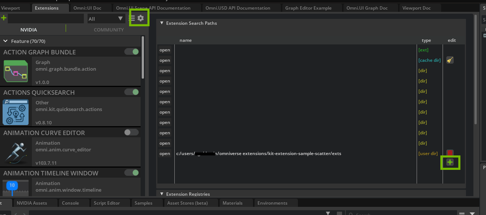
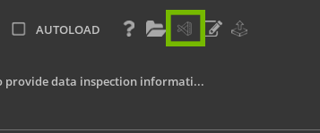

# How to make a Object Info Widget Extension
This guide will provide you with a starting point for displaying Object Info and nesting these modules into a Widget. A Widget is a useful utility in `Omniverse Kit` that can be used to add features such as buttons and sliders.


# Learning Objectives
In this guide you will learn how to:
 - Create a Widget Extension 
 - Use Omniverse UI Framework
 - Create a label
 - (optional) Create a toggle button feature
 - (optional) Create a slider

# Prereqs
It is recommended that you have completed the following:

- [Extension Enviroment Tutorial](https://github.com/NVIDIA-Omniverse/ExtensionEnvironmentTutorial)
- [How to make an extension to display Object Info](https://github.com/NVIDIA-Omniverse/kit-extension-sample-ui-scene/tree/main/exts/omni.example.ui_scene.object_info/Tutorial) 


# Table of Contents
- [Step 1: Create the Widget Module ](#step-1-create-the-widget-module)
  - [Step 1.1: Clone Slider Tutorial Branch](#step-11-clone-slider-tutorial-branch)
  - [Step 1.2: Add Extension Path to Extension Manager](#step-12-add-extension-path-to-extension-manager)
  - [Step 1.3: Create the Module](#step-13-create-the-widget-module)
  - [Step 1.4: Create the Ui Framework](#step-14-create-the-ui-framework)
  - [Step 1.5: Create Manipulator Functions](#step-15-create-manipulator-functions)
- [Step 2: Update Viewport and Extensions](#step-2-update-viewport-and-extension)
  - [Step 2.1: Updating viewport_scene.py](#step-21-updating-viewportscenepy)
  - [Step 2.2: Updating extension.py](#step-22-updating-extensionpy)
- [Step 3: (optional) Create a Toggle Button](#step-3-optional-create-a-toggle-button)
  - [Step 3.1: Add the Button to extension.py](#step-31-add-the-button-to-extensionpy)
- [Step 4:(optional) Add a Slider](#step-4-optional-add-a-slider)
  - [Step 4.1:Add to widget_info_manipulator.py](#step-41-add-to-widgetinfomanipulatorpy)
- [Congratulations!](#congratulations)


# Step 1: Create the Widget Module

In this series of steps, you will be setting up your Extension to create the module needed for the widget.

## Step 1.1: Clone Slider Tutorial Branch

 Clone the `slider-tutorial-start` branch of the `kit-extension-sample-ui-scene` [github respositiory](https://github.com/NVIDIA-Omniverse/kit-extension-sample-ui-scene) to get the assets needed for this hands-on lab. 

 ## Step 1.2: Add Extension Path to Extension Manager

 Add the local path of `exts` from `slider-tutorial-start` cloned from the [github respositiory.](https://github.com/NVIDIA-Omniverse/kit-extension-sample-ui-scene)
 
 Then import the extension into the `Extensions Manager` in `Omniverse Code` by selecting the `Extensions` tab and locate the gear icon. 

 Select this icon to open `Extensions Search Paths`. Locate the <span style="color:green">green</span> :heavy_plus_sign: icon at the bottom right of that console to add a new path. Then copy/paste the local path of the `exts` folder, as so:
<br>



>:memo: Check that the `UI Scene Object Info` Extension is enabled in the `Extensions Manager` and working by creating a new primitive in the `Viewport` and selecting it, the object's path and info should be displayed above the object.

<br>

You can open `VS Code` directly from the `Extension Manager`:
<br>


<br>


>:bulb:If you would like to know more about how we created the Modules for displaying Object Info, [check out the guide here.](https://github.com/NVIDIA-Omniverse/kit-extension-sample-ui-scene/blob/main/exts/omni.example.ui_scene.object_info/Tutorial/object_info.tutorial.md)

<br>

 ## Step 1.3: Create the Module

Create a new script called `object_info_widget.py` in the `exts` hierarchy that our other modules are located in. This will be our Widget Module.

The Widget module will be building off the Object Info Modules that we provided for you. You will see these modules as `object_info_manipulator.py`, `object_info_model.py`, `viewport_scene.py`, and an updated `extension.py`.


   >:memo: Visual Studio Code (VS Code) is our preferred IDE, hence forth we will be referring to it throughout this guide.

<br>

   ## Step 1.3: Set up Widget Class

Inside of the `object_info_widget.py`, import `omni.ui` then create the `WidgetInfoManipulator` class to nest our functions. Aftter, initialize our methods, as so:

   ```python
from omni.ui import scene as sc
from omni.ui import color as cl
import omni.ui as ui


class WidgetInfoManipulator(sc.Manipulator):
     def __init__(self, **kwargs) -> None:
        super().__init__(**kwargs)
        self.destroy()

    def destroy(self):
        self._root = None
        self._name_label = None
```

This widget will house our object info to make the information contrasted in the viewport and add other utilities later on.

We will accomplish this by structuring a box for the label with a background color.

## Step 1.4: Create the Ui Framework

Let's define this as `on_build_widgets` and use the `Omniverse UI Framework` to create the label for this widget in a `ZStack`. [See here for more documentation on Omniverse Ui Framework](https://docs.omniverse.nvidia.com/py/kit/source/extensions/omni.ui/docs/index.html).

```python
...
    def on_build_widgets(self):
        with ui.ZStack():
```

Once we have established the UI layout, we can create the background for the widget using `ui.Rectangle` and set the border attributes and background color. We can then create the `ui.Label` and set its alignment, as so:

```python
...
    def on_build_widgets(self):
        with ui.ZStack():
            ui.Rectangle(style={
                "background_color": cl(0.2),
                "border_color": cl(0.7),
                "border_width": 2,
                "border_radius": 4,
            })
            self._name_label = ui.Label("", height=0, alignment=ui.Alignment.CENTER)
```

## Step 1.5: Create Manipulator Functions

With a Manipulator, we need to define an `on_build` function.

 This function is called when the model is changed so that the framework is rebuilt. [You can find more information about the Manipulator here.](https://docs.omniverse.nvidia.com/py/kit/source/extensions/omni.ui.scene/docs/Manipulator.html)

```python
...
        self.on_model_updated(None)

    def on_build(self):
        """Called when the model is changed and rebuilds the whole slider"""
        self._root = sc.Transform(visible=False)
        with self._root:
            with sc.Transform(scale_to=sc.Space.SCREEN): 
                with sc.Transform(transform=sc.Matrix44.get_translation_matrix(0, 100, 0)):
                    self._widget = sc.Widget(500, 150, update_policy=sc.Widget.UpdatePolicy.ON_MOUSE_HOVERED)
                    self._widget.frame.set_build_fn(self.on_build_widgets)
```

Now define `on_model_updated` function that was called above. In this function we need to establish what happens if nothing is selected, when to update the shapes, and when to update the shape name, as so:

```python
...
    def on_model_updated(self, _):
        # if we don't have selection then show nothing
        if not self.model or not self.model.get_item("name"):
            self._root.visible = False
            return
        # Update the shapes
        position = self.model.get_as_floats(self.model.get_item("position"))
        if self._root:
            self._root.transform = sc.Matrix44.get_translation_matrix(*position)
            self._root.visible = True
        # Update the shape name
        if self._name_label:
            self._name_label.text = f"Prim:{self.model.get_item('name')}"
```

<details>
<summary>Click here for the end code of <b>widget_info_manipulator.py</b></summary>

```python
from omni.ui import scene as sc
from omni.ui import color as cl
import omni.ui as ui


class WidgetInfoManipulator(sc.Manipulator):
    def __init__(self, **kwargs) -> None:
        super().__init__(**kwargs)
        self.destroy()

    def destroy(self):
        self._root = None
        self._name_label = None
    
    def on_build_widgets(self):
        with ui.ZStack():
            ui.Rectangle(style={
                "background_color": cl(0.2),
                "border_color": cl(0.7),
                "border_width": 2,
                "border_radius": 4,
            })
            self._name_label = ui.Label("", height=0, alignment=ui.Alignment.CENTER)

        self.on_model_updated(None)

    def on_build(self):
        """Called when the model is changed and rebuilds the whole slider"""
        self._root = sc.Transform(visible=False)
        with self._root:
            with sc.Transform(scale_to=sc.Space.SCREEN): 
                with sc.Transform(transform=sc.Matrix44.get_translation_matrix(0, 100, 0)):
                    self._widget = sc.Widget(500, 150, update_policy=sc.Widget.UpdatePolicy.ON_MOUSE_HOVERED)
                    self._widget.frame.set_build_fn(self.on_build_widgets)

    def on_model_updated(self, _):
        # if we don't have selection then show nothing
        if not self.model or not self.model.get_item("name"):
            self._root.visible = False
            return
        # Update the shapes
        position = self.model.get_as_floats(self.model.get_item("position"))
        if self._root:
            self._root.transform = sc.Matrix44.get_translation_matrix(*position)
            self._root.visible = True
        # Update the shape name
        if self._name_label:
            self._name_label.text = f"Prim:{self.model.get_item('name')}"
```

</details>

<br>

# Step 2: Update Viewport and Extension

  Now that we have created a new script, it is important for us to bring this information into `viewport_scene.py` and update `extension.py` to reflect these new changes.

  ## Step 2.1: Updating viewport_scene.py

Let's start by updating `viewport_scene.py`.

First, import `widget_info_manpulator.py` at the top of the file with the other imports, as so:

```python
from omni.ui import scene as sc
import omni.ui as ui

from .object_info_manipulator import ObjInfoManipulator
from .object_info_model import ObjInfoModel
# NEW
from .widget_info_manipulator import WidgetInfoManipulator
# END NEW
```

Next, inside of the `ViewportSceneInfo` class, we will add `display_widget` parameter to the init method:

```python
...
class ViewportSceneInfo():
    # NEW PARAMETER: display_widget
    def __init__(self, viewport_window, ext_id, display_widget) -> None:
        self.scene_view = None
        self.viewport_window = viewport_window
...
```

Let's define the parameters of `display_widget` as so:

```python
...
class ViewportSceneInfo():
    # NEW PARAMETER: display_widget
    def __init__(self, viewport_window, ext_id, display_widget) -> None:
        self.scene_view = None
        self.viewport_window = viewport_window

        with self.viewport_window.get_frame(ext_id):
            self.scene_view = sc.SceneView()

            with self.scene_view.scene:
              # NEW
                if display_widget:
                    WidgetInfoManipulator(model=ObjInfoModel())                    
                else:
              # END NEW
                    ObjInfoManipulator(model=ObjInfoModel())
...
```
<br>

<details>
<summary>Click here for the updated <b>viewport_scene.py</b></summary>

```python
from omni.ui import scene as sc
import omni.ui as ui

from .object_info_manipulator import ObjInfoManipulator
from .object_info_model import ObjInfoModel
from .widget_info_manipulator import WidgetInfoManipulator

class ViewportSceneInfo():
    def __init__(self, viewport_window, ext_id, display_widget) -> None:
        self.scene_view = None
        self.viewport_window = viewport_window

        with self.viewport_window.get_frame(ext_id):
            self.scene_view = sc.SceneView()

            with self.scene_view.scene:
                if display_widget:
                    WidgetInfoManipulator(model=ObjInfoModel())                    
                else:
                    ObjInfoManipulator(model=ObjInfoModel())

            self.viewport_window.viewport_api.add_scene_view(self.scene_view)

    def __del__(self):
        self.destroy()

    def destroy(self):
        if self.scene_view:
            self.scene_view.scene.clear()

            if self.viewport_window:
                self.viewport_window.viewport_api.remove_scene_view(self.scene_view)
            
        self.viewport_window = None
        self.scene_view = None
```

</details>

<br>

## Step 2.2: Updating extension.py

Now that we have created the widget and passed it into the viewport, we need to call this in the `extension.py` script for it to function.

We are going to start by changing the class name of `extension.py` from `MyExtension` to something more descriptive, like `ObjectInfoWidget`:

```python
...

## Replace ##
class MyExtension(omni.ext.IExt):

## With ##
class ObjectInfoWidget(omni.ext.IExt):
## END ##

    def __init__(self) -> None:
        super().__init__()
        self.viewportScene = None
```

Next, let's pass the new parameter in `on_startup` as follows:

```python
...
    def on_startup(self, ext_id):
        #Grab a reference to the viewport
        viewport_window = get_active_viewport_window()

        # NEW PARAMETER PASSED
        self.viewportScene = ViewportSceneInfo(viewport_window, ext_id, True)
...
```

<details>
<summary>Click here for the updated <b>extension.py</b> script </summary>

```python
import omni.ext
import omni.ui as ui
from omni.ui import scene as sc
from omni.ui import color as cl
from omni.kit.viewport.utility import get_active_viewport_window
from .viewport_scene import ViewportSceneInfo


class ObjectInfoWidget(omni.ext.IExt):
    def __init__(self) -> None:
        super().__init__()
        self.viewportScene = None

    def on_startup(self, ext_id):
        #Grab a reference to the viewport
        viewport_window = get_active_viewport_window()

        self.viewportScene = ViewportSceneInfo(viewport_window, ext_id, True)

    def on_shutdown(self):
        if self.viewportScene:
            self.viewportScene.destroy()
            self.viewportScene = None
```

</details>
<br>

You should see these updates in `Omniverse Code` at this point:
<br>


# Step 3: (Optional) Create a Toggle Button

  In this section we will create a button that enables us to turn the object info widget on and off in the viewport. This feature is built in `extension.py` and is an optional section. If you do not want the toggle button, feel free to skip this part. 

## Step 3.1: Add the button to extension.py

First initialize new values in `extension.py` for `viewport_scene`,`widget_view`, and `ext_id`, as follows:

```python
...
class ObjectInfoWidget(omni.ext.IExt):
    def __init__(self) -> None:
        super().__init__()
        # NEW VALUES
        self.viewport_scene = None
        self.widget_view_on = False
        self.ext_id = None
        # END NEW
```

Next, update `on_startup` to create a new window for the button. 

After creating the window, add a pass for the new value, `widget_view_on`, like so:

```python
...
    def on_startup(self, ext_id):
        # NEW: Window with a label and button to toggle the widget / info 
        self.window = ui.Window("Toggle Widget View", width=300, height=300)
        self.ext_id = ext_id
        with self.window.frame:
            with ui.HStack(height=0):
                ui.Label("Toggle Widget View", alignment=ui.Alignment.CENTER_TOP, style={"margin": 5})
                ui.Button("Toggle Widget", clicked_fn=self.toggle_view)
        # END NEW

        #Grab a reference to the viewport
        viewport_window = get_active_viewport_window()

        # NEW: passed in our new value self.widget_view_on
        self.viewport_scene = ViewportSceneInfo(viewport_window, ext_id, self.widget_view_on)
...
```

Now, call `toggle_view` function.

This function will be binded to the button's clicked function, thus requring an `if` statement to check when the button is on/off:

```python
...
    # NEW: New function that is binded to our button's clicked_fn
    def toggle_view(self):
        self.reset_viewport_scene()
        self.widget_view_on = not self.widget_view_on
        if self.widget_view_on:
            self._toggle_button.text = "Toggle Widget Info Off"
        else:
            self._toggle_button.text = "Toggle Widget Info On"
        viewport_window = get_active_viewport_window()
        self.viewport_scene = ViewportSceneInfo(viewport_window, self.ext_id, self.widget_view_on)
    # END NEW
...
```

Since this button is used in more than one spot, create the function `reset_viewport_scene`.

This function will purge our scene when the button is reset.

```python
...
    # NEW: New function for reseting the viewport scene (since this will be used in more than one spot)
    def reset_viewport_scene(self):
        if self.viewport_scene:
            self.viewport_scene.destroy()
            self.viewport_scene = None
    # END NEW
...
```

FInally, update `on_shutdown` to remove the `viewport_scene` parameters we moved into the reset function and then call that function.

```python
...
    def on_shutdown(self):
        # NEW: Moved code block to a function and call it
        self.reset_viewport_scene()
        # END NEW
```

<br>

<details>
<summary>Click here for the updated <b>extension.py</b> script </summary>

```python
import omni.ext
import omni.ui as ui
from omni.kit.viewport.utility import get_active_viewport_window
from .viewport_scene import ViewportSceneInfo


class ObjectInfoWidget(omni.ext.IExt):
    def __init__(self) -> None:
        super().__init__()
        self.viewport_scene = None
        self.widget_view_on = False
        self.ext_id = None

    def on_startup(self, ext_id):
        self.window = ui.Window("Toggle Widget View", width=300, height=300)
        self.ext_id = ext_id
        with self.window.frame:
            with ui.HStack(height=0):
                ui.Label("Toggle Widget View", alignment=ui.Alignment.CENTER_TOP, style={"margin": 5})
                ui.Button("Toggle Widget", clicked_fn=self.toggle_view)

        #Grab a reference to the viewport
        viewport_window = get_active_viewport_window()

        self.viewport_scene = ViewportSceneInfo(viewport_window, ext_id, self.widget_view_on)

    def toggle_view(self):
        self.reset_viewport_scene()
        self.widget_view_on = not self.widget_view_on
        if self.widget_view_on:
            self._toggle_button.text = "Toggle Widget Info Off"
        else:
            self._toggle_button.text = "Toggle Widget Info On"
        viewport_window = get_active_viewport_window()
        self.viewport_scene = ViewportSceneInfo(viewport_window, self.ext_id, self.widget_view_on)

    def reset_viewport_scene(self):
        if self.viewport_scene:
            self.viewport_scene.destroy()
            self.viewport_scene = None

    def on_shutdown(self):
        self.reset_viewport_scene()

```

</details>

<br>

Here is what you should see in the viewport at this point:

<br>


# Step 4: (Optional) add a Slider

   In this step, we will be adding a slider to the widget created in Step 3. This slider will change the scale of the object. This is an optional step and may be skipped as it is just to showcase a simple addition of what a widget can do. For a more complex slider, [check out the guide to `Slider Manipulator` here.](https://github.com/NVIDIA-Omniverse/kit-extension-sample-ui-scene/blob/main/exts/omni.example.ui_scene.slider_manipulator/Tutorial/slider_Manipulator_Tutorial.md)

## Step 4.1: Add to widget_info_manipulator.py

Use `Omniverse Ui Framework` to build the framework for the slider in the function `on_build_widgets`.

This slider is an optional feature to the widget but is a great way to add utility. 

 ```python
...
    def on_build_widgets(self):
        with ui.ZStack():
            ui.Rectangle(style={
                "background_color": cl(0.2),
                "border_color": cl(0.7),
                "border_width": 2,
                "border_radius": 4,
            })
            # NEW: Adding the Slider to the widget in the scene
            with ui.VStack(style={"font_size": 24}):
                self._name_label = ui.Label("", height=0, alignment=ui.Alignment.CENTER)
                # setup some model, just for simple demonstration here
                self._slider_model = ui.SimpleFloatModel()
                ui.Spacer(height=5)
                with ui.HStack():
                    ui.Spacer(width=10)
                    ui.Label("scale", height=0, width=0)
                    ui.Spacer(width=5)
                    ui.FloatSlider(self._slider_model)
                    ui.Spacer(width=5)
                ui.Spacer(height=5)

              # END NEW
        self.on_model_updated(None)
...
 ```

Add a new function that will scale the model when the slider is dragged. Call this function after `on_model_updated` and name it `update_scale`.

 ```python
 ...
    def on_model_updated(self, _):
        # if we don't have selection then show nothing
        if not self.model or not self.model.get_item("name"):
            self._root.visible = False
            return
        # Update the shapes
        position = self.model.get_as_floats(self.model.get_item("position"))
        if self._root:
            self._root.transform = sc.Matrix44.get_translation_matrix(*position)
            self._root.visible = True

        # NEW
        # Update the slider
        def update_scale(prim_name, value):
            print(f"changing scale of {prim_name}, {value}")
            stage = self.model.usd_context.get_stage()
            prim = stage.GetPrimAtPath(self.model.current_path)
            scale = prim.GetAttribute("xformOp:scale")
            scale.Set(Gf.Vec3d(value, value, value))      

        if self._slider_model:
            self._slider_subscription = None
            self._slider_model.as_float = 1.0
            self._slider_subscription = self._slider_model.subscribe_value_changed_fn(
                lambda m, p=self.model.get_item("name"): update_scale(p, m.as_float)
            )
        # END NEW
 ...
 ```

 <details>
 <summary>Click here for the updated `widget_info_manipulator.py` script  </summary>

```python
from omni.ui import scene as sc
from omni.ui import color as cl
import omni.ui as ui
from pxr import Gf


class WidgetInfoManipulator(sc.Manipulator):
    def __init__(self, **kwargs) -> None:
        super().__init__(**kwargs)
        self.destroy()

    def destroy(self):
        self._root = None
        self._name_label = None
        self._slider_model = None

    def on_build_widgets(self):
        with ui.ZStack():
            ui.Rectangle(style={
                "background_color": cl(0.2),
                "border_color": cl(0.7),
                "border_width": 2,
                "border_radius": 4,
            })
            with ui.VStack():
                self._name_label = ui.Label("", height=0, alignment=ui.Alignment.CENTER)
                # setup some model, just for simple demonstration here
                self._slider_model = ui.SimpleFloatModel()
                ui.Spacer(height=5)
                with ui.HStack():
                    ui.Spacer(width=10)
                    ui.Label("scale", height=0, width=0)
                    ui.Spacer(width=5)
                    ui.FloatSlider(self._slider_model)
                    ui.Spacer(width=5)
                ui.Spacer(height=5)
        self.on_model_updated(None)

    def on_build(self):
        """Called when the model is changed and rebuilds the whole slider"""
        self._root = sc.Transform(visibile=False)
        with self._root:
            with sc.Transform(scale_to=sc.Space.SCREEN): 
                with sc.Transform(transform=sc.Matrix44.get_translation_matrix(0, 100, 0)):
                    self._widget = sc.Widget(500, 150, update_policy=sc.Widget.UpdatePolicy.ON_MOUSE_HOVERED)
                    self._widget.frame.set_build_fn(self.on_build_widgets)

    def on_model_updated(self, _):
        # if we don't have selection then show nothing
        if not self.model or not self.model.get_item("name"):
            self._root.visible = False
            return
        # Update the shapes
        position = self.model.get_as_floats(self.model.get_item("position"))
        if self._root:
            self._root.transform = sc.Matrix44.get_translation_matrix(*position)
            self._root.visible = True

        # Update the slider
        def update_scale(prim_name, value):
            print(f"changing scale of {prim_name}, {value}")
            stage = self.model.usd_context.get_stage()
            prim = stage.GetPrimAtPath(self.model.current_path)
            scale = prim.GetAttribute("xformOp:scale")
            scale.Set(Gf.Vec3d(value, value, value))      

        if self._slider_model:
            self._slider_subscription = None
            self._slider_model.as_float = 1.0
            self._slider_subscription = self._slider_model.subscribe_value_changed_fn(
                lambda m, p=self.model.get_item("name"): update_scale(p, m.as_float)
            )

        # Update the shape name
        if self._name_label:
            self._name_label.text = f"Prim:{self.model.get_item('name')}"
```

 </details>

 <br>

 Here is what is created in thew viewport of Omniverse Code:
<br>

 

 # Congratulations!

 You have successfully created a Widget Extension for the Object Info! 