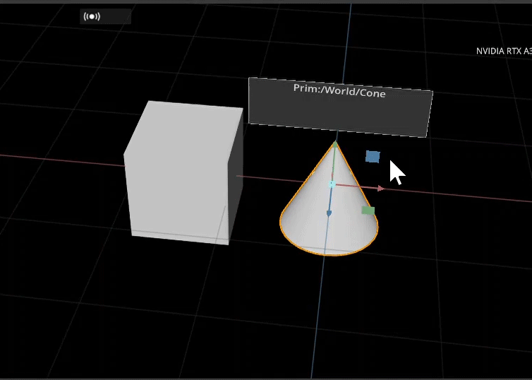
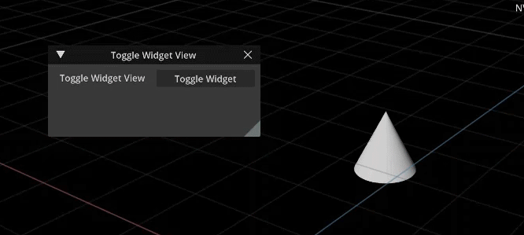

# How to make a Object Info Widget Extension
   In a previous guide, you learned how display the object's path and type in the viewport. This guide will extend on this knowledge and help you create a widget that will contrast the object info from the viewport, as well as creating a feature to be added onto, such as buttons and sliders. We will be walking you through how to create this widget extension but you may refer back to the [github repository ](https://github.com/NVIDIA-Omniverse/kit-extension-sample-ui-scene/tree/main/exts/omni.example.ui_scene.widget_info) at any time. 

# Learning Objectives
In this guide you will learn how to:
 - Create a Widget Extension 
 - Use Omniverse UI Framework
 - Create a label
 - (optional) Create a toggle button feature
 - (optional) Create a slider

# Prereqs
It is required that you have completed the guide on [How to make an extension to display Object Info]("insert link") as this guide will create a widget using the information gathered from the object info extension. 

# Table of Contents
 - [Step 1: Add Script to Object Info](#step-1-add-script-to-object-info)
   - [Step 1.1: Begin your code](#step-11-begin-your-code)
- [Step 2: Update Viewport and Extension ](#step-2-update-viewport-and-extension)
   - [Step 2.1: Updating viewportScene.py](#step-21-updating-viewportscenepy)
   - [Step 2.2: Updating extension.py ](#step-22-updating-extensionpy)
- [Step 3: (optional) Create a Toggle Button](#step-3-optional-create-a-toggle-button) 
   - [Step 3.1: Adding the Feature to extension.py ](#step-31-adding-the-feature-to-extensionpy)
- [Step 4: (optional) Adding a Slider ](#step-4-optional-adding-a-slider)
   - [Step 4.1: Adding to widgetInfoManipulator.py ](#step-41-adding-to-widgetinfomanipulatorpy)
- [Congratulations!](#congratulations)


 # Step 1: Add Script to Object Info
   As this will be using the same scripts we established in `object info`, we will be creating the `object info widget` module in the same file structure. So, just as you did previously, create a new file in the folder with `extension.py`, `objectInfoModel.py`, and `objectInfoManipulator.py`. We will name this new module `widgetInfoManipulator.py`.

   

   ## Step 1.1 Begin your code
   ### Theory
   As with all of our previous scripts, we will start by importing from Omniverse, then begin our `WidgetInfoManipulator` class to hold our functions. These functions will create a label for the object info to live in as well as updating the model for when the model is changed. 

   Let's go ahead and import from Omniverse at the top of our `widgetInfoManipulator.py` file, as so:

   ```python
from omni.ui import scene as sc
from omni.ui import color as cl
import omni.ui as ui
   ```
Now we will create the class `WidgetInfoManipulator` and assign the baseclass with the proper inheritence, as well as define our `__init__` method. In the `__init__` method, we will call the `destroy` function, so we will also define what will happen when this is called, as follows:

```python
...
class WidgetInfoManipulator(sc.Manipulator):
     def __init__(self, **kwargs) -> None:
        super().__init__(**kwargs)
        self.destroy()

    def destroy(self):
        self._root = None
        self._name_label = None
```

From here, we can begin building the widget. This widget will house our object info so we want to make it obvious in the viewport. We will accomplish this by structuring a box for the label with a background color to contrast it from the viewport. 

Let's define this as `on_build_widgets` and use the `Omniverse UI Framework` to create the label for this widget in a `ZStack`. [See here for more documentation on Omniverse Ui Framework](https://docs.omniverse.nvidia.com/py/kit/source/extensions/omni.ui/docs/index.html).

```python
...
    def on_build_widgets(self):
        with ui.ZStack():
```

Once we have established the UI layout, we can create the background for the widget using `ui.Rectangle` and set the border attributes and background color. We can then create the `ui.Label` and set its alignment, as so:

```python
...
    def on_build_widgets(self):
        with ui.ZStack():
            ui.Rectangle(style={
                "background_color": cl(0.2),
                "border_color": cl(0.7),
                "border_width": 2,
                "border_radius": 4,
            })
            self._name_label = ui.Label("", height=0, alignment=ui.Alignment.CENTER)
```
With a Manipulator, we need to define an `on_build` function. This function is called when the model is changed so that the framework is rebuilt:

```python
...
        self.on_model_updated(None)

    def on_build(self):
        """Called when the model is changed and rebuilds the whole slider"""
        self._root = sc.Transform(visible=False)
        with self._root:
            with sc.Transform(scale_to=sc.Space.SCREEN): 
                with sc.Transform(transform=sc.Matrix44.get_translation_matrix(0, 100, 0)):
                    self._widget = sc.Widget(500, 150, update_policy=sc.Widget.UpdatePolicy.ON_MOUSE_HOVERED)
                    self._widget.frame.set_build_fn(self.on_build_widgets)
```

For the final part of this widget script, before we move onto the viewport, will be to define `on_model_updated`. In this function we need to establish what happens if nothing is selected, when to update the shapes, and when to update the shape name, as so:

```python
...
    def on_model_updated(self, _):
        # if we don't have selection then show nothing
        if not self.model or not self.model.get_item("name"):
            self._root.visible = False
            return
        # Update the shapes
        position = self.model.get_as_floats(self.model.get_item("position"))
        if self._root:
            self._root.transform = sc.Matrix44.get_translation_matrix(*position)
            self._root.visible = True
        # Update the shape name
        if self._name_label:
            self._name_label.text = f"Prim:{self.model.get_item('name')}"
```

<details>
<summary>Click here for the end code of <b>widgetInfoManipulator.py</b></summary>

```python
from omni.ui import scene as sc
from omni.ui import color as cl
import omni.ui as ui

class WidgetInfoManipulator(sc.Manipulator):
    def __init__(self, **kwargs) -> None:
        super().__init__(**kwargs)
        self.destroy()

    def destroy(self):
        self._root = None
        self._name_label = None
    
    def on_build_widgets(self):
        with ui.ZStack():
            ui.Rectangle(style={
                "background_color": cl(0.2),
                "border_color": cl(0.7),
                "border_width": 2,
                "border_radius": 4,
            })
            self._name_label = ui.Label("", height=0, alignment=ui.Alignment.CENTER)

        self.on_model_updated(None)

    def on_build(self):
        """Called when the model is changed and rebuilds the whole slider"""
        self._root = sc.Transform(visible=False)
        with self._root:
            with sc.Transform(scale_to=sc.Space.SCREEN): 
                with sc.Transform(transform=sc.Matrix44.get_translation_matrix(0, 100, 0)):
                    self._widget = sc.Widget(500, 150, update_policy=sc.Widget.UpdatePolicy.ON_MOUSE_HOVERED)
                    self._widget.frame.set_build_fn(self.on_build_widgets)

    def on_model_updated(self, _):
        # if we don't have selection then show nothing
        if not self.model or not self.model.get_item("name"):
            self._root.visible = False
            return
        # Update the shapes
        position = self.model.get_as_floats(self.model.get_item("position"))
        if self._root:
            self._root.transform = sc.Matrix44.get_translation_matrix(*position)
            self._root.visible = True
        # Update the shape name
        if self._name_label:
            self._name_label.text = f"Prim:{self.model.get_item('name')}"
```

</details>

# Step 2: Update Viewport and Extension
### Theory
  Now that we have created the manipulator module, it is important for us to bring this information into the viewport and update `extension.py` to reflect these new changes.

  ## Step 2.1: Updating viewportScene.py
Let's start by updating `viewportScene.py`, the viewport script we created in the Object Info guide. 

First, import `widgetInfoManpulator.py` at the top of the file with the other imports, as so:

```python
from omni.ui import scene as sc
import omni.ui as ui

from .objectInfoManipulator import ObjInfoManipulator
from .objectInfoModel import ObjInfoModel
# NEW
from .widgetInfoManipulator import WidgetInfoManipulator
# END NEW
```
Next, inside of the `ViewportSceneInfo` class, we will add `display_widget` parameter to the init method:

```python
...
class ViewportSceneInfo():
    # NEW PARAMETER: display_widget
    def __init__(self, viewport_window, ext_id, display_widget) -> None:
        self.scene_view = None
        self.viewport_window = viewport_window
...
```

Let's define the parameters of `display_widget` as so:

```python
...
class ViewportSceneInfo():
    # NEW PARAMETER: display_widget
    def __init__(self, viewport_window, ext_id, display_widget) -> None:
        self.scene_view = None
        self.viewport_window = viewport_window

        with self.viewport_window.get_frame(ext_id):
            self.scene_view = sc.SceneView()

            with self.scene_view.scene:
              # NEW
                if display_widget:
                    WidgetInfoManipulator(model=ObjInfoModel())                    
                else:
              # END NEW
                    ObjInfoManipulator(model=ObjInfoModel())
...
```
<details>
<summary>Click here for the updated <b>viewportScene.py</b></summary>

```python
from omni.ui import scene as sc
import omni.ui as ui

from .objectInfoManipulator import ObjInfoManipulator
from .objectInfoModel import ObjInfoModel
from .widgetInfoManipulator import WidgetInfoManipulator

class ViewportSceneInfo():
    # NEW PARAMETER: display_widget
    def __init__(self, viewport_window, ext_id, display_widget) -> None:
        self.scene_view = None
        self.viewport_window = viewport_window

        with self.viewport_window.get_frame(ext_id):
            self.scene_view = sc.SceneView()

            with self.scene_view.scene:
              # NEW
                if display_widget:
                    WidgetInfoManipulator(model=ObjInfoModel())                    
                else:
              # END NEW
                    ObjInfoManipulator(model=ObjInfoModel())

            self.viewport_window.viewport_api.add_scene_view(self.scene_view)

    def __del__(self):
        self.destroy()

    def destroy(self):
        if self.scene_view:
            self.scene_view.scene.clear()

            if self.viewport_window:
                self.viewport_window.viewport_api.remove_scene_view(self.scene_view)
            
        self.viewport_window = None
        self.scene_view = None
```

</details>

## Step 2.2: Updating extension.py
Now that we have created the widget and passed it into the viewport, we need to call this in the `extension.py` script for it to function in `Omniverse Code`.

We are going to start by changing the class name of `extension.py` from `MyExtension` to something more descriptive, like `ObjectInfoWidget`:

```python
...
# NEW CLASS NAME
class ObjectInfoWidget(omni.ext.IExt):
    def __init__(self) -> None:
        super().__init__()
        self.viewportScene = None
```

Next, let's pass the new parameter in `on_startup` as follows:


```python
...
    def on_startup(self, ext_id):
        #Grab a reference to the viewport
        viewport_window = get_active_viewport_window()

        # NEW PARAMETER PASSED
        self.viewportScene = ViewportSceneInfo(viewport_window, ext_id, True)
...
```
<details>
<summary>Click here for the updated <b>extension.py</b> script </summary>

```python
import omni.ext
import omni.ui as ui
from omni.ui import scene as sc
from omni.ui import color as cl
from omni.kit.viewport.utility import get_active_viewport_window
from .viewportScene import ViewportSceneInfo

# NEW CLASS NAME
class ObjectInfoWidget(omni.ext.IExt):
    def __init__(self) -> None:
        super().__init__()
        self.viewportScene = None

    def on_startup(self, ext_id):
        #Grab a reference to the viewport
        viewport_window = get_active_viewport_window()

        # NEW PARAMETER PASSED
        self.viewportScene = ViewportSceneInfo(viewport_window, ext_id, True)

    def on_shutdown(self):
        if self.viewportScene:
            self.viewportScene.destroy()
            self.viewportScene = None
```
</details>
<br>

You should see these updates in `Omniverse Code` at this point:



# Step 3: (Optional) Create a Toggle Button
### Theory
  In this section we will create a button that enables us to turn the object info widget on and off in the viewport. This feature is built in `extension.py` and is an optional section. If you do not want the toggle button, feel free to skip this part. 

## Step 3.1: Adding the feature to extension.py
The toggle button for the object info widget will require a few new functions in `extension.py` as well as creating new values within the init method. 

Let's start with those new values. We will need one for the `viewport_scene`, `widget_view`, and `ext_id`, as follows:
```python
...
class ObjectInfoWidget(omni.ext.IExt):
    def __init__(self) -> None:
        super().__init__()
        # NEW VALUES
        self.viewport_scene = None
        self.widget_view_on = False
        self.ext_id = None
        # END NEW
```

Next, we will move to updating `on_startup` where we will create a new window that will house the button for toggling the widget. After creating the window, we will also add a pass for the new value, `widget_view_on`, like so:

```python
...
    def on_startup(self, ext_id):
        # NEW: Window with a label and button to toggle the widget / info 
        self.window = ui.Window("Toggle Widget View", width=300, height=300)
        self.ext_id = ext_id
        with self.window.frame:
            with ui.HStack(height=0):
                ui.Label("Toggle Widget View", alignment=ui.Alignment.CENTER_TOP, style={"margin": 5})
                ui.Button("Toggle Widget", clicked_fn=self.toggle_view)
        # END NEW

        #Grab a reference to the viewport
        viewport_window = get_active_viewport_window()

        # NEW: passed in our new value self.widget_view_on
        self.viewport_scene = ViewportSceneInfo(viewport_window, ext_id, self.widget_view_on)
...
```

For our first new function in `extension.py`, we will call `toggle_view`. This function will be binded to the button's clicked function, thus requring an `if` statement to check when the button is on/off:

```python
...
    # NEW: New function that is binded to our button's clicked_fn
    def toggle_view(self):
        self.reset_viewport_scene()
        self.widget_view_on = not self.widget_view_on
        if self.widget_view_on:
            self._toggle_button.text = "Toggle Widget Info Off"
        else:
            self._toggle_button.text = "Toggle Widget Info On"
        viewport_window = get_active_viewport_window()
        self.viewport_scene = ViewportSceneInfo(viewport_window, self.ext_id, self.widget_view_on)
    # END NEW
...
```

Now, we create another new function, `reset_viewport_scene`, since this button will be used in more than one spot:

```python
...
    # NEW: New function for reseting the viewport scene (since this will be used in more than one spot)
    def reset_viewport_scene(self):
        if self.viewport_scene:
            self.viewport_scene.destroy()
            self.viewport_scene = None
    # END NEW
...
```

Finally, we because we moved the `on_shutdown` code block to `reset_viewport_scene`, we just need to update `on_shutdown` to call that new function:

```python
...
    def on_shutdown(self):
        # NEW: Moved code block to a function and call it
        self.reset_viewport_scene()
        # END NEW
```
<details>
<summary>Click here for the updated `extension.py` script </summary>

```python
import omni.ext
import omni.ui as ui
from omni.kit.viewport.utility import get_active_viewport_window
from .viewportScene import ViewportSceneInfo

class ObjectInfoWidget(omni.ext.IExt):
    def __init__(self) -> None:
        super().__init__()
        # NEW VALUES
        self.viewport_scene = None
        self.widget_view_on = False
        self.ext_id = None
        # END NEW

    def on_startup(self, ext_id):
        # NEW: Window with a label and button to toggle the widget / info 
        self.window = ui.Window("Toggle Widget View", width=300, height=300)
        self.ext_id = ext_id
        with self.window.frame:
            with ui.HStack(height=0):
                ui.Label("Toggle Widget View", alignment=ui.Alignment.CENTER_TOP, style={"margin": 5})
                ui.Button("Toggle Widget", clicked_fn=self.toggle_view)
        # END NEW

        #Grab a reference to the viewport
        viewport_window = get_active_viewport_window()

        # NEW: passed in our new value self.widget_view_on
        self.viewport_scene = ViewportSceneInfo(viewport_window, ext_id, self.widget_view_on)

    # NEW: New function that get's finded to our button's clicked_fn
    def toggle_view(self):
        self.reset_viewport_scene()
        self.widget_view_on = not self.widget_view_on
        if self.widget_view_on:
            self._toggle_button.text = "Toggle Widget Info Off"
        else:
            self._toggle_button.text = "Toggle Widget Info On"
        viewport_window = get_active_viewport_window()
        self.viewport_scene = ViewportSceneInfo(viewport_window, self.ext_id, self.widget_view_on)
    # END NEW

    # NEW: New function for reseting the viewport scene (since this will be used in more than one spot)
    def reset_viewport_scene(self):
        if self.viewport_scene:
            self.viewport_scene.destroy()
            self.viewport_scene = None
    # END NEW

    def on_shutdown(self):
        # NEW: Moved code block to a function and call it
        self.reset_viewport_scene()
        # END NEW

```

</details>
<br>

Here is what you should see in the viewport at this point:


# Step 4: (Optional) Adding a slider
### Theory
   In this step, we will be adding a slider to the widget created in Step 3. This slider will change the scale of the object. This is an optional step and may be skipped.

## Step 4.1: Adding to widgetInfoManipulator.py

 Just as we used `Omniverse UI Framework` to build the Object Info Widget in `widgetInfoManipulator.py` previously, we will be using UI Framework again to build the slider into this widget. Again, this slider is an optional feature to the widget but is a great way to add utility. 

 We will add this framework to `on_build_widgets` as so:

 ```python
...
    def on_build_widgets(self):
        with ui.ZStack():
            ui.Rectangle(style={
                "background_color": cl(0.2),
                "border_color": cl(0.7),
                "border_width": 2,
                "border_radius": 4,
            })
            # NEW: Adding the Slider to the widget in the scene
            with ui.VStack(style={"font_size": 24}):
                self._name_label = ui.Label("", height=0, alignment=ui.Alignment.CENTER)
                # setup some model, just for simple demonstration here
                self._slider_model = ui.SimpleFloatModel()
                ui.Spacer(height=5)
                with ui.HStack():
                    ui.Spacer(width=10)
                    ui.Label("scale", height=0, width=0)
                    ui.Spacer(width=5)
                    ui.FloatSlider(self._slider_model)
                    ui.Spacer(width=5)
                ui.Spacer(height=5)

              # END NEW
        self.on_model_updated(None)
...
 ```

 Let's also add a new function to scale the slider in the widget. We will call this function after `on_model_updated` and name it `update_scale`:

 ```python
 ...
    def on_model_updated(self, _):
        # if we don't have selection then show nothing
        if not self.model or not self.model.get_item("name"):
            self._root.visible = False
            return
        # Update the shapes
        position = self.model.get_as_floats(self.model.get_item("position"))
        if self._root:
            self._root.transform = sc.Matrix44.get_translation_matrix(*position)
            self._root.visible = True

        # NEW
        # Update the slider
        def update_scale(prim_name, value):
            print(f"changing scale of {prim_name}, {value}")
            stage = self.model.usd_context.get_stage()
            prim = stage.GetPrimAtPath(self.model.current_path)
            scale = prim.GetAttribute("xformOp:scale")
            scale.Set(Gf.Vec3d(value, value, value))      

        if self._slider_model:
            self._slider_subscription = None
            self._slider_model.as_float = 1.0
            self._slider_subscription = self._slider_model.subscribe_value_changed_fn(
                lambda m, p=self.model.get_item("name"): update_scale(p, m.as_float)
            )
        # END NEW
 ...
 ```

 <details>
 <summary>Click here for the updated `widgetInfoManipulator.py` script  </summary>

```python
from omni.ui import scene as sc
from omni.ui import color as cl
import omni.ui as ui
from pxr import Gf

class WidgetInfoManipulator(sc.Manipulator):
    def __init__(self, **kwargs) -> None:
        super().__init__(**kwargs)
        self.destroy()

    def destroy(self):
        self._root = None
        self._name_label = None
        self._slider_model = None

    def on_build_widgets(self):
        with ui.ZStack():
            ui.Rectangle(style={
                "background_color": cl(0.2),
                "border_color": cl(0.7),
                "border_width": 2,
                "border_radius": 4,
            })
            with ui.VStack():
                self._name_label = ui.Label("", height=0, alignment=ui.Alignment.CENTER)
                # setup some model, just for simple demonstration here
                self._slider_model = ui.SimpleFloatModel()
                ui.Spacer(height=5)
                with ui.HStack():
                    ui.Spacer(width=10)
                    ui.Label("scale", height=0, width=0)
                    ui.Spacer(width=5)
                    ui.FloatSlider(self._slider_model)
                    ui.Spacer(width=5)
                ui.Spacer(height=5)
        self.on_model_updated(None)

    def on_build(self):
        """Called when the model is changed and rebuilds the whole slider"""
        self._root = sc.Transform(visibile=False)
        with self._root:
            with sc.Transform(scale_to=sc.Space.SCREEN): 
                with sc.Transform(transform=sc.Matrix44.get_translation_matrix(0, 100, 0)):
                    self._widget = sc.Widget(500, 150, update_policy=sc.Widget.UpdatePolicy.ON_MOUSE_HOVERED)
                    self._widget.frame.set_build_fn(self.on_build_widgets)

    def on_model_updated(self, _):
        # if we don't have selection then show nothing
        if not self.model or not self.model.get_item("name"):
            self._root.visible = False
            return
        # Update the shapes
        position = self.model.get_as_floats(self.model.get_item("position"))
        if self._root:
            self._root.transform = sc.Matrix44.get_translation_matrix(*position)
            self._root.visible = True

        # NEW
        # Update the slider
        def update_scale(prim_name, value):
            print(f"changing scale of {prim_name}, {value}")
            stage = self.model.usd_context.get_stage()
            prim = stage.GetPrimAtPath(self.model.current_path)
            scale = prim.GetAttribute("xformOp:scale")
            scale.Set(Gf.Vec3d(value, value, value))      

        if self._slider_model:
            self._slider_subscription = None
            self._slider_model.as_float = 1.0
            self._slider_subscription = self._slider_model.subscribe_value_changed_fn(
                lambda m, p=self.model.get_item("name"): update_scale(p, m.as_float)
            )
        # END NEW

        # Update the shape name
        if self._name_label:
            self._name_label.text = f"Prim:{self.model.get_item('name')}"
```

 </details>

 <br>

 Here is what is created in thew viewport of Omniverse Code:

 

 # Congratulations!
 You have successfully created a Widget Extension for the Object Info! 