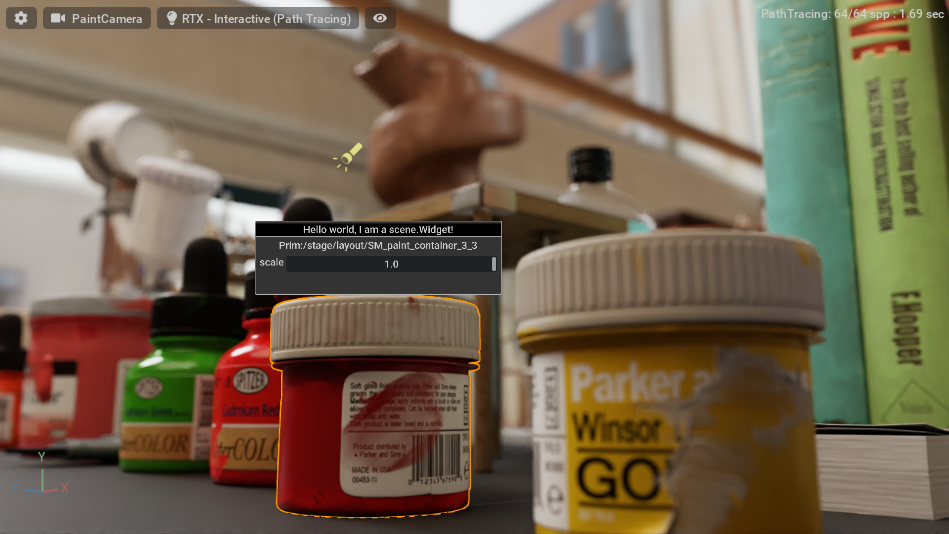

# Overview

In the example, we show how to leverage `ui.scene.Widget` item to create a
`ui.Widget` that is in 3D. The Widget can have any type of `omni.ui` element,
including being interactive, as shown with the slider.



# The extension showcase view concepts

Similarly to the other `ui.scene` example it shows you to set up the viewport
scene in `viewport_scene.py`. Then there is the Manipulator object that manages
the presentation of the item `widget_info_manipulator.py`. Finally, the
`widget_info_model.py` contains the model that connects the world with the
manipulator.


# Overlaying with the viewport

We use `sc.Manipulator` with `sc.Widget` to draw `omni.ui` widgets in 3D view.
To show it in the viewport, we overlay `sc.SceneView` with our `sc.Manipulator`
on top of the viewport window.

```python
from omni.kit.viewport.utility import get_active_viewport_window
viewport_window = get_active_viewport_window()

# Create a unique frame for our SceneView
with viewport_window.get_frame(ext_id):
    # Create a default SceneView (it has a default camera-model)
    self._scene_view = sc.SceneView()
    # Add the manipulator into the SceneView's scene
    with self._scene_view.scene:
        WidgetInfoManipulator(model=WidgetInfoModel())
```

To synchronize the projection and view matrices, `omni.kit.viewport.utility` has
the method `add_scene_view`, which replaces the camera model, and the
manipulator visually looks like it's in the main viewport.

```python
# Register the SceneView with the Viewport to get projection and view updates
viewport_window.viewport_api.add_scene_view(self._scene_view)
```